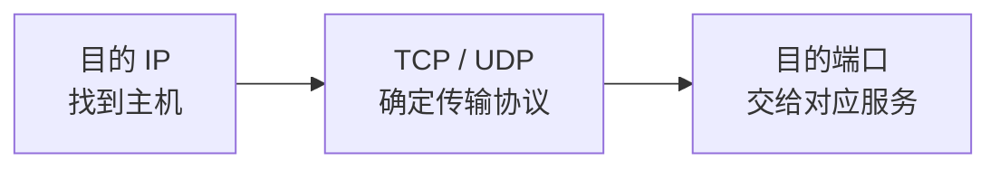

# 端口与进程通信：IP 已经找到主机，数据到底交给哪个程序

> [!summary] 快速复习卡片
> **三层定位**：IP 地址找主机；TCP/UDP 决定传输方式；端口号继续区分主机上的网络服务/通信端点。
> **端口不是物理插孔**：TCP/UDP 端口是传输层使用的逻辑编号。
> **默认端口题**：HTTP 80、HTTPS 443、DNS 53、SMTP 25；默认是约定，不代表现实中不能修改。
> **易错点**：完整识别最好看“传输协议 + 端口号”，例如 UDP 53 与 TCP 53 不是同一个传输语境。

## 先看问题：一台服务器上不止一个服务

上一站 [[TCP与UDP对比]] 已经决定“怎么传”。

现在服务器 `203.0.113.10` 同时运行：

- Web；
- DNS；
- 邮件；
- SSH。

IP 只能把数据送到 `203.0.113.10` 这台主机，却不能仅凭 IP 判断应该交给哪个服务。

于是还需要一个主机内部的逻辑编号：**端口号**。

## IP 找主机，端口继续找主机里的服务

可以把一次通信定位成三步：

例如访问 `203.0.113.10:443`：

- IP 地址找到这台服务器；
- TCP 表示使用 TCP 传输；
- 443 把通信交给监听 TCP 443 的服务端通信端点。

所以最值得记的一句是：

> **IP 找主机，端口找主机里的服务。**

## “端口”为什么不是交换机上的网口

交换机的 1 号口、2 号口是物理/链路接口。

TCP 80、TCP 443、UDP 53 里的“端口”是操作系统和传输层使用的**逻辑编号**。

同一个中文词，语境不同，不要混成一回事。

## 默认端口只要记高价值项

| 应用协议 | 常见默认端口 |
| --- | ---: |
| HTTP | TCP 80 |
| HTTPS | TCP 443 |
| DNS | UDP/TCP 53 |
| SMTP | TCP 25 |

“默认端口”只是标准约定和常见配置。现实中服务可以改到别的端口，所以“看到 443”也不能反推业务内容百分之百一定是 HTTPS。

这一轮不展开临时源端口、socket 五元组和连接状态。

## 一句话收口

**IP 决定数据到哪台主机，TCP/UDP 决定用什么传输服务，端口号再把数据交给这台主机上的正确网络服务。**

## 上一站

[[TCP与UDP对比]]：已经知道应用可以选择 TCP 或 UDP，本篇补上“一台主机有很多服务时怎样分发”。

## 下一站

[[应用层协议功能与端口识别]]：数据终于能到具体服务了，下一篇开始回答：**浏览网页、查域名、拿网络配置、传文件、发邮件这些不同业务，各自用什么应用层协议说话？**
