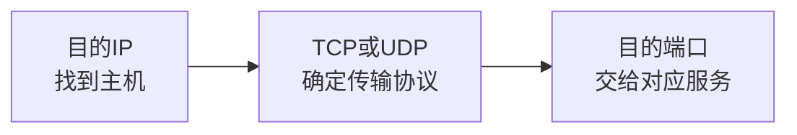

# 端口与进程通信：IP 已经找到服务器，数据为什么还不能直接交给“服务器”

> [!summary] 快速复习卡片
> **先记三层定位**：IP 地址找主机；TCP/UDP 决定传输服务；端口号继续区分这台主机上的网络服务/通信端点。
> **端口不是物理插孔**：它是传输层使用的逻辑编号，TCP 和 UDP 各有自己的 0～65535 端口号空间。
> **典型默认端口**：HTTP 80、HTTPS 443、DNS 53、SMTP 25 等；“默认”是约定，不等于服务绝对不能改端口。
> **易错点**：TCP 53 和 UDP 53 是不同传输协议下的端口语境，不能只看数字 53 就忽略 TCP/UDP。

## 继续上一站：数据到了服务器 S，可服务器上同时跑着很多程序

上一站 [[TCP与UDP对比]] 已经解决了：

> 应用到底想使用 TCP 这种可靠有序字节流，还是 UDP 这种简单数据报服务？

现在假设服务器 S 的 IP 是：

`203.0.113.10`

这台服务器同时运行：

- Web 服务；
- DNS 服务；
- 邮件服务；
- SSH 服务。

网络层只知道：

> **把这个 IP 分组送到 `203.0.113.10`。**

但分组真正到达操作系统以后，还必须回答：

> **到底交给哪个网络服务？**

如果没有额外编号，四个程序都在同一台主机上，系统就无法只凭 IP 把数据分给正确程序。

于是传输层需要**端口号**。

## 端口可以先理解成“这台主机里的收件窗口编号”

同一个办公楼地址可以找到一栋楼，但楼里可能有很多窗口。

IP 类似“楼的地址”；端口号继续告诉系统“送到哪个窗口”。

例如浏览器访问：

`203.0.113.10:443`

如果使用 TCP，可以把这次定位拆成：

- `203.0.113.10`：找到服务器 S；
- TCP：使用 TCP 这种传输方式；
- 443：把通信交给监听 TCP 443 的服务端通信端点。

所以最重要的一句话是：

> **IP 找主机，端口找主机里的服务/通信端点。**

## 为什么端口不是“服务器后面的网线接口”

“端口”这个词在计算机里很容易混。

交换机也有物理端口，例如 1 号口、2 号口；服务器网卡也有物理接口。

但 TCP/UDP 的 80、443、53 不是这些物理插孔。

它们是操作系统和传输层使用的**逻辑编号**。

所以看到：

- 交换机端口 → 物理/链路连接语境；
- TCP/UDP 端口号 → 传输层进程通信语境。

不要因为中文都叫“端口”就混在一起。

## 为什么 TCP 和 UDP 都有 53 号端口

TCP 和 UDP 是两个不同的传输协议，各自有 16 位端口号字段。

因此可以同时存在：

- UDP 53；
- TCP 53。

它们数字一样，不代表是“同一个端口连接”。

DNS 就是一个很好例子：常见查询大量使用 UDP 53，但特定场景也可以使用 TCP 53。

所以完整识别最好是：

> **传输协议 + 端口号**

而不是只记一个数字。

## 为什么服务器常用“固定默认端口”，客户端却不必一直固定

如果 Web 服务每次启动都随机选择一个完全未知端口，客户端就很难知道该连哪里。

所以常见服务有约定的默认端口，例如：

| 应用协议 | 常见默认端口 |
| --- | ---: |
| HTTP | TCP 80 |
| HTTPS | TCP 443 |
| DNS | UDP/TCP 53 |
| SMTP | TCP 25 |

服务端使用这些约定端口，客户端就容易找到它。

而客户端发起连接时，操作系统通常会选择一个临时源端口，用来区分本机同时存在的不同通信。

当前只需要形成这个直觉，不展开 socket 五元组等工程细节。

## 默认端口为什么不是“写死在协议里绝对不能改”

“HTTPS 默认 443”表示标准约定和常见使用方式。

管理员完全可以把某个 Web 服务改到其他端口，例如 8443。

所以考试题里看到“HTTP 默认端口”可以答 80，但现实判断不能反过来说：

> “看到 443 就一定 100% 是 HTTPS。”

端口号是标识和约定，不是自动证明应用内容的魔法标签。

## 到这里，传输层这一阶段已经解决什么

从 [[TCP与UDP对比]] 到这里，我们已经回答：

1. 数据到目标主机后，用什么传输服务？——TCP 或 UDP；
2. 同一台主机跑很多应用，交给哪个？——看端口。

于是数据现在终于能到达具体的网络服务。

接下来进入应用层，不再问“怎么把数据送到程序”，而开始问：

> **浏览网页、查域名、自动拿 IP、传文件、发邮件，这些程序之间到底约定了什么协议和默认端口？**

这就是下一站 [[应用层协议功能与端口识别]]。

## 一句话总结

**IP 找到哪台主机，TCP/UDP 决定怎么传，端口号再把数据交给这台主机上的正确服务。**

## 下一站

**上一站：[[TCP与UDP对比]]**  
**主下一站：[[应用层协议功能与端口识别]]**

为什么继续：传输层已经把数据交给具体服务，下一阶段开始学习**这些服务本身用什么应用协议说话**。
