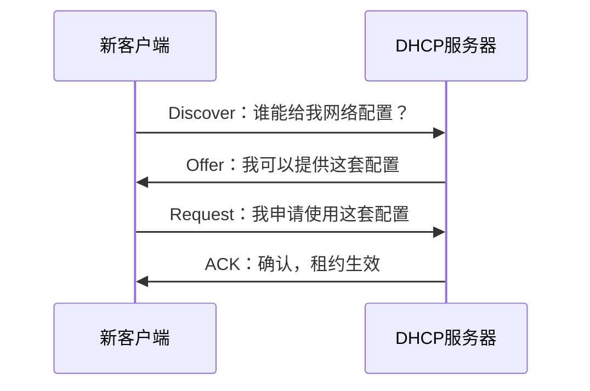

# DHCP 自动地址配置：一台刚接入网络、连自己 IP 都不知道的电脑，怎么开始联网

> [!summary] 快速复习卡片
> **DHCP 解决什么**：自动给客户端提供 IP、子网掩码、默认网关、DNS 等网络参数。
> **基础流程 DORA**：Discover → Offer → Request → ACK，也就是发现 → 提供 → 请求 → 确认。
> **常见端口**：服务器 UDP 67，客户端 UDP 68。
> **易错点**：DHCP 是“发网络配置”，DNS 是“域名 → IP”；DHCP 给你的 DNS 服务器地址，不等于 DHCP 自己负责域名解析。

## 继续总览里的那台新电脑

上一站 [[应用层协议功能与端口识别]] 中，一台新笔记本刚连接公司网络。

现在先假设它没有手工配置任何网络参数。

它甚至还不知道：

- 自己应该使用哪个 IP；
- 本地网络多大，子网掩码是多少；
- 目标不在本地时应该把数据交给哪个默认网关；
- 以后查域名应该问哪个 DNS 服务器。

如果这些信息都靠管理员一台一台手工填写，设备一多就会出现：

- IP 配重复；
- 网关或 DNS 改了要逐台修改；
- 临时设备来了又走，地址不好回收。

所以网络需要一个自动配置机制：**DHCP**。

## 最麻烦的地方：客户端连 DHCP 服务器地址都不知道

这正是 DHCP 最值得理解的地方。

一台刚接入网络的客户端连自己的正常 IP 配置都还没有，更不可能先假设它已经知道“DHCP 服务器具体在哪”。

所以第一步不是精准点名服务器，而是先在当前可达范围里问：

> **“有没有 DHCP 服务器能给我配置？”**

这就是 DORA 的第一步 Discover。

## DORA 四步跟着一次申请走

### 1. Discover：我需要配置，谁能帮我

客户端发出 DHCP Discover。

它的目的不是选定一个具体地址，而是先发现可用 DHCP 服务。

### 2. Offer：我可以给你这一套

DHCP 服务器收到发现请求后，可以返回 Offer，提出一套可用配置，例如：

- IP：`192.168.10.100`；
- 掩码：`255.255.255.0`；
- 网关：`192.168.10.1`；
- DNS：`192.168.10.53`；
- 租约时间等。

这一步只是“提供方案”。

### 3. Request：我选择使用这套配置

客户端再发送 Request，表示自己接受并请求使用相应配置。

### 4. ACK：可以，这份租约正式给你

服务器返回 ACK，确认配置可以生效。

所以 DORA 不应该只背四个英语单词，而应该记成一个完整协商：

> **先找人 → 对方给方案 → 我正式申请 → 对方确认。**

## 为什么叫“租约”，而不是把这个 IP 永久送给你

DHCP 地址通常不是永久归某台临时设备所有，而是在一定期限内分配使用。

这样设备离开网络以后，地址以后还有机会被重新利用。

所以 DHCP 很适合大量动态接入的终端。

当前只理解“地址按租约管理”，不展开续租时序和服务器数据库细节。

## 为什么客户端和服务器用 68/67

考试常把 DHCP 和端口一起考：

- DHCP 服务器：UDP 67；
- DHCP 客户端：UDP 68。

这里不要把 67/68 当成两个完全不同协议，只要知道它们是 DHCP 客户端/服务器常见端口约定。

## DHCP 给了 DNS 地址，但它自己不会替你查域名

假设 DHCP 给客户端下发：

> DNS 服务器 = `192.168.10.53`

DHCP 做到这里只是在告诉客户端：

> **“以后需要解析域名时，可以去问这个 DNS 服务器。”**

真正的域名解析仍然是 DNS 的工作。

这就是为什么学习顺序是：

> **DHCP 先让主机有联网参数 → DNS 再把用户输入的名字变成 IP。**

## 这一篇解决了什么，还剩什么没解决

现在新电脑已经拿到了：

- IP；
- 掩码；
- 网关；
- DNS 服务器地址。

它已经具备正常联网的基本配置。

接下来用户打开浏览器输入：

`www.example.com`

但前面网络层一直使用的是 IP 地址。

新的问题是：

> **浏览器手里只有一个人类容易记的域名，服务器 IP 从哪里来？**

下一站 [[DNS域名解析]] 就解决这个问题。

## 一句话总结

**DHCP 让一台“什么网络参数都还不知道”的新主机自动获得联网配置；DORA 就是发现服务、获得方案、提出申请、收到确认。**

## 下一站

**上一站：[[应用层协议功能与端口识别]]**  
**主下一站：[[DNS域名解析]]**

为什么继续：主机现在已经能联网，也知道该去问哪个 DNS 服务器，但用户输入的是**域名而不是 IP**。下一站把名字转换成网络层能使用的地址。
