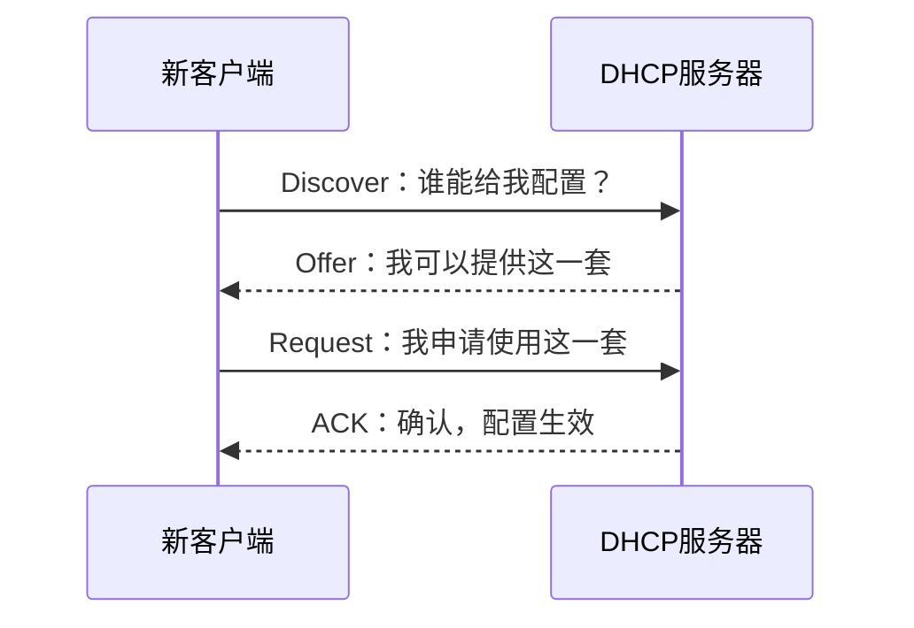

# DHCP 自动地址配置：电脑刚接上网，连自己的 IP 都不知道怎么办

> [!summary] 快速复习卡片
> **DHCP 解决什么**：自动给客户端提供 IP、子网掩码、默认网关、DNS 等网络参数。
> **DORA**：Discover → Offer → Request → ACK，也就是发现 → 提供 → 请求 → 确认。
> **端口**：服务器 UDP 67，客户端 UDP 68。
> **易错点**：DHCP 是“发网络配置”；DNS 是“域名 → IP”。DHCP 可以告诉你 DNS 服务器地址，但不负责域名解析。
> **减负**：会跟住首次获取配置即可，不展开续租时序和 DHCP 服务器实现。

## 先看问题：一台新电脑连“该问谁”都不知道

假设一台电脑刚接入公司网络，又没有手工配置。

它连这些基本信息都没有：

- 自己用哪个 IP；
- 子网掩码是多少；
- 默认网关是谁；
- DNS 服务器是谁。

如果每台设备都靠管理员手填，设备一多就容易配错、配重复，也不好回收地址。

所以才需要 **DHCP**：让主机自动获得一套可用的网络配置。

## 最关键的一点：客户端一开始不知道 DHCP 服务器在哪里

既然连正常 IP 配置都没有，客户端当然不能先假设自己知道 DHCP 服务器的具体地址。

所以它先发出 **Discover**，大意就是：

> **“这里有没有 DHCP 服务器能给我配置？”**

服务器找到客户端后，再完成后面的协商。

把 DORA 记成一句大白话就行：

> **先找人 → 对方给方案 → 我正式申请 → 对方确认。**

服务器提供的配置通常可以包含 IP、掩码、默认网关、DNS 服务器地址等。

## 为什么地址叫“租约”

DHCP 分配的地址通常不是永久送给某台临时设备，而是在一定期限内给它使用。

设备离开以后，这个地址还可以重新分配给别的设备。

当前记住“动态分配、按租约管理”即可。

## 一句话收口

**DHCP 解决的是“新主机连正常网络参数都没有”的问题；DORA 就是发现服务、拿到方案、提出申请、收到确认。**

## 上一站

[[应用层协议功能与端口识别]]：上一站只是把常见业务和协议放到正确位置，本篇真正跟一遍“自动获得网络配置”是怎么发生的。

## 下一站

[[DNS域名解析]]：主机现在已经有 IP、网关，也知道 DNS 服务器是谁；下一步用户输入的却是域名，所以要继续解决：**域名怎样变成网络层真正使用的 IP 地址？**
