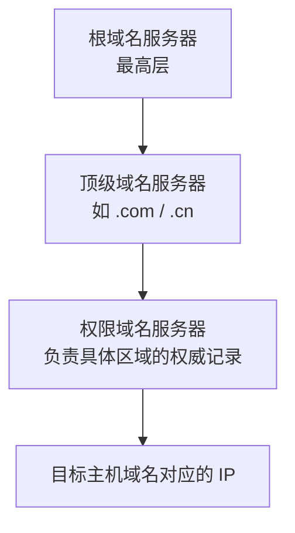

# DNS 域名解析：浏览器为什么要先把域名变成服务器 IP

> [!summary]- 快速复习卡片（学完再看）
> **作用/定位**：把便于人记忆的域名解析成网络层真正用于寻址的 IP 地址。
> **核心层级**：根域名服务器 → 顶级域名服务器 → 权限域名服务器；最高层是**根域名服务器**。
> **查询方式**：递归 = “你帮我查到底再给最终结果”；迭代 = “我告诉你下一步该问谁，你自己继续问”。
> **题干信号 → 第一反应**：域名/主机名/53 → DNS；问最高层 → 根服务器；问某个区域最终权威记录 → 权限服务器。
> **易错点**：DNS 是域名 → IP，不负责 IP → MAC；顶级域名服务器不是 DNS 的最高层。

## 先直接回答：为什么浏览器不能直接拿域名去路由

上一站 [[DHCP自动地址配置]] 已经让主机拿到了 IP、默认网关、DNS 服务器等网络参数。

用户更喜欢输入 `www.example.com` 这样的名字，但网络层路由真正依据的是 **IP 地址**。

因此访问网站前必须先完成：

> **人类容易记的域名 → 网络能寻址的 IP 地址。**

这个转换就是 DNS（Domain Name System，域名系统）的核心作用。

## 打开网站时 DNS 在哪一步

可以先用一条最小链理解：

1. 用户输入域名；
2. DNS 查询得到对应服务器 IP；
3. 网络层根据这个 IP 找到服务器；
4. 传输层连接到相应服务端口；
5. HTTP/HTTPS 才开始真正交换 Web 数据。

所以：

> **DNS 是“先找到服务器在哪里”，HTTP/HTTPS 是“找到以后交换什么 Web 业务”。**

## DNS 为什么要分很多层

Internet 上的域名数量太多，不可能让一台服务器保存并直接回答全球所有域名。

所以 DNS 把管理范围分层。做题先记住这条关系：

三层分别干什么：

| 服务器 | 最小理解 |
| --- | --- |
| **根域名服务器** | DNS 层次的最高层；通常告诉查询者应该继续找哪个顶级域名服务器 |
| **顶级域名服务器** | 管理某个顶级域下的下一层信息，例如 `.com`、`.cn` |
| **权限域名服务器** | 对自己负责的区域保存权威记录，能够给出该区域主机域名对应的 IP 等信息 |

所以旧题如果说：

> “顶级域名服务器是最高层次的域名服务器”

应判断为**错误**，因为最高层是根域名服务器。

## 本地域名服务器和缓存又是什么

主机通常不会自己从根服务器一路问到底，而是把查询交给配置好的**本地域名服务器**。

本地域名服务器如果以前查过相同或相关记录，可能直接从**缓存**中返回结果；没有缓存命中时，再继续向其他 DNS 服务器查询。

因此缓存的作用很直观：

> **最近查过的结果先保存一段时间，下次不必重新走完整层级。**

缓存不是“另一个最高层 DNS 服务器”，只是减少重复查询。

## 递归查询和迭代查询到底差在哪

这两个词最容易只背定义。直接看“谁负责继续往下问”。

### 递归查询：你帮我查到底

A 问 B：

> “请把最终答案查出来再告诉我。”

接下来继续询问其他服务器的责任主要落在 B 这一侧。

所以递归可以记成：

> **提问者等最终答案。**

### 迭代查询：告诉我下一步问谁

A 问 B，B 不一定给最终 IP，而可能回答：

> “这个我不负责，你下一步去问 C。”

然后 A 再去问 C。

所以迭代可以记成：

> **每次拿到下一站线索，查询者自己继续问。**

### 为什么根服务器通常不适合替所有人递归查到底

根服务器面向全球大量 DNS 查询。如果每次都替查询者一路追到最终权限服务器，会承担更多状态和查询工作。

因此基础题中看到“根服务器替客户端递归查到底”这类描述，应警惕它会增加根服务器负担；实际 DNS 体系更常见的是层级转介和缓存配合。

> [!note] 边界
> DNS 真实实现中递归、迭代的角色和配置可以更灵活；软考基础题只需先掌握“递归给最终答案、迭代给下一步线索”的识别模型，不把它背成所有服务器永远固定一种查询方式。

## 为什么 DNS 和 ARP 容易混

它们都像“把一个标识换成另一个标识”，但所在层次完全不同：

| 机制 | 输入 | 输出 | 主要语境 |
| --- | --- | --- | --- |
| DNS | 域名 | IP | 应用层名称解析 |
| ARP | 当前链路 IPv4 地址 | MAC | 二层实际交付 |

考试看到“域名/主机名”就优先想 DNS；看到“IP 已知，要找 MAC”才想 ARP。

## 一句话总结

**DNS 负责把域名解析成 IP；层级上根服务器最高，再到顶级和权限服务器；递归是“帮我查到底”，迭代是“告诉我下一步问谁”。**

> [!question] 自测 1
> DNS 层次中，根域名服务器和顶级域名服务器谁处在更高层？

> [!answer]- 第 1 题答案与解析
> **答案**：根域名服务器。
> **解析**：根服务器位于 DNS 层次最高处，顶级域名服务器位于其下一层。

> [!question] 自测 2
> 某 DNS 服务器没有直接返回最终 IP，而是告诉查询者“下一步去问这台服务器”。这更符合递归查询还是迭代查询？

> [!answer]- 第 2 题答案与解析
> **答案**：迭代查询。
> **解析**：迭代的关键是返回下一步线索，由查询者继续询问；递归则由被询问方继续查并最终返回答案。

## 上一站

[[DHCP自动地址配置]]：主机先获得 IP、掩码、网关和 DNS 服务器等参数，才有条件把域名查询交给 DNS。

## 下一站

[[HTTP与HTTPS]]：DNS 已经把网站名字变成服务器 IP，下一步看浏览器找到服务器以后怎样真正交换 Web 请求和响应。
