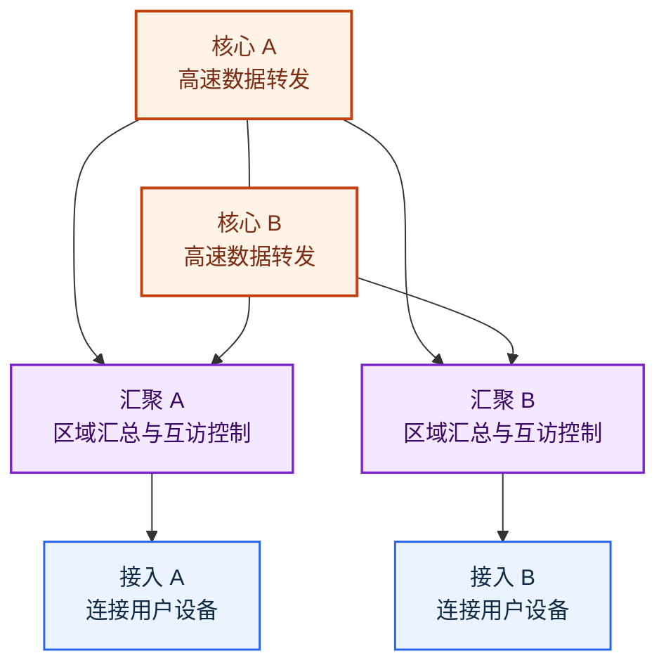

# 层次化组网与冗余设计：网络一大，为什么不能一直平铺交换机

> [!summary]- 快速复习卡片（学完再看）
> **接入层**：把用户设备接进网络。
> **汇聚层**：汇总接入区域、做互访控制，并减轻核心转发压力。
> **核心层**：提供高速数据转发。
> **分层的收益**：易扩展、故障可分级排查、维护更方便。
> **冗余的收益**：关键设备或链路故障后仍有替代路径；代价是投资和控制复杂度上升。
> **题干信号 → 第一反应**：先分清层的职责，再看是否存在单点故障和备用路径。

## 网络大了，为什么不能只堆交换机

上一站 [[网络拓扑结构]] 解决了“节点怎样连接”。但当园区网络的用户、部门和业务不断增加时，如果所有交换机都平铺互连，会出现上联关系混乱、策略重复、故障范围难定位和扩容无处下手的问题。

**层次化组网**是把设备按职责组织为核心层、汇聚层和接入层；**冗余设计**则为关键设备或链路准备替代路径。前者解决“规模大了怎样管理”，后者解决“关键点坏了怎么办”。

> [!tip] 本篇的边界
> 三层是典型的层次局域网模型，不是每个小网络都必须部署三套独立设备。规模较小时，汇聚和核心功能可以合并；题目若描述单核心、双核心或环形架构，要按题干的实际设备与链路判断。

## 三层分别负责什么：不是名字不同，而是分担不同工作

图中双核心、双上联是为了同时展示“分层”和“冗余”；它不是所有网络都必须照抄的固定物理结构。

| 层次 | 教材中的主要职责 | 为什么放在这一层 | 题干关键词 |
| --- | --- | --- | --- |
| **核心层** | 提供高速数据转发 | 承担跨区域的骨干流量，不能被大量局部交换拖慢 | 高速骨干、核心交换设备、跨区域转发 |
| **汇聚层** | 提供充足接口；与接入层实现互访控制；完成所辖接入区域的业务交换 | 汇总多个接入区域，减少直接压到核心层的转发压力 | 区域汇总、策略、互访控制、减轻核心压力 |
| **接入层** | 让用户设备接入网络 | 终端、用户和 AP 最靠近这里，接入变化不应直接扰动核心 | 用户接入、终端、接入交换机 |

### 分层带来的优点和代价

**优点**：层次局域网易于扩展；网络故障可以分级排查，因此维护更方便。新增一个接入区域时，通常先接入相应汇聚层，而不是在核心层到处增加杂乱连接。

**代价与边界**：层数和设备更多，建设成本、配置和运维复杂度也会提高。小规模网络若强行拆成三层，可能只有增加设备而没有获得相应收益。

## 分层以后，关键点坏了怎么办：冗余让备用路径接手

只分层并不能消除单点故障。若只有一台核心设备或一条关键上联，核心或链路失效仍可能使一大片接入网络中断。

| 方式 | 正常时怎么走 | 故障后怎么走 | 解决的问题 | 代价 / 风险 |
| --- | --- | --- | --- | --- |
| **备用路径** | 主路径承载业务 | 主路径或关键设备失效后，切换到备用路径 | 消除单链路或单设备故障 | 备用资源可能平时闲置；需要保护与切换机制 |
| **负载分担** | 多条路径同时承担流量 | 某一路径失效后，剩余路径继续承载 | 同时提升利用率和可靠性 | 路径与流量控制更复杂，容量需要留余量 |

教材中的双核心局域网以两台核心交换设备互联为例：可通过网关保护或负载均衡实现保护；接入区域访问核心业务时有一条以上路径可选择，因此可靠性更高，并可在业务路由转发中实现热切换。

> [!warning] 冗余链路不等于“直接多接一根线”
> 二层多链路如果形成环路，需要用 STP、LACP 等机制处理链路保护或带宽扩展；主备设备之间也需要相应保护协议。没有控制机制的冗余，可能把“单点故障”变成“环路故障”。

## 做题时按这个顺序判断

1. **题干在问哪一层？** “用户接入”找接入层；“区域汇总、互访控制”找汇聚层；“高速骨干转发”找核心层。
2. **题干在问哪种收益？** “易扩展、故障分级排查、便于维护”对应层次化；“备用路径、热切换、网关保护、负载均衡”对应冗余。
3. **题干在问什么代价？** 单核心成本低、结构简单，但有单点故障、扩展有限且端口密度要求高；双核心可靠性提高，但设备投资和冗余设计复杂度也会上升。

> [!example] 贯穿判断：一个部门网络要扩容，同时不能因一台核心交换机故障而整体中断
> 先把新增终端放在接入层，将多个接入区域汇总到汇聚层，再让核心层承担高速骨干转发；核心采用双核心或提供替代上联。这样，分层解决扩容和管理，冗余解决核心单点故障。题目若强调“成本最低”，不能直接选双核心；它的可靠性更高，但投资也更高。

## 一句话收口

**接入层连用户，汇聚层管区域，核心层跑骨干；分层让网络可扩展、可维护，冗余让关键故障后仍有路可走。**

> [!question] 自测
> 1. 某设备负责连接用户终端，它最符合哪一层的职责？
> 2. 某题干强调“区域内接入设备的业务交换、与接入层的互访控制，并减轻核心转发压力”，应选哪一层？
> 3. 为什么双核心比单核心可靠性更高，但不能简单地说“双核心总是更好”？

> [!answer]- 第 1 题答案与解析
> **答案**：接入层。
> **解析**：接入层的直接职责是让用户设备接入网络；不要因设备名称里有“交换机”就误判为核心或汇聚层。

> [!answer]- 第 2 题答案与解析
> **答案**：汇聚层。
> **解析**：区域汇总、接入层互访控制和减轻核心压力，正是教材给出的汇聚层职责。

> [!answer]- 第 3 题答案与解析
> **答案**：双核心提供网关保护、负载均衡或替代路径，核心故障时可提高连续性；但设备投资更高，冗余设计更复杂，且对核心端口密度有要求。
> **解析**：拓扑选择是可靠性、成本和管理复杂度之间的取舍，不存在脱离场景的“总是更好”。

## 上一站

[[网络拓扑结构]]：上一站说明连接形状怎样决定故障范围和替代路径；本篇进一步把大型网络按职责分层，并在关键路径上加入冗余。

## 下一站

[[网络工程规划设计实施]]：现在已经知道网络结构可以怎样组织；下一篇继续回答：一张网络怎样从需求和可行性，经过设计，最后落地运行？
