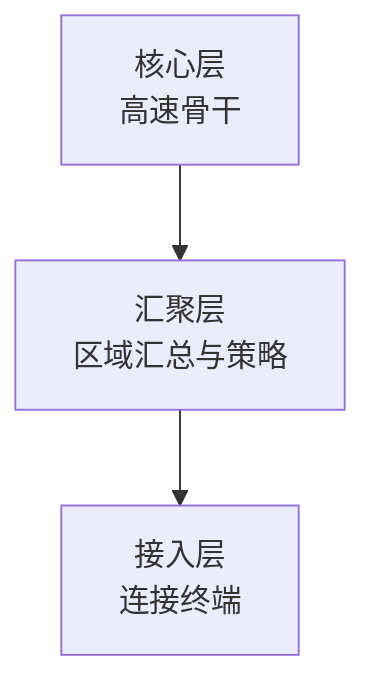

# 层次化组网与冗余设计：网络一大，为什么不能一直平铺交换机

> [!summary] 快速复习卡片
> **接入层**：最靠近用户、终端、AP。
> **汇聚层**：汇总多个接入区域，并承载部分策略。
> **核心层**：不同区域之间的高速骨干转发。
> **分层解决什么**：规模大以后职责清楚、扩展和管理更容易。
> **冗余解决什么**：关键设备或链路故障时还有替代路径。
> **易错点**：三层是常见设计模型，不代表每个小网络都必须部署三套独立设备。

## 先看问题：设备越堆越多，为什么网络会越来越难管

上一站 [[网络拓扑结构]] 只回答了“节点怎么连”。

如果一个大型园区继续把大量交换机、用户和业务全部平铺在同一层，常见问题会变成：

- 上联关系越来越乱；
- 故障影响范围难控制；
- 策略到处重复；
- 扩容时不知道新设备应该接到哪里。

于是网络开始按职责分层：

这就是常见的**接入层 → 汇聚层 → 核心层**思路。

重点不是“必须凑三层设备”，而是：

> **不同层负责不同工作，让大网络不至于越长越乱。**

小型网络完全可能把汇聚和核心功能合并。

## 分层清楚了，为什么还要冗余

如果核心设备或关键上联只有一个，再漂亮的分层也挡不住单点故障。

所以还需要冗余。

| 方式 | 正常时 | 发生故障时 |
| --- | --- | --- |
| 备用路径 | 主要走主路径 | 备用路径接班 |
| 负载分担 | 多条路径平时就一起承担流量 | 剩余路径继续承担 |

二层冗余如果形成环路，要联想到前面已经学过的 [[STP与链路聚合]]；这里不重新讲 STP。

## 一句话收口

**分层解决“网络大了怎么管”，冗余解决“关键点坏了怎么办”：接入连终端，汇聚做汇总和策略，核心跑骨干。**

## 上一站

[[网络拓扑结构]]：上一站只看连接形状，本篇进一步给大型网络里的设备分工，并处理关键节点/链路的单点故障。

## 下一站

[[网络工程规划设计实施]]：现在已经知道网络结构可以怎么设计，但真正建设时不能拿到需求就直接买设备；下一篇继续回答：**一张网络怎样从需求和可行性，经过设计，最后落地运行？**
