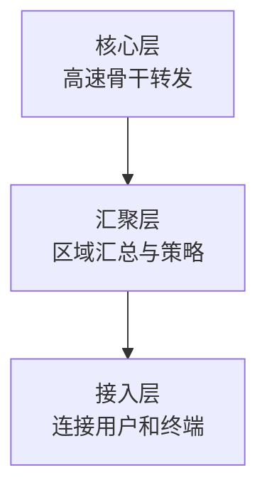

# 层次化组网与冗余设计：网络规模大了以后怎样仍然可控

> [!summary] 快速复习卡片
> **作用/定位**：承接网络拓扑，把大型园区/组织网络按职责分层，并用冗余降低关键节点和链路故障的影响。
> **核心结论**：接入层连接终端；汇聚层汇总流量并承载策略；核心层承担高速骨干转发。备用路径强调“故障时接班”，负载分担强调“正常时就共同承担流量”。
> **经典题型怎么做 / 题干怎么认**：用户/AP 接入 → 接入层；策略/区域汇总 → 汇聚层；高速骨干 → 核心层；平时主要不承担业务、故障接管 → 备用；多路同时承载 → 负载分担。
> **易错点 / 考试重点**：三层结构是常见模型，不是所有小网络都必须机械部署三层；二层冗余形成环路时要联想 STP。

## 先直接回答：为什么网络规模大了以后不能一直“平铺交换机”

上一站 [[网络拓扑结构]] 已经知道不同连接形态会影响故障和扩展。

如果网络规模继续扩大，还把大量交换设备、用户和业务平铺在同一层次，会出现：

- 上联关系混乱；
- 故障影响范围难控制；
- 策略到处重复配置；
- 扩容时很难判断新设备应该接在哪里。

所以大型网络常把职责分开：

这不是为了“必须凑三层设备”，而是为了让不同层只承担适合自己的职责。

## 三层分别解决什么

- **接入层**：最靠近用户、终端、AP 等接入对象；
- **汇聚层**：把多个接入区域的流量汇总，并承担一定策略和边界控制；
- **核心层**：负责不同区域之间的高速骨干转发，重点追求稳定和高吞吐。

小型网络可以把核心/汇聚功能合并，所以不要机械认为“三层模型 = 一定三类独立物理设备”。

## 为什么分层以后还要冗余

即使分层很清楚，只要关键上联或核心设备只有一个，一旦故障仍可能造成大面积中断。

因此还会设计冗余路径或设备。

| 方式 | 正常时 | 故障时 |
| --- | --- | --- |
| 备用路径 | 备用链路可能不承载主要业务 | 主路径故障后接管 |
| 负载分担 | 多条路径共同承担业务 | 其余路径继续承载并重新分担 |

二层冗余若形成环路要联想 [[STP与链路聚合]]；这里不重复学习 STP 选举细节。

## 为什么下一站是网络工程规划、设计与实施

现在已经能理解“一张网络在结构上应该怎样组织”，但真正建设网络还不能直接开始买设备、接线。

工程上还要先回答：

- 需求到底是什么、项目是否可行；
- 具体方案怎样设计；
- 方案怎样落地、调试、试运行和切换。

所以最后一张卡用“规划 → 设计 → 实施”把网络基础章收口。

## 一句话总结

**接入连终端，汇聚做汇总和策略，核心跑骨干；分层解决规模，冗余降低单点故障。**

## 下一站

**上一站：[[网络拓扑结构]]**  
**主下一站：[[网络工程规划设计实施]]**

为什么继续学它：网络结构已经会判断，最后要看一张网络怎样从需求和可行性，经过设计，真正实施成可运行系统。
