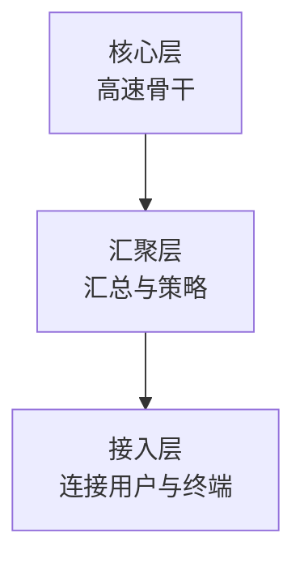

# 层次化组网与冗余设计：网络规模大了以后怎样仍然可控

> [!summary] 快速复习卡片
> **作用/定位**：大型园区/组织网络不再平铺连接，而是通过分层和冗余控制规模、故障影响与扩展成本。
> **核心结论**：接入层连接终端；汇聚层汇总流量并承载策略；核心层承担高速骨干转发。备用路径强调“故障时接班”，负载分担强调“正常时就一起承担流量”。
> **经典题型怎么做 / 题干怎么认**：用户/AP 接入 → 接入层；策略/区域汇总 → 汇聚层；高速骨干 → 核心层；平时闲置、故障接管 → 备用；多路同时承载 → 负载分担。
> **易错点 / 考试重点**：三层结构是常见模型，不是所有小网络都必须机械放三层；有冗余链路还要考虑二层环路，继续联想 STP。

## 为什么要分层

终端越来越多时，如果所有交换设备都平铺互联，链路、广播、路由和故障影响都会难以控制。层次化设计把职责分开：

小型网络可以把核心/汇聚折叠，不要把三层当成物理设备数量的硬规定。

## 冗余为什么有两种常见目标

| 方式 | 正常时 | 故障时 |
| --- | --- | --- |
| 备用路径 | 备用链路可能不承载主要业务 | 主路径故障后接管 |
| 负载分担 | 多条路径共同承担业务 | 其余路径继续承载并重新分担 |

冗余的价值是降低单点故障，但二层冗余若形成环路又会产生广播风暴，因此还要结合 [[STP与链路聚合]]。

## 一句话总结

**接入连终端，汇聚做汇总和策略，核心跑骨干；备用是“出事再上”，负载分担是“平时一起上”。**

## 下一站

- 专题入口：[[网络拓扑、组网与网络工程]]。
- 二层冗余：[[STP与链路聚合]]。
