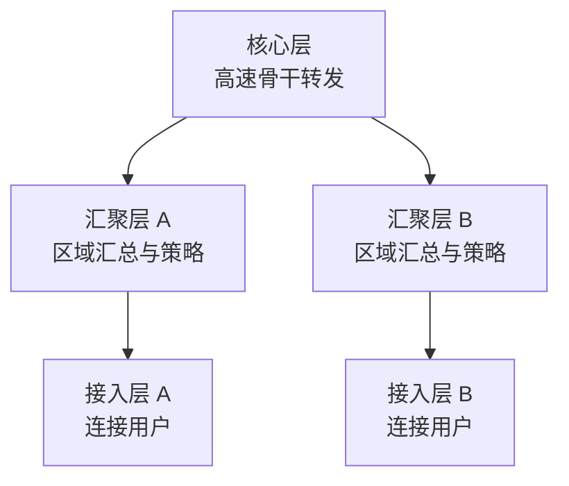

# 层次化组网与冗余设计：网络一大，为什么不能一直平铺交换机

> [!summary]- 快速复习卡片（学完再看）
> **接入层**：把用户设备接进网络，并承担贴近用户的接入管理与信息收集。
> **汇聚层**：汇总多个接入区域，做路由汇总、访问控制、策略处理等区域级工作。
> **核心层**：承担高速骨干转发，设计重点是高吞吐、低额外处理、可靠冗余。
> **题干信号 → 第一反应**：用户/MAC认证 → 接入；区域汇总/策略/协议转换 → 汇聚；高速骨干 → 核心。
> **易错点**：基础题里“核心层负责大量包过滤、策略路由”通常是错项；这些复杂处理会影响核心高速转发。
> **冗余**：关键链路或设备故障后仍有替代路径，但必须配合 STP、链路聚合或相应保护机制，不能只靠“多接一根线”。

## 网络大了，为什么不能只堆交换机

上一站 [[网络拓扑结构]] 解决了“节点怎样连接”。但当园区网络的用户、部门和业务不断增加时，如果所有交换机都平铺互连，会出现：

- 上联关系混乱；
- 策略到处重复；
- 故障范围难定位；
- 扩容不知道应该接到哪里。

所以大型局域网通常采用**层次化组网**：把设备按职责分成接入层、汇聚层和核心层。

而分层以后仍可能存在单点故障，所以关键设备、链路还需要做**冗余设计**。

> [!tip] 边界
> 三层是典型设计模型，不是每个小网络都必须部署三套独立设备。规模较小时，核心和汇聚功能可以合并；考试按题干职责判断，不按设备名字机械判断。

## 三层不是三个名字，而是三种不同工作

### 接入层：离用户最近

接入层直接面对 PC、终端、AP 等用户设备。

所以它常见的工作包括：

- 让用户设备接入网络；
- MAC 地址认证等接入控制；
- 收集用户 IP、MAC、访问记录等信息；
- 提供本地网段需要的接入带宽。

做题看到“用户终端、接入交换机、MAC 认证、用户信息收集”，优先想**接入层**。

### 汇聚层：把多个接入区域收拢起来

如果每个接入网段都直接把大量路由和策略扔给核心层，核心会越来越复杂。

因此汇聚层负责把多个接入区域汇总，并承接更适合在区域边界完成的工作，例如：

- 路由汇总；
- 访问控制和流量控制；
- 策略处理；
- 某些协议转换；
- 隐藏接入层细节，减轻核心负担。

所以看到“路由汇总、区域策略、协议转换、接入区互访控制”，优先想**汇聚层**。

### 核心层：最重要的是把骨干流量尽快转发过去

核心层连接各个汇聚区域，是整个网络的高速骨干。

它最重要的目标不是“功能越多越好”，而是：

> **稳定、可靠、高速地转发大量骨干流量。**

这就是历年题里容易出的反向判断：

> “核心层设备负责大量数据包过滤、复杂策略路由”

在典型三层设计语境下通常是不合适的。

原因不是核心设备“做不到”，而是：

> **包过滤、复杂策略判断会增加每个分组的处理工作，可能降低核心层最需要保证的高速转发能力。**

因此这些工作更常下沉到汇聚层等合适边界，核心层尽量保持简单、高速。

可以直接记成：

> **接入管用户，汇聚管区域和策略，核心管高速骨干。**

> [!warning] 不要背成现实世界绝对规则
> 现代设备完全可能在核心承担更多能力；软考这里考的是典型层次化网络设计原则。判断题要先看题目是否处在这个经典三层设计语境。

## 为什么还要冗余：分层解决管理，冗余解决单点故障

如果只有一台核心交换设备或一条关键上联，那么它一旦失效，大片网络仍可能中断。

所以关键位置会准备备用设备或备用路径。

| 方式 | 正常时 | 故障后 | 主要收益 |
| --- | --- | --- | --- |
| 备用路径 | 主路径工作 | 切到备用路径 | 消除单链路/单设备故障 |
| 负载分担 | 多条路径共同工作 | 剩余路径继续承载 | 同时提高利用率和可靠性 |

代价也很明确：设备投资增加，控制协议和运维复杂度也会上升。

## 冗余链路为什么不能只是“多接一根线”

二层网络如果随意增加并行链路，可能形成二层环路，广播帧不断循环。

因此冗余链路必须和相应控制机制配合：

- **STP**：逻辑阻塞冗余路径，避免二层环路；
- **链路聚合**：把多条物理链路作为一个逻辑链路使用；
- 其他主备/网关保护机制：负责设备或路径故障后的切换。

所以：

> **冗余是设计目标，STP、链路聚合等是实现和控制冗余的方法。**

## 做题按这三个问题判断

1. **离谁最近？** 用户终端 → 接入层。
2. **是在汇总和管策略吗？** 路由汇总、访问控制、协议转换 → 汇聚层。
3. **是在跑高速骨干吗？** 大量跨区域流量、高速转发、冗余核心 → 核心层。

如果题目说：

> “为了充分利用核心交换机功能，应把大量复杂策略路由和数据包过滤都放在核心层。”

基础题应警惕：这会与“核心层尽量高速、简单转发”的设计原则冲突。

## 一句话收口

**接入层连用户，汇聚层汇总区域并承担策略，核心层尽量简单高速地跑骨干；分层解决扩展和管理，冗余解决关键设备或链路故障。**

1. 某层负责用户 MAC 认证、收集终端 IP/MAC 信息，最符合哪一层？

> [!answer]- 第 1 题答案与解析
> **答案**：接入层。
> **解析**：这些工作直接贴近用户和终端接入。

2. “路由汇总、访问控制、协议转换”更符合核心层还是汇聚层？

> [!answer]- 第 2 题答案与解析
> **答案**：汇聚层。
> **解析**：汇聚层负责收拢接入区域，并承担区域边界上的策略和汇总工作。

3. 为什么典型三层设计中，不建议让核心层承担大量复杂包过滤和策略路由？

> [!answer]- 第 3 题答案与解析
> **答案**：因为核心层首要目标是高速、稳定地转发骨干流量；复杂策略处理会增加每个分组的处理负担，更适合放在汇聚层等边界位置。
> **解析**：这不是说核心设备技术上绝对做不到，而是典型层次化设计的职责取舍。

## 上一站

[[网络拓扑结构]]：上一站说明连接形状怎样影响故障范围和替代路径；本篇进一步把大型网络按职责分层，并在关键位置加入冗余。

## 下一站

[[网络工程规划设计实施]]：现在已经知道网络结构可以怎样组织；下一篇继续回答：一张网络怎样从需求和可行性，经过设计，最后落地运行？
