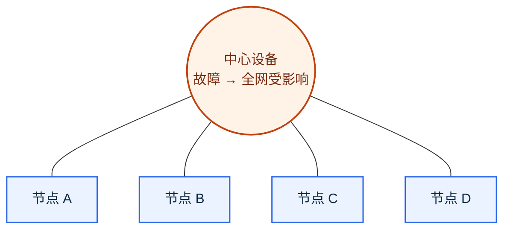
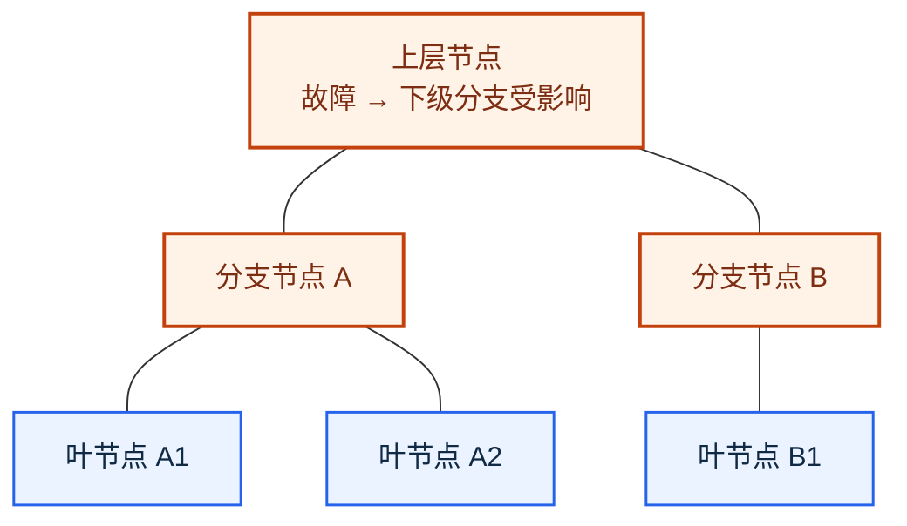
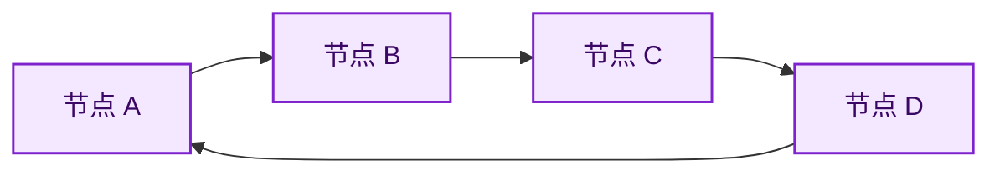
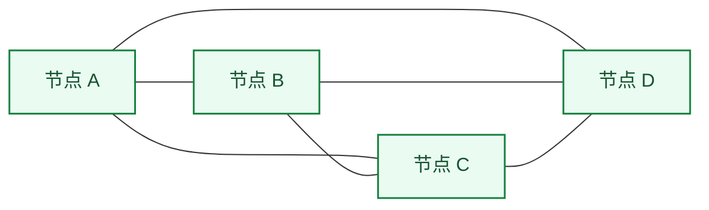

# 网络拓扑结构：设备怎么连，为什么会直接影响故障和扩展

> [!summary]- 快速复习卡片（学完再看）
> **总线型**：共用主干；主干故障影响全部节点。
> **星型**：都经过中心；外围节点通信最多两跳，中心是单点故障。
> **树型**：逐层分支；好扩展，但上层节点或链路故障影响下级。
> **环型**：首尾成环；经典单环只有一条通路，扩展不便。
> **网状**：多路径换可靠性；布线、建设和管理成本最高。
> **题干信号 → 第一反应**：先找关键点，再看有无替代路径，最后比较扩展和成本。

## 同样几台设备，连接方式一变，故障范围就完全不同

上一站 [[5G网络切片]] 已经结束无线和移动通信主线。真正开始建设网络时，先要决定设备和链路怎样组织。

这种连接关系就是**网络拓扑**。它决定了某个节点或链路故障时谁会受影响、是否可以绕行，以及网络扩大后是否仍容易管理。

本篇讨论的是教材中的**经典拓扑模型**。现实网络可能通过双中心、双环或冗余链路改善单点故障；做题时要先按题干给出的结构判断，不能把“有冗余的现实方案”自动套到经典模型上。

> [!tip] 看图的颜色
> 蓝色表示普通节点；橙色表示公共主干、中心或上层关键节点；紫色表示闭合环；绿色表示存在多条互连路径。颜色只帮助记忆，判断仍以连接关系和文字标签为准。

## 五种结构：先看形状，再看取舍

### 总线型：所有节点共用一条主干

![[05_画图素材/Excalidraw/原子笔记插图/总线型拓扑结构.svg|1000]]

**它是什么**：每个节点都接到同一根通信总线，信息传输都要经过这条公共主干。

**优点**：结构较直接，所需连接较少；可作为理解“共享通信介质”的基础模型。

**缺点与故障范围**：总线的负载能力有限；它既是通信枢纽也是关键点，主干故障会影响总线上每个节点的通信。

**题干识别**：出现“共用一条主干”“所有节点接在同一总线上”，先想到总线型，再检查主干负载或主干故障。

### 星型：所有外围节点都经过中心

**它是什么**：每个节点都通过连接线接到中心节点；两个外围节点通信时必须先到中心节点。

**优点**：教材强调任意两个节点通信最多经过两步，因此传输较快；结构简单、建网容易，也便于控制和管理。某一条外围支线或外围节点故障，通常不会切断其他外围节点的连接。

**缺点与故障范围**：中心节点是单点故障。中心故障会导致全网瘫痪；教材还指出其网络共享能力较差。

**题干识别**：看到“中心交换设备”“所有终端连接中心”“任意两终端最多两跳”，选择星型；题干问全网故障原因时，优先找中心设备。

### 树型：从上到下逐层分支

**它是什么**：树型又称分级的集中式网络，节点按层次向下分支；任意两个节点之间不形成回路。

**优点**：成本较低、结构简单；每条链路支持双向传输，节点扩充方便灵活，也便于查找链路路径。

**缺点与故障范围**：叶节点及其连接链路之外，其他工作站或链路发生故障都可能影响整个网络系统的正常运行。换句话说，越靠上的节点和链路，影响范围通常越大。

**题干识别**：看到“分级”“层次”“根—分支—叶节点”“不产生回路”，选择树型；问扩展能力或上层故障影响范围时，优先想到它。

### 环型：节点首尾相连成闭环

**它是什么**：各节点通过首尾相连的通信链路组成一个闭合环。教材的经典模型中，各节点地位相同，信息按固定方向单向流动，两个节点之间只有一条通路。

**优点**：传输方向和路径明确，经典模型中没有信道选择问题。

**缺点与故障范围**：任一节点故障都可能导致物理瘫痪；闭合结构不便扩充，系统响应延时较长，传输效率相对较低。

> [!warning] 不要把“成环”直接等同于“可靠”
> 这里说的是经典单环。只有题干明确给出双环、保护倒换或自愈机制时，才能据此判断存在故障后的替代路径。

**题干识别**：看到“首尾相连”“固定方向”“单向流动”“只有一条通路”，选择环型；看到“任一节点故障导致中断”，应联想到经典单环。

### 网状：用多条路径换取更高可靠性

**它是什么**：教材中的网状结构指任意节点之间都存在通信链路；图中的多条边表示可选路径。

**优点**：任一节点故障不会影响其他节点之间的通信，可靠性高。

**缺点与故障范围**：布线烦琐、建设成本高，控制和管理方法也更复杂。

**题干识别**：看到“多条替代路径”“局部节点故障仍可通信”“高可靠性但成本高”，选择网状。

## 一张表做题：不要问“谁最好”，要问“题目在比较什么”

| 拓扑 | 关键连接关系 | 优点 | 缺点 / 关键故障点 | 题干信号 |
| --- | --- | --- | --- | --- |
| 总线型 | 共用一条主干 | 连接较少、结构直接 | 主干负载有限；主干故障影响全部节点 | 共享主干、总线是枢纽 |
| 星型 | 所有节点连接中心 | 最多两跳；易控制、易管理 | 中心故障导致全网受影响 | 中心设备、外围节点 |
| 树型 | 根节点向下分支 | 易扩展、易查路径 | 上层节点或链路故障影响下级 | 分级、层次、叶节点 |
| 环型 | 首尾闭合、经典模型单向传输 | 路径规则明确 | 单环仅一条通路；扩容不便 | 固定方向、首尾相连 |
| 网状 | 多条相互连接的路径 | 冗余强、可靠性高 | 布线、建设和管理复杂 | 替代路径、高可靠性 |

## 考试视角：按这三个问题判断

1. **结构长什么样？** 共享主干、中心辐射、逐层分支、首尾闭合、多路径互连，分别对应五种拓扑。
2. **故障后谁受影响？** 找公共主干、中心节点、上层节点或唯一通路；再看题干有没有明确备用路径。
3. **题目在取舍什么？** 题干强调扩展和层次，偏树型；强调中心管理和两跳，偏星型；强调多路径可靠性，偏网状；强调成本、布线或控制复杂度时，要反向排除网状。

> [!example] 做题动作：星型“最多两跳”怎么数
> 终端 A 与终端 B 通信的路径是 `A → 中心设备 → B`，经过两段链路，因此是**最多两跳**。这里的“跳”数的是链路转发路径，不是中间节点数量。

## 一句话收口

**网络拓扑不是背五个名称，而是从连接形状推出关键故障点、替代路径、扩展能力和建设成本。**

1. 某网络中所有终端都连接到一台中心交换设备；两个终端通信最多经过两段链路。它是什么拓扑？最大风险是什么？

> [!answer]- 第 1 题答案与解析
> **答案**：星型。中心交换设备是关键点；中心故障会影响全网通信。
> **解析**：中心辐射和“最多两跳”都是星型的直接题干信号。

2. 某网络要求一个节点故障后，其他节点之间仍能通信；代价是布线和控制复杂。应想到哪种拓扑？

> [!answer]- 第 2 题答案与解析
> **答案**：网状结构。
> **解析**：替代路径带来可靠性，也带来更多链路和更高的建设、管理成本。

## 上一站

[[5G网络切片]]：无线与移动通信已经学完，本篇开始进入网络工程，先从最直观的“设备和链路怎样连接”建立工程视角。

## 下一站

[[层次化组网与冗余设计]]：本篇已说明“连接形状”如何影响故障与扩展；下一篇继续回答大型网络怎样按接入、汇聚、核心分工，并为关键路径配置冗余。
