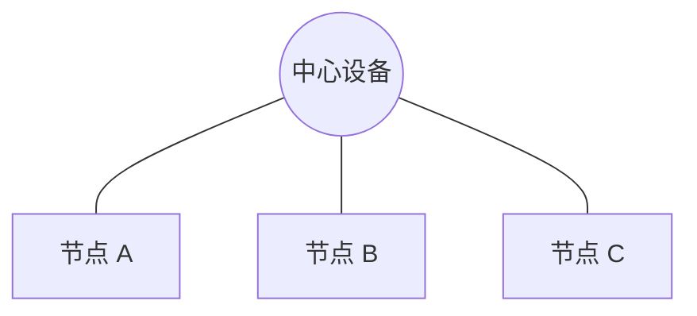
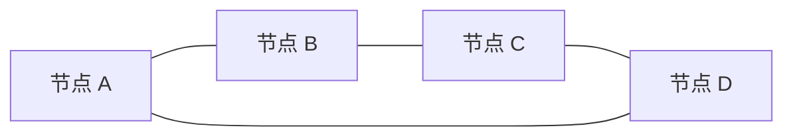
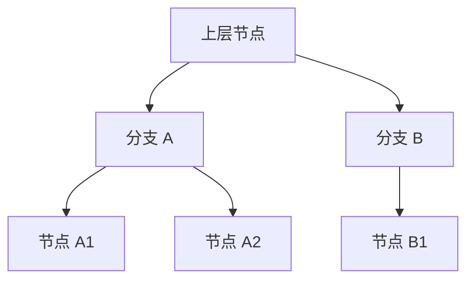
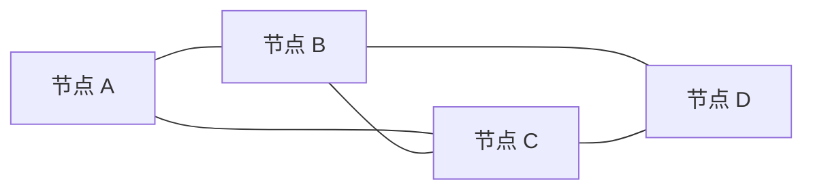

# 网络拓扑结构：设备怎么连，为什么会直接影响故障和扩展

> [!summary] 快速复习卡片
> **总线型**：大家共用主干；主干是关键点。
> **星型**：都连中心；中心设备是关键点。
> **环型**：首尾相连成环；是否容错还要看具体恢复机制。
> **树型**：逐层分支，适合层次化扩展。
> **网状**：替代路径多，冗余强，但链路和管理成本更高。
> **做题只问三件事**：关键点在哪、有没有替代路径、规模扩大后好不好管理。

## 先看问题：同样几台设备，换个连接方式，故障范围就完全不同

上一站 [[5G网络切片]] 已经结束无线和移动通信主线。

真正开始建设网络时，先要决定设备和链路怎样组织。

这不是“画得好不好看”，而是会直接影响：

- 某台设备坏了会影响多少节点；
- 某条链路断了有没有备用路；
- 扩容时要新增多少连接；
- 网络以后好不好管理。

这种连接关系就是**网络拓扑**。

## 五种常见拓扑先看形状

### 总线型：大家共用一条主干

识别点：**共享主干**。

### 星型：所有节点围着一个中心

识别点：外围支线相互独立，但**中心设备很关键**。

### 环型：首尾相连形成闭环

识别点：**成环**。不要因为有环就直接断言“一定不会中断”，还要看具体保护机制。

### 树型：从上往下逐层分支

识别点：**分层扩展**，越靠上的节点通常影响越大。

### 网状：存在较多替代路径

识别点：**多路径换冗余**，代价是链路更多、管理更复杂。

## 做题不要背“谁最好”

| 拓扑 | 最先想到 |
| --- | --- |
| 总线型 | 共享主干 |
| 星型 | 中心节点 |
| 环型 | 首尾成环 |
| 树型 | 分层扩展 |
| 网状 | 多路径冗余 |

没有一种拓扑在所有场景都“最好”。题目问成本、单点故障、扩展还是冗余，答案可能完全不同。

## 一句话收口

**拓扑不是背五个名字，而是看连接方式怎样改变关键故障点、替代路径和扩展成本。**

## 上一站

[[5G网络切片]]：无线与移动通信已经学完，本篇开始进入网络工程，先从最直观的“设备和链路怎样连接”建立工程视角。

## 下一站

[[层次化组网与冗余设计]]：知道星型、树型、网状以后，还没回答“大型组织网络到底怎样分工”；下一篇继续看**为什么常把网络分成接入、汇聚、核心，并给关键路径做冗余**。
