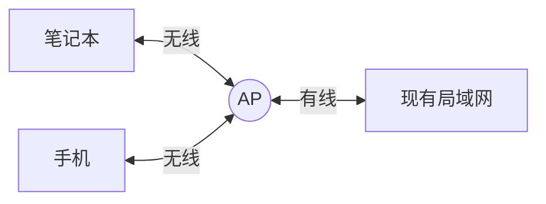

# 无线局域网 802.11：没有网线，设备怎样组成一个局域网

## 从有线网络走到无线网络

前面学习以太网时，电脑通过网线或交换机接入局域网。现在只改变一件事：

> **如果设备不方便拉网线，能不能把局域网中的这段连接换成无线信号？**

可以。**无线局域网（Wireless Local Area Network，WLAN）**就是在家庭、办公室、校园等有限范围内，通过无线方式连接设备的局域网。

这里先分清三个容易混在一起的词：

| 名称 | 先怎样理解 |
| --- | --- |
| WLAN | 一类网络：使用无线方式连接的局域网 |
| IEEE 802.11 | 一族标准：规定无线局域网怎样通信 |
| Wi-Fi | 日常最常见的 802.11 无线局域网产品和使用称呼 |

所以最简单的关系是：

> **WLAN 是网络类型，802.11 是主要标准，日常说的 Wi-Fi 通常就是在使用这一族标准。**

## 一台笔记本是怎样通过 Wi-Fi 访问服务器的

以办公室为例，先认识三个对象：

- **无线终端**：笔记本、手机等需要联网的设备；
- **AP（无线接入点）**：提供一片无线覆盖，并把无线终端接入现有网络；
- **现有局域网**：交换机、服务器和出口路由器所在的网络。

笔记本访问公司服务器时，大致发生三步：

1. 笔记本先接入 AP 覆盖的无线网络；
2. 数据通过无线信道到达 AP；
3. AP 再把数据送入现有局域网，后续仍按普通网络方式转发。

因此，“无线局域网”不是把整个互联网都变成无线，也不是不再需要网络设备。它主要替换的是终端接入局域网的那一段传输方式。

## 三类拓扑是在比较什么

设备都使用无线连接，但“谁和谁直接通信、是否需要中心节点”可以不同。大纲和主教材把常用 WLAN 拓扑分为三类。

仍以校园为例：

| 拓扑 | 数据怎样走 | 校园中的直观场景 | 主要特点 |
| --- | --- | --- | --- |
| 点对点型 | 两个固定节点直接连接 | 用无线链路连接图书馆和实验楼的两个有线网段 | 结构简单，适合固定的两点互联 |
| HUB 型 | 外围节点都经过中心节点 | 手机、笔记本都通过一个中心接入点通信 | 容易统一管理；中心故障会影响整个网络 |
| 完全分布型 | 节点彼此协助，多跳转发 | 较分散的节点互相接力，把数据送到目的地 | 抗毁和移动能力较强；节点与管理更复杂 |

考试判断时只抓结构：

- 只有两个固定端点互联 → **点对点型**；
- 所有通信围绕一个中心节点 → **HUB 型**；
- 没有统一中心，节点还要帮助其他节点转发 → **完全分布型**。

> [!note] 教材中的两组分类不要混
> 主教材还单独列出了室外无线局域网的连接形态：点对点、点对多点、多点对点和混合型。这是在描述室外链路怎样组合，不是大纲所说的“点对点型、HUB 型、完全分布型”三类拓扑。第一轮复习先掌握三类拓扑，不把两张表混背。

## 802.11 后面的字母表示什么

802.11 不是只有一个固定速率。后续的 a、b、g、n 等字母表示这一标准族中的不同版本。

按当前主教材口径，先记下面这张历史标准表，不扩展现代 Wi-Fi 的全部版本：

| 标准 | 教材给出的速率/特点 |
| --- | --- |
| 802.11 | 1～2 Mb/s |
| 802.11b | 最高 11 Mb/s |
| 802.11a | 最高 54 Mb/s |
| 802.11g | 最高 54 Mb/s；兼容 802.11b；工作在 2.4 GHz |
| 802.11n | 200 Mb/s 以上 |

2026 年上半年一份可追溯的考生回忆题直接问 802.11b 的传输速率，选项中的正确组合是：

> **5.5 Mb/s 和 11 Mb/s。**

这条属于 C 级回忆证据，不冒充官方原卷；但它说明当前复习至少要能识别 802.11b 与 11 Mb/s。

## 多台设备共用空气，为什么还要协调发送

网线通常把信号限制在物理线路中；无线终端则可能共用同一片无线信道。如果两台设备同时发送，接收方可能无法正确识别数据。

> **补充理解：** 802.11 常用 CSMA/CA（载波监听多路访问/冲突避免）协调共享信道。它的直觉不是“撞了再处理”，而是“发送前先尽量避开”。

第一次学习只跟住这条动作链：

1. 发送前先监听信道；
2. 信道忙就等待；
3. 信道空闲后经过随机退避再发送；
4. 收到确认帧 ACK，说明本次发送成功；
5. 没有收到 ACK，则按规则重试。

这和经典共享式以太网的 CSMA/CD 不同：

- **CD（Collision Detection）**重在检测碰撞；
- **CA（Collision Avoidance）**重在事先尽量避免碰撞。

当前考试主线只要求记住这种区别，不展开 RTS/CTS、帧间间隔和退避窗口计算。

## 考试时先判断题目在问哪一层

| 题干信号 | 第一反应 |
| --- | --- |
| “无线局域网标准” | IEEE 802.11 |
| “802.11b 速率” | 5.5 Mb/s、11 Mb/s；最高 11 Mb/s |
| “中心节点统一接入，外围通信经过中心” | HUB 型 |
| “两个固定网段通过无线链路互联” | 点对点型 |
| “节点协助转发、形成多跳” | 完全分布型 |
| “无线共享信道、冲突避免” | CSMA/CA |

> [!summary]- 快速复习卡片（学完再看）
> **作用/定位**：WLAN 用无线方式完成局域范围内的设备接入，IEEE 802.11 是其主要标准族。
> **三类拓扑**：两个固定端点是点对点型；围绕中心节点是 HUB 型；节点互相协助转发是完全分布型。
> **题干信号 → 第一反应**：802.11b 速率 → 5.5 Mb/s、11 Mb/s；无线冲突避免 → CSMA/CA。
> **易错点**：WLAN、802.11、Wi-Fi 不是三个平级网络；教材“室外四种连接形态”也不要和大纲“三类拓扑”混成一张表。

## 自测

1. WLAN、IEEE 802.11 和 Wi-Fi 分别处于什么层次？
2. 一台笔记本通过 AP 访问公司服务器时，数据依次经过哪三个部分？
3. 题目说“节点掌握部分拓扑信息，并帮助其他节点多跳转发”，应选择哪类拓扑？
4. 为什么无线局域网更强调 CSMA/CA，而不是 CSMA/CD？

## 下一站

- 上一站：[[电子邮件协议]]
- 相关对比：[[以太网技术]]
- 主下一站：[[移动通信网发展特征与服务化架构]]

WLAN 已经解决家庭、办公室和校园等局部范围的无线接入。下一站把范围放大：**手机跨区域移动、用户规模更大、业务差异更明显时，移动通信网为什么还需要从 1G 持续演进到 5G？**
