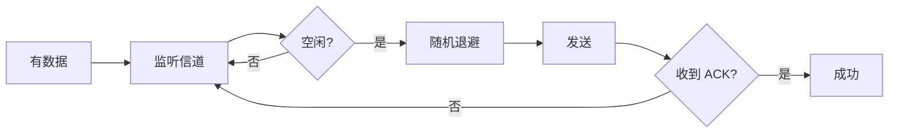

# 无线局域网 802.11：无线为什么不用 CSMA/CD

> [!summary] 快速复习卡片
> **作用/定位**：无线局域网（WLAN）的核心标准与介质访问方法。
> **核心结论**：IEEE 802.11 是 Wi-Fi 标准族；无线难以边发送边可靠检测碰撞，所以主要采用 CSMA/CA，发送前竞争并用 ACK 判断是否成功。
> **经典题型怎么做 / 题干怎么认**：无线、随机退避、ACK、隐藏终端 → CSMA/CA；**2026H1 回忆题直接考 802.11b 的 5.5 Mb/s 和 11 Mb/s**。
> **易错点 / 考试重点**：只补近年直接命中的 `5.5/11 Mb/s` 这一对数字，不扩展背完整 802.11 速率表；CA 是“避免”，CD 是“检测”。

## 先定位：802.11 是无线局域网标准族

WLAN 解决的是局部范围内的无线接入，典型就是 Wi-Fi。802.11 规定无线终端、AP 如何使用共享无线信道。

常见代际识别：

- 802.11n → Wi-Fi 4；
- 802.11ac → Wi-Fi 5；
- 802.11ax → Wi-Fi 6。

这些名称作为识别即可，不需要扩成参数表。

## 为什么无线不能照搬 CSMA/CD

传统共享式有线以太网可以一边发送一边检测线路上的碰撞；无线发送时，自身强信号会妨碍同时监听远端，而且还会遇到“隐藏终端”。

所以 802.11 的核心思路是：

1. 发送前先监听；
2. 信道忙就等待；
3. 信道可用后经过间隔和随机退避再发送；
4. 接收端成功收到后返回 ACK；
5. 没收到 ACK，则认为可能失败，再重新竞争。

## 隐藏终端为什么会发生

A 和 C 都能听到 AP，但 A、C 彼此听不到。此时两边都可能判断“信道空闲”，然后同时向 AP 发送，在 AP 处发生冲突。

RTS/CTS 可以在部分场景先预约信道，降低这种风险；它是辅助机制，不是每个数据帧都必须使用。

## 2026H1 真题信号

已核验的考生/学员回忆题直接问：**IEEE 802.11b 规定的两种高速传输速率是什么？**

当前复习只记：

> **5.5 Mb/s 和 11 Mb/s**

按最新减负规则，不因为这一题顺手背完整的 802.11a/b/g/n/ac/ax 速率参数表。

## 与有线以太网别混

| 场景 | 核心方法 | 题眼 |
| --- | --- | --- |
| 传统共享式有线以太网 | CSMA/CD | 边发边检测碰撞 |
| 无线 802.11 | CSMA/CA | 先避免、随机退避、ACK |

## 一句话总结

**无线难以边发边检测，所以 802.11 用 CA；2026H1 额外记住 802.11b 的 5.5/11 Mb/s。**

## 下一站

- 上一站：[[以太网技术]]。
- 下一站：[[5G]]，但 5G 当前为 P3，只需识别三大场景。
