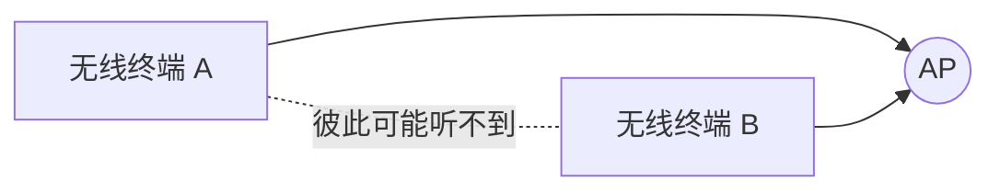

# 无线局域网 802.11：没有网线以后，大家怎么避免同时抢着发

> [!summary] 快速复习卡片
> **802.11**：WLAN（无线局域网）标准族。
> **核心机制**：无线共享信道主要用 **CSMA/CA**，重点是“发送前尽量避免冲突”，不是照搬有线共享以太网的 CSMA/CD。
> **为什么要 CA**：无线设备难以一边强力发送、一边可靠检测远处碰撞，还存在隐藏终端。
> **教材三类拓扑**：点对点型、HUB 型、完全分布型。
> **近年已核验题眼**：2026H1 回忆题直接出现 802.11b 的 **5.5 Mb/s、11 Mb/s**；只记这组，不背完整 Wi-Fi 参数表。

## 先看问题：两台无线设备都觉得“没人说话”，为什么还是会撞

上一站 [[电子邮件协议]] 已经把应用层主线收口。

现在把接入方式从网线换成 Wi-Fi。

假设无线终端 A 和 B 都连接同一个 AP，但 A、B 因距离或障碍物彼此听不到：

A 听不到 B，会觉得信道空闲；B 也可能这么想。两者同时向 AP 发送时，仍然可能在 AP 处发生冲突。

这就是无线里常说的**隐藏终端**问题。

另外，无线设备自己发射时信号很强，很难像传统共享式有线以太网那样，一边发送一边可靠判断远端是否发生了碰撞。

所以 802.11 更强调：

> **先尽量避免碰撞，再通过确认判断是否成功。**

这就是 **CSMA/CA** 的核心思路。

## CSMA/CA 记最小动作就够

第一次学习只跟住：

1. 发送前先监听；
2. 信道忙就等；
3. 空闲后还要随机退避；
4. 再发送；
5. 成功收到后由接收方返回 ACK；
6. 没收到 ACK，再进入重试。

RTS/CTS 只需要知道它可以在部分场景帮助减轻隐藏终端冲突，不展开帧字段。

## 教材三类 WLAN 拓扑只做识别

| 题目场景 | 教材术语 |
| --- | --- |
| 两个固定节点/网络用无线链路直接互联 | 点对点型 |
| 有一个中心节点统一接入和管理 | HUB 型 |
| 节点彼此协助、可形成多跳 | 完全分布型 |

当前只按教材术语认场景，不扩展现代 Wi-Fi Mesh 工程实现。

## 标准参数学到哪里停

不要背整张 802.11a/b/g/n 速率和频段表。

当前有明确近年信号的只额外记：

> **802.11b：5.5 Mb/s、11 Mb/s。**

## 一句话收口

**WLAN 用 802.11；因为无线难以可靠“边发边检测碰撞”，所以主要采用 CSMA/CA：先监听和退避，尽量避免冲突，再用 ACK 判断是否成功。**

## 上一站

[[电子邮件协议]]：基础有线互联网和应用协议已经学完，本篇不是重新学一遍底层，而是把“终端怎样接入网络”从有线扩展到无线。

## 下一站

[[移动通信网发展特征与服务化架构]]：WLAN 解决的是家庭、办公室、园区这类局部无线接入；下一篇把范围放大到蜂窝移动网络，看看**手机跨区域移动时，移动通信为什么从 1G 一直演进到 5G**。
