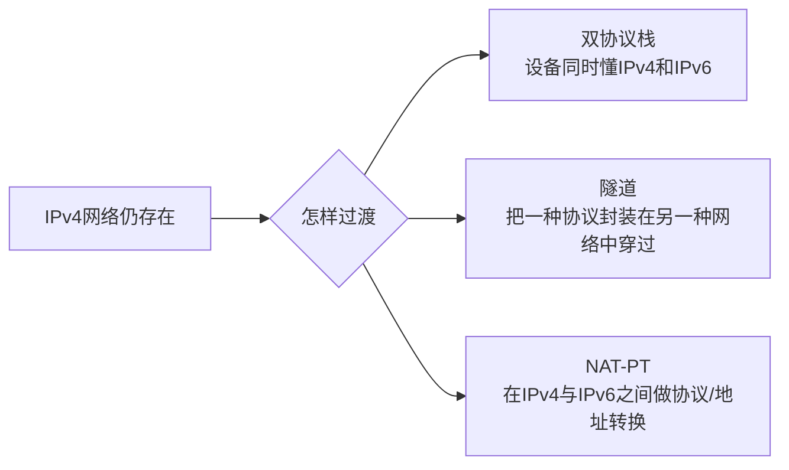

# IPv6 与 IPv4 过渡：IPv4 地址不够以后怎么办

## 痛点：32 位地址空间不可能无限用

IPv4 地址只有 32 位。随着终端、服务器和物联网设备不断增加，仅靠私网和地址复用并不能从根本上扩展互联网的全局地址空间。

IPv6 把地址长度扩展到 128 位，同时重新设计了部分报文和邻居发现机制。

## 地址从 32 位变成 128 位

IPv4：

```text
192.168.1.10
```

IPv6 常写成 8 组十六进制数：

```text
2001:0db8:0000:0000:0000:ff00:0042:8329
```

连续的全 0 组可以按规则压缩成双冒号，但一个地址中双冒号只能用于一次压缩，否则无法判断省略了多少组。

例如：

```text
2001:db8::ff00:42:8329
```

## IPv6 三种目的地址怎么认

| 类型 | 含义 | 人话 |
| --- | --- | --- |
| 单播 Unicast | 发给一个接口 | 一对一 |
| 组播 Multicast | 发给一组接口 | 一对多 |
| 任播 Anycast | 发给一组接口中的“一个”，通常由路由选择较合适者 | 一对最近/最优之一 |

IPv6 不再使用 IPv4 那种广播地址来完成所有节点广播，很多场景改用组播。

## IPv6 不是一夜之间替换 IPv4

真实网络升级时，IPv4 和 IPv6 会长期共存，因此要解决：

> **一边是 IPv4，一边是 IPv6，怎么过渡？**

教材常见三类过渡思路。不要只背名字，先问：**通信两端和中间网络到底分别支持什么协议？**



### 双协议栈

同一设备同时运行 IPv4 和 IPv6。

优点：理解简单、兼容性直接。  
代价：两套地址和路由都要维护。

### 隧道技术

当中间网络只支持一种协议时，可以把另一种协议的报文封装进去穿过中间网络，到另一端再解封装。

人话就是：

> **不会走这条路的包，先套一层“这条路认识的外壳”。**

### NAT-PT

通过翻译实现 IPv4 和 IPv6 节点之间的互通。考试按教材识别“协议转换”即可；现实 IPv6 过渡方案很多，不要把 NAT-PT 当成现代部署的唯一选择。

### 同一个“IPv6 要穿过旧网络”的场景，三种办法怎么分？

| 场景 | 实际动作 | 选什么 |
| --- | --- | --- |
| 设备本身同时懂 IPv4、IPv6 | 根据对端和网络条件直接选择 IPv4 或 IPv6 通信 | **双协议栈** |
| 两端懂 IPv6，但中间一段只懂 IPv4 | 给 IPv6 报文再套一个 IPv4 外壳，穿过后再拆掉 | **隧道** |
| 一端只有 IPv6，另一端只有 IPv4 | 中间设备翻译地址/协议表示，让两边互通 | **协议转换 / NAT-PT 类思路** |

> **双栈是“自己两种都会”，隧道是“套壳穿过去”，转换是“双方语言不同，中间翻译”。**

## IPv4 和 IPv6 的核心对比

| 项目 | IPv4 | IPv6 |
| --- | --- | --- |
| 地址长度 | 32 位 | 128 位 |
| 常见写法 | 点分十进制 | 冒号分隔十六进制 |
| 广播 | 支持广播 | 主要用组播等机制替代 |
| 过渡 | 原有协议 | 与 IPv4 共存需过渡技术 |

## 考试怎么认

- “128 位地址” → IPv6。
- “单播、组播、任播” → IPv6 地址类型高频识别。
- “一台设备同时支持 IPv4/IPv6” → 双协议栈。
- “把 IPv6 包封装进 IPv4 网络穿过去” → 隧道。
- “两种协议之间做翻译” → NAT-PT。

## 易错点

- IPv6 不是“IPv4 地址多写几位”，地址表示方式和部分协议机制也变化。
- 任播不是“发给所有成员”，而是路由到其中一个合适的成员。
- 过渡技术解决的是共存阶段，不代表最终网络必须永远同时运行两套协议。

## 一句话总结

> **IPv6 用 128 位地址解决地址空间问题；IPv4 到 IPv6 的迁移主要靠双栈、隧道和协议转换。**

## 自测

1. IPv6 地址是多少位？
2. 组播和任播的区别是什么？
3. 双协议栈和隧道分别解决什么问题？

## 下一站

> 想回看 IPv4 地址怎么划子网，去 [[IP编址与子网划分]]。  
> 想看跨网段到底怎样选择路径，去 [[路由协议与路由选择]]。
