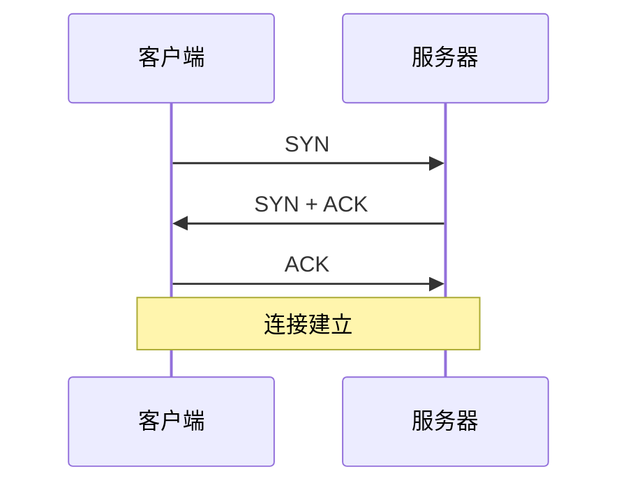

# TCP 三次握手：为什么建立连接不是“两边各说一次你好”就够了

## 先定位：TCP 要维护可靠连接，双方先得确认双向通信和初始序号信息

TCP 建立连接时，双方需要交换并确认连接相关信息。

经典三次握手：

## 第一次：客户端提出建立连接

客户端发送 SYN，并携带自己的初始序号相关信息。

服务器收到后至少知道：

> **客户端到服务器这个方向能到。**

## 第二次：服务器同意并发送自己的信息

服务器返回 SYN + ACK：

- ACK 确认客户端的 SYN；
- SYN 又把服务器自己的初始序号信息发给客户端。

## 第三次：客户端确认服务器的 SYN

客户端再发 ACK。

服务器收到以后才知道：

> **自己刚才发给客户端的 SYN/序号信息也确实被客户端收到。**

所以第三次不是重复礼貌动作。

## 为什么不是简单两次

如果停在第二次：

- 客户端知道服务器收到了自己的请求；
- 客户端也收到了服务器的 SYN；
- 但服务器还不知道“自己的 SYN 是否被客户端收到”。

第三次 ACK 完成了这个确认闭环。

## 一句话记住

> **三次握手的重点不是背 SYN 顺序，而是双方交换并相互确认建立连接所需的信息。**

## 下一站

- 上一站：[[端口与进程通信]]
- 下一站：[[TCP可靠传输机制]]
