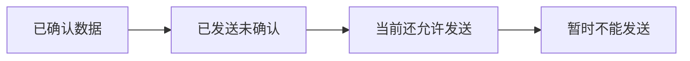

# TCP 可靠传输：IP 可能丢包、乱序，TCP 凭什么还能交付有序字节流

## 先定位：可靠不是“网络从此不丢”，而是端点发现问题后进行恢复

IP 网络仍可能出现：

- 丢失；
- 重复；
- 乱序；
- 差错。

TCP 的可靠性来自一组端到端机制，而不是底层网络保证不出错。

## 序号：先知道每段数据处在字节流哪里

TCP 用序号标记字节流位置。

这样即使网络分组乱序到达，接收方也知道：

> **谁应该排前面，谁应该排后面。**

## 确认：告诉发送方连续收到哪里

确认号的经典含义是：

> **下一个期望收到的字节序号。**

如果接收端确认 1501，可以理解为：

> 1501 之前的连续字节已经按协议规则得到确认。

## 重传：迟迟没有得到有效确认怎么办

发送方如果判断某段数据没有成功交付，会按 TCP 机制重传。

因此：

> **可靠传输不是“不丢”，而是“丢了能发现，并重新发送”。**

## 滑动窗口：为什么不用每发一点就停下来等

如果每发一个小段都必须停住等 ACK，链路利用率会很低。

滑动窗口允许：

> **在允许范围内连续发送多份未确认数据。**

随着确认返回，窗口向前滑动，新的数据又可以继续发送。

## 校验在做什么

TCP 首部包含校验机制，用来帮助检测传输中的比特错误。

它和序号、确认、重传一起构成可靠性的不同环节。

## 一句话记住

> **序号管顺序，ACK 管确认，重传管丢失，窗口管连续发送效率。**

## 下一站

- 上一站：[[TCP三次握手]]
- 下一站：[[TCP流量控制与拥塞控制]]
