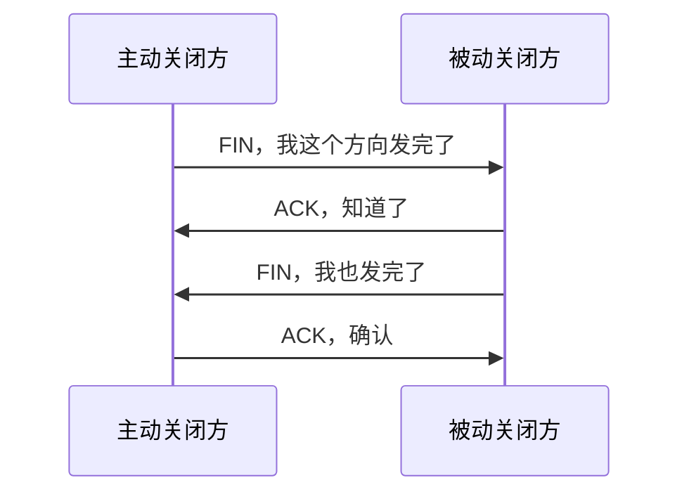

# TCP 四次挥手：建立连接三次，关闭为什么通常要四次

## 先定位：TCP 是全双工连接，两个方向可以分别关闭

一条 TCP 连接里：

- A 可以向 B 发数据；
- B 也可以向 A 发数据。

因此：

> **A 说“我发完了”，不代表 B 也已经发完。**

这就是连接释放通常需要分两边处理的原因。

## 经典过程

## 为什么中间的 ACK 和 FIN 常分开

B 收到 A 的 FIN 时：

> 可以确认 A 不再发送。

但 B 自己可能还有数据要发。

所以 B 先 ACK，不一定马上 FIN。

等 B 也完成发送后，再单独发 FIN。

因此经典关闭流程通常表现为四次报文交互。

## 和三次握手不要用“3 对 4”死背

- 建立：双方 SYN 信息可以在第二次里把“确认 + 自己的 SYN”合在一起；
- 关闭：收到对方 FIN 时，自己未必同时准备关闭发送方向，因此 ACK 和 FIN 往往分开。

## 一句话记住

> **四次挥手的根本原因是全双工两个方向可以独立结束。**

## 下一站

- 上一站：[[TCP流量控制与拥塞控制]]
- 下一站：[[应用层常用协议]]
