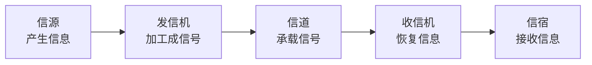

# 数据通信基本模型：一条“能通的线路”为什么还要分信源、发信机、信道、收信机、信宿

## 先定位：网络通信最底层先解决“信息怎样从 A 到 B”

一条完整通信链路不只是“两台机器 + 一根线”。

原始信息必须先变成介质能承载的信号，穿过信道，再被恢复。

经典模型是：

## 五个角色分别是什么

| 角色 | 人话 |
| --- | --- |
| 信源 | 信息从哪里产生 |
| 发信机 | 把信息变成适合信道的信号 |
| 信道 | 信号真正经过的通路 |
| 收信机 | 把收到的信号恢复 |
| 信宿 | 信息最终交给谁 |

## 物理信道和逻辑信道不要混

**物理信道**是实际承载信号的介质和设备，例如双绞线、光纤、无线电波。

**逻辑信道**是上层看到的逻辑通信通道，建立在物理资源之上。

> **物理信道像真实道路，逻辑信道像在道路资源上组织出来的业务通道。**

## 为什么下一步要学编码与调制

信源产生的“字符、比特、声音”并不能自动在每一种物理介质上传播。

所以发信机还要解决：

> **这些信息怎样变成适合当前信道的信号？**

下一张 [[编码调制与解调译码]] 专门回答。

## 一句话记住

> **数据通信模型先把“谁产生、谁加工、从哪传、谁恢复、交给谁”五个角色分清。**

## 下一站

- 上一站：[[网络性能指标]]
- 下一站：[[编码调制与解调译码]]
