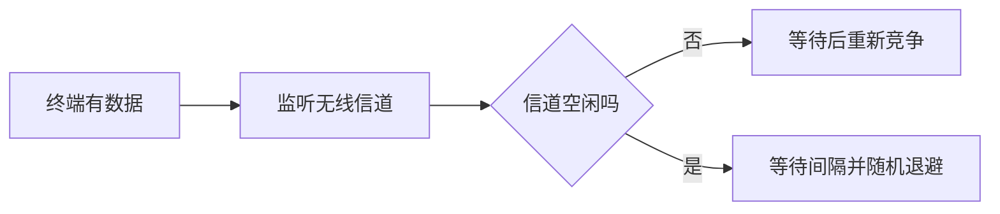
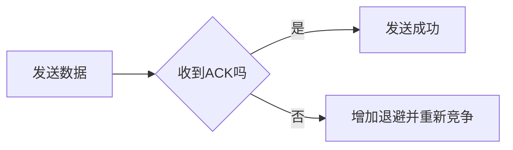

# 无线局域网 802.11：看不见的道路如何避免相撞

> [!important] 一句话结论
> IEEE 802.11 是无线局域网标准族，核心识别点是 CSMA/CA：无线设备难以边发送边检测碰撞，因此采用发送前等待、必要时预约，并用 ACK 确认。

## 痛点：无线设备无法像有线网卡那样“边说边听”

有线共享以太网可以检测线路上的电信号变化，判断是否碰撞；无线设备自己发射时，近距离的发送信号会淹没远端信号，而且还可能存在隐藏终端，导致“我没听见别人”并不代表真的没有人发送。

802.11 的定位是规定无线局域网的接入、帧交换和设备协作方式。它要解决的不是“把线换成空气”这么简单，而是让共享无线信道尽量少发生冲突。

## 定义：802.11 是 Wi-Fi 背后的标准家族

常见对应关系：802.11n 通常称 Wi-Fi 4，802.11ac 通常称 Wi-Fi 5，802.11ax 通常称 Wi-Fi 6。Wi-Fi 代际名称是市场常用称呼，具体频段、速率和能力还取决于设备实现与配置。

无线局域网常见两种组织方式：

- **基础设施模式**：终端通过接入点 AP 接入网络，家庭无线路由器就是常见例子。
- **Ad hoc 模式**：终端之间临时直接通信，不依赖固定 AP。

## 核心机制：CSMA/CA 如何降低碰撞

无线终端发送前监听信道；信道空闲时也不一定立刻发送，而是等待规定的间隔并随机退避，以降低多个终端同时起传的概率。接收方成功收到后返回 ACK，发送方在超时未收到 ACK 时认为可能丢失并重传。

获得发送机会后，再看本次发送是否成功：

RTS/CTS 可以在特定场景下先预约信道，缓解隐藏终端问题，但它会增加控制开销，不是所有帧都必须使用。

### 隐藏终端到底隐藏在哪？

假设 A 和 C 都能和 AP 通信，但 A、C 彼此距离太远，互相听不到：

- A 监听：觉得信道空闲；
- C 监听：也觉得信道空闲；
- A、C 如果同时向 AP 发，仍可能在 AP 处发生冲突。

所以“我没听见别人”不等于“接收端那里一定没人发”。RTS/CTS 的思路是先预约：

1. 发送方先发 RTS 请求发送；
2. 接收方返回 CTS，告诉周围站点这段时间先别抢；
3. 其他听到 CTS 的站点按持续时间等待；
4. 发送方再发送数据，并等待 ACK。

> **CSMA/CA 是尽量降低碰撞概率，不是保证无线永远不会碰撞。**

## 易混对比：无线 802.11 与有线以太网

| 对比项 | 有线共享以太网 | 无线局域网 802.11 |
| --- | --- | --- |
| 访问方法 | 传统共享介质用 CSMA/CD | CSMA/CA |
| 碰撞处理 | 发送中检测碰撞 | 尽量事前避免，靠 ACK 判断成功 |
| 介质特征 | 信号可较容易监听 | 半双工、信号衰减、隐藏终端 |
| 典型设备 | 集线器、交换机 | AP、无线终端 |
| 题干关键词 | 边发边听、碰撞检测 | 随机退避、ACK、无线 |

**核心区分**：无线的关键限制是无法可靠地“边发边听”，所以选 CA（避免）而不是 CD（检测）。

## 这个知识与考试的关系

- “无线局域网”优先想到 IEEE 802.11 和 CSMA/CA。
- “Wi-Fi 4/5/6”通常对应 802.11n/ac/ax。
- “半双工、隐藏终端、ACK、随机退避”是选择 CSMA/CA 的线索。
- 不要因为看到“局域网”就直接选 CSMA/CD；先判断介质是有线共享还是无线。

## 记忆口诀

**无线看不清，先避再确认；802.11 用 CA，成功要 ACK。**

## 下一站 / 链接

- 沿主线往下看 [[5G]]：Wi-Fi 解决局部无线接入，下一步看面向广域移动通信的 5G 三大场景。
- 想回看这段，回 [[应用层常用协议]]；关联主题是 [[以太网技术]]。

