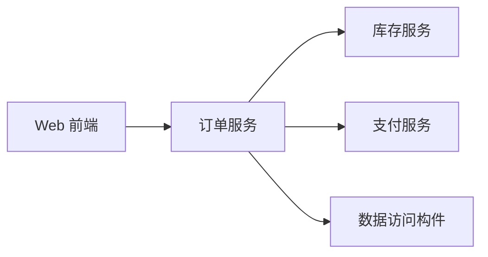
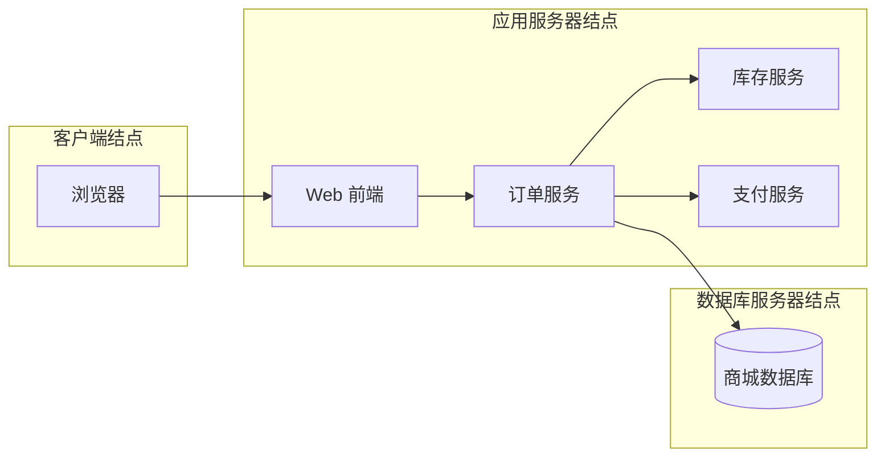

# UML 构件图与部署图：是在看“软件拆成哪些块”，还是看“这些块跑在哪”

> [!summary]- 快速复习卡片（学完再看）
> **构件图**：看软件由哪些可替换/可组织的实现构件组成，以及构件之间怎样依赖。  
> **部署图**：看软件制品/构件最终部署到哪些结点、设备或运行环境。  
> **题干信号 → 第一反应**：模块/构件/接口/依赖 → 构件图；服务器/结点/设备/部署位置 → 部署图。  
> **易错点**：构件图主要回答“软件怎么拆”，部署图主要回答“软件放哪里跑”。

前面的 [[UML活动图与状态机图]] 已经把“流程怎么走”和“对象怎么变”分清了。

现在商城真正要上线，又遇到两个完全不同的问题。

第一个问题：

> 商城软件本身被拆成哪些部分？订单、库存、支付之间怎样依赖？

第二个问题：

> 这些软件部分最后到底跑在浏览器、应用服务器，还是数据库服务器上？

前一个更接近**构件图**，后一个更接近**部署图**。

## 构件图：先别管服务器，先看“软件是怎么拼起来的”

假设商城被拆成：

- Web 前端；
- 订单服务；
- 库存服务；
- 支付服务；
- 数据访问构件。

下面只是帮助理解问题的概念示意，不用 Mermaid 图形代替 UML 的标准构件记号：

这张图最关心的是：

> **软件里面有哪些可组织的实现部分，它们之间怎样依赖和提供能力。**

大白话：

> **构件图 = 把程序拆成几个软件块，再看这些软件块怎么连。**

题目出现“构件、组件、接口、依赖、实现组织”等词时，优先想到构件图。

## 部署图：软件已经有了，接下来问“放哪台机器”

现在软件已经拆好了，但真正上线还得决定：

- 用户的浏览器跑在客户端；
- Web/订单服务跑在应用服务器；
- 数据库跑在数据库服务器。

这时候重点已经不是“订单服务和支付服务在逻辑上是什么关系”，而是：

> **软件最终被放到了哪些结点上运行。**

大白话：

> **部署图 = 把软件块放到真实运行位置上，看它们到底跑在哪。**

教材中的“结点（Node）”可以先理解成承载软件运行的物理设备或执行环境。

## 两张图为什么经常一起出现

因为真实项目通常是连续的：

1. 先确定软件由哪些构件组成；
2. 再决定这些构件部署到哪里。

但考试要你分清它们的主问题：

| 题目在问什么 | 更适合 |
| --- | --- |
| 系统有哪些软件构件 | 构件图 |
| 构件之间怎样依赖/提供接口 | 构件图 |
| 软件部署到哪些服务器/结点 | 部署图 |
| 软件与硬件运行环境怎样映射 | 部署图 |

所以最稳的判断不是看“图里有没有服务器”几个字，而是问：

> **现在主要在讨论软件内部组成，还是软件到运行环境的映射？**

## 和“实现视图/部署视图”是什么关系

[[建模语言与UML]] 已经讲过：**图不等于视图。**

- 构件图常用于表达实现组织方面的信息；
- 部署图常用于表达部署方面的信息；
- 但“构件图”是一种具体 UML 图，“实现视图/部署视图”是观察系统的关注角度。

所以不要看到名字接近就直接画等号。

## 考试怎么认

1. “模块、构件、接口、软件依赖关系” → **构件图**；
2. “物理结点、服务器、设备、运行环境” → **部署图**；
3. “某个软件制品部署到哪个结点” → **部署图**；
4. “系统由哪些可替换软件部分组成” → **构件图**；
5. 看到“实现视图/部署视图”时先判断题目问的是视角还是具体 UML 图。

## 一句话记住

> **构件图回答“程序拆成什么”，部署图回答“这些程序块放哪儿跑”。**

## 自测

> [!question] 自测
> 1. 题目要求描述订单服务依赖支付服务、库存服务，优先考虑哪种图？
>
> > [!answer]- 第 1 题答案与解析
> > **答案**：构件图。
> > **解析**：题目重点是软件构件之间的组成和依赖关系。
>
> 2. 题目要求说明 Web 服务部署在应用服务器、数据库部署在数据库服务器，优先考虑哪种图？
>
> > [!answer]- 第 2 题答案与解析
> > **答案**：部署图。
> > **解析**：题目重点是软件与运行结点之间的部署映射。
>
> 3. 构件图和实现视图是不是完全同义？
>
> > [!answer]- 第 3 题答案与解析
> > **答案**：不是。
> > **解析**：构件图是一张具体 UML 图；实现视图是观察系统实现组织的一个关注角度。

## 下一站

回 [[建模语言与UML]] 做一次总复习：看到题干时，先判断它在问“功能、类关系、交互先后、流程、状态、软件构件还是部署位置”，再选相应 UML 图。

UML 知识组完成后，再进入 [[形式化语言与规格说明]]。
