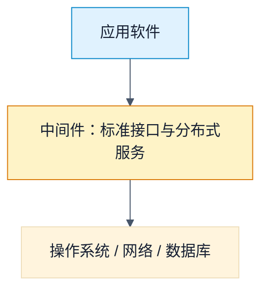

# 中间件：为什么同一应用不该为每种系统重写一遍

> [!summary]- 快速复习卡片（学完再看）
> **核心结论**：中间件用标准接口和协议连接应用与不同系统环境，让应用相对独立于硬件、操作系统。
> **题干信号**：跨平台、消息、事务、公共分布式服务 → 中间件；MQSeries → 消息，Tuxedo → 交易。

若应用直接绑定某种操作系统或网络环境，换平台就可能要重写。**中间件**位于应用软件下层、操作系统/网络/数据库之上，提供标准化接口和分布式系统服务，使相同应用功能能在不同环境中运行。它属于基础软件和可复用软件；教材也提示其归类存在口径，有人将其视为操作系统的一部分，因此做题优先识别它的作用而非死记层级。

## 按职责识别类型

| 类型 | 主要作用 | 典型识别词 |
| --- | --- | --- |
| 消息中间件 | 跨平台可靠、高效、实时地传递数据 | 消息、队列、通信 |
| 交易中间件 | 协调多服务器事务、监视调度、恢复与切换 | OLTP、事务、负载平衡、高可用 |
| 数据存取管理中间件 | 帮助虚拟缓冲、格式转换、解压等数据访问 | 数据服务器、格式转换 |
| Web 服务器中间件 | 弥补浏览器/HTTP 在会话、数据写入等方面的限制 | 浏览器、会话、Web |
| 安全中间件 | 为安全保密需求提供适配能力 | 安全、保密 |
| 跨平台与架构中间件 | 集成不同平台或新旧构件 | CORBA、JavaBeans、COM+ |
| 专用平台、网络中间件 | 面向特定领域，或支持网管、接入、测试等 | 电子商务、网管、接入 |

**典型产品**：IBM MQSeries 是消息处理中间件，资源是消息和队列，强调可靠传输；BEA Tuxedo 属于交易中间件，面向多数据库协调更新与连续服务。

> [!question] 自测
> 1. 多个异构系统之间通过队列可靠传递订单消息，应优先想到什么？
>
> [!answer]- 第 1 题答案与解析
> **答案**：消息中间件；教材列举的 MQSeries 是典型产品。
> **解析**：题干重点是跨平台通信、消息和队列，而不是具体业务功能。
>
> 2. 中间件是否等于操作系统？
>
> [!answer]- 第 2 题答案与解析
> **答案**：不等同。它通常处于应用与操作系统/网络/数据库之间；教材也说明其归类可有不同口径。

## 下一站

[[软件构件与构件组装]]：中间件提供运行协作环境；构件则回答业务软件怎样按接口被独立开发和复用。
