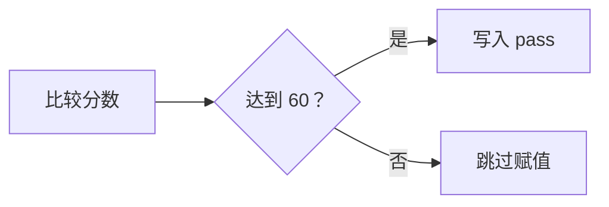
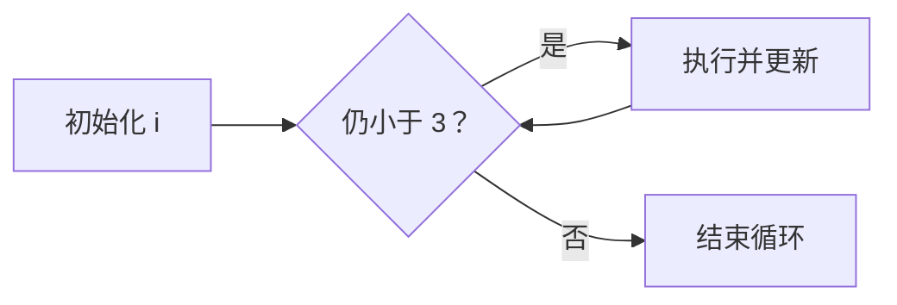

# 计算机语言：人写的程序怎样变成机器指令

> [!summary]- 快速复习卡片（学完再看）
> **核心结论**：`if` 会降为“比较 + 条件跳转”，`for` 会降为“初始化 + 比较 + 循环体 + 更新 + 回跳”；CPU 最终只执行编码后的机器指令。
> **题干信号 → 第一反应**：二进制操作码/操作数 → 机器语言；助记符 ADD、MOV → 汇编；词法/语法/语义 → 编译过程。
> **易错点**：CPU 不认识 `if`、`for` 或汇编助记符；具体二进制编码取决于目标 CPU 的指令集。

## 痛点：CPU 看不懂 `if` 和 `for`

CPU 只执行机器指令，人直接写二进制又慢又容易错。计算机语言让人用符号表达算法，再由编译器、解释器或虚拟机等语言处理系统，把这些表达落实为目标平台能执行的动作。

## 定义（讲人话）

机器语言是 CPU 的“母语”，汇编语言给机器指令起助记名，高级语言更接近人的问题描述。编译器像“整本翻译后出版”，解释器像“同声传译，读一句执行一句”。

## 写程序时，语言本身由什么组成

教材把计算机语言看作人与计算机传递信息的媒介；一套指令通常包含三部分：

| 部分 | 包含什么 | 解决什么 |
| --- | --- | --- |
| 表达式 | 变量、常量、字面量、运算符 | 怎样表示数据和计算 |
| 流程控制 | 分支、循环、函数、异常 | 程序下一步怎样走 |
| 集合 | 字符串、数组、散列表等数据结构 | 怎样组织一组数据 |

这三项是在说“源程序里可以写什么”；编译或解释是在说“写完以后怎样让机器处理它”。两者不要混成同一个分类维度。

## 逐个认识

| 层次 | 特点 | 怎么认 |
| --- | --- | --- |
| 机器语言 | 二进制指令，依赖硬件 | 可直接执行、可移植性差 |
| 汇编语言 | 助记符表示指令 | 需汇编，仍依赖指令集 |
| 高级语言 | 接近算法与业务 | 需编译或解释，可移植性较好 |

| 方式 | 产物与执行 | 优点 | 易错点 |
| --- | --- | --- | --- |
| 编译 | 整体翻译，通常形成目标代码 | 重复运行快、可优化 | 编译通过不等于逻辑正确 |
| 解释 | 边翻译边执行，通常不单独生成完整目标程序 | 交互方便、跨平台实现灵活 | 每次运行仍需解释环境 |

**核心区分**：词法分析把字符组成单词，语法分析检查结构，语义分析检查含义与类型，代码生成才产生目标代码。为了避免一张图横向过宽，完整过程拆成“前端分析”和“后端生成”两段；两图前后相接，没有省略阶段。

**前端分析：先确认源程序写了什么、是否成立。**

**代码生成与运行准备：语义检查通过后，再逐步形成可执行程序。**

其中，链接与装入发生在目标代码生成之后，不要把它们误认成词法、语法或语义分析的一部分。

## `if` 怎样变成 CPU 能执行的跳转

以 `if (score >= 60) pass = 1;` 为例，编译器不会给 CPU 发出一条叫“执行 if”的指令，而是把它降成目标指令集能够表达的**比较和跳转**。下面使用汇编式伪指令展示共同机制；它不是某款 CPU 的固定语法或二进制编码。

| 顺序 | 汇编式伪指令 | CPU 要完成的动作 |
| --- | --- | --- |
| 1 | `CMP score, 60` | 比较 `score` 与 60，并更新状态标志 |
| 2 | `JL IF_END` | 若 `score < 60`，跳到结束位置 |
| 3 | `MOV pass, 1` | 没有跳走，说明条件成立，执行赋值 |
| 4 | `IF_END:` | 分支结束位置的标签，不是 CPU 操作 |

执行时，CPU 依次取出并译码这些机器指令。比较指令会更新状态标志；条件跳转指令检查标志：条件不满足时程序计数器（PC）继续指向下一条，满足跳转条件时则把 PC 改成标签对应的目标地址。**分支的本质不是 CPU 认识 `if`，而是跳转指令改变了下一条要取的指令地址。**

## `for` 怎样靠“回跳”形成循环

再看 `for (i = 0; i < 3; i++) total += i;`。它会被拆成初始化、条件判断、循环体、更新和回跳：

| 顺序 | 汇编式伪指令 | CPU 要完成的动作 |
| --- | --- | --- |
| 1 | `MOV i, 0` | 初始化，只执行一次 |
| 2 | `LOOP_TEST:` | 标记每轮条件判断的位置 |
| 3 | `CMP i, 3` | 比较 `i` 与 3 |
| 4 | `JGE LOOP_END` | 若 `i >= 3`，跳出循环 |
| 5 | `ADD total, i` | 执行循环体 |
| 6 | `ADD i, 1` | 更新 `i` |
| 7 | `JMP LOOP_TEST` | 回到条件判断，开始下一轮 |
| 8 | `LOOP_END:` | 循环结束位置的标签 |

这里真正形成“循环”的是最后一条无条件回跳：它把 PC 改回条件判断的位置。条件跳转负责退出，无条件跳转负责开始下一轮。

## 助记符又怎样变成二进制

`CMP`、`JL`、`MOV`、`JMP` 仍是给人看的助记符，CPU 也不直接认识。汇编器会按照**目标 CPU 的指令集编码规则**，把操作码、寄存器、立即数或地址等字段编码成 0 和 1；装入内存后，CPU 的控制器再按该指令集完成取指、译码和执行。

因此不能脱离目标平台写出一串“`if` 的固定二进制”：x86、ARM 等指令集的操作码和指令格式不同，编译器优化后选用的指令序列也可能不同。考试中需要掌握的是这条稳定主线：

> **高级语言控制结构 → 比较/运算/跳转等目标指令 → 指令集规定的二进制编码 → CPU 取指、译码、执行。**

## 这个知识与考试的关系

- “识别单词”是词法，“结构是否合法”是语法，“类型是否匹配”是语义。
- Java、.NET 等可组合字节码/中间语言、虚拟机与即时编译，现实实现不必强行二选一。
- 目标代码往往还要经过链接与装入才能运行。
- 题目问分支、循环怎样落实到硬件时，先找比较指令、条件转移和对 PC 的修改；不要回答“CPU 直接识别 `if`、`for`”。

## 自测

> [!question] 自测
> 1. `if`、`for` 和异常处理主要属于语言组成的哪一部分？
>
> > [!answer]- 第 1 题答案与解析
> > **答案**：流程控制。
> > **解析**：它们决定程序按哪条分支走、是否循环，以及异常出现时怎样转移处理；落实到机器指令时，分支和循环通常依靠比较与跳转改变 PC。
>
> 2. 助记符 `ADD`、`MOV` 最接近哪类语言？为什么还不能由 CPU 直接识别？
>
> > [!answer]- 第 2 题答案与解析
> > **答案**：汇编语言；它是机器语言的符号化描述，仍需要汇编程序翻译为二进制机器指令。
>
> 3. “类型是否匹配”主要是哪一阶段的检查？
>
> > [!answer]- 第 3 题答案与解析
> > **答案**：语义分析。
> > **解析**：词法看字符如何组成单词，语法看结构是否合法，语义才检查类型和含义。
>
> 4. 为什么不能给出一串对所有 CPU 都适用的“`if` 的二进制”？
>
> > [!answer]- 第 4 题答案与解析
> > **答案**：因为二进制机器码由目标 CPU 的指令集编码规则决定，编译器采用的具体指令序列也可能因平台和优化而变化。
> > **解析**：稳定不变的是“控制结构降为比较、运算和跳转”，不是某一串具体机器码。

## 记忆口诀

> **字符组词是词法，单词成句是语法，句子有理是语义，生成链接才运行。**

## 下一站

> 顺着主线往下看 [[多媒体概述]]——程序除了处理数字和文字，还要处理声音、图像与视频。
> 想回看软件层次，回 [[计算机软件基础-分类、中间件与构件]]。
