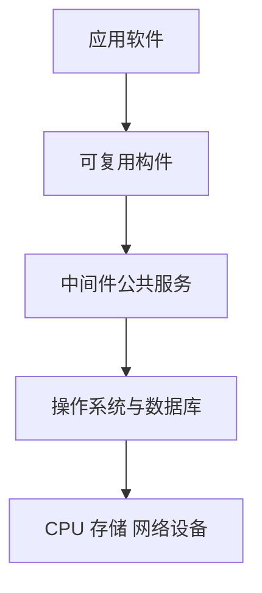

# 计算机软件基础：从“裸硬件”到可复用服务

## 痛点：每个应用都直接控制硬件，开发会失控

硬件只认识机器指令。若每个应用都自己管理 CPU、磁盘、网络和数据格式，不仅重复造轮子，还会互相争抢资源。软件分层就是给开发者逐层垫脚：系统软件管理机器，支撑软件提供公共能力，应用软件解决具体业务。

## 定义（讲人话）

软件是程序、数据及相关文档的集合。类比一栋商场：操作系统是物业，中间件是水电与公共服务，构件是可安装的标准店铺模块，应用软件才是面向顾客的商店。

## 逐个认识：按用途分类

| 类型 | 作用 | 怎么认 | 例子 |
| --- | --- | --- | --- |
| 系统软件 | 管理硬件和基础资源 | “操作系统、驱动、语言处理” | Linux、设备驱动、编译器 |
| 支撑软件 | 为开发和运行提供公共能力 | “数据库、中间件、开发工具” | DBMS、消息中间件、IDE |
| 应用软件 | 解决用户业务问题 | “办公、财务、行业应用” | ERP、浏览器、政务系统 |

**核心区分**：操作系统向下管硬件，中间件横向提供通用服务，应用向上解决业务。

## 核心机制：中间件与构件怎样连接软件

- **中间件**位于操作系统/网络与应用之间，屏蔽分布式环境差异，常提供通信、事务、消息、数据访问等服务。
- **构件**是具有明确接口、可以独立部署和复用的软件单元；接口说明“能做什么”，实现隐藏“怎么做”。
- **应用**通过接口组合构件，再借助中间件跨进程、跨机器协作。

## 这个知识与考试的关系

- 题干出现“屏蔽异构、消息、事务、公共服务”优先想到中间件。
- 出现“明确接口、可替换、可复用、独立部署”优先想到构件。
- 数据库基础应在数据库技术相邻章节单独维护；本篇只说明它在软件层次中的位置，不重复抄一份。

## 记忆口诀

> **系统软件管机器，中间件搭桥梁，构件按接口复用，应用解决业务。**

## 下一站

> 顺着主线往下看 [[计算机语言-编译与解释]]——软件要交给机器执行，还要经过语言处理。
> 想回看软件由谁管理，回 [[操作系统概述]]。
