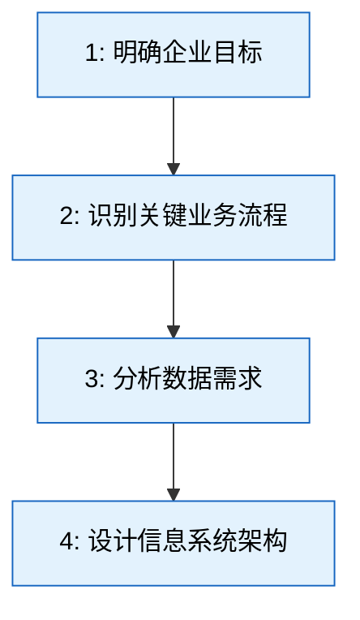
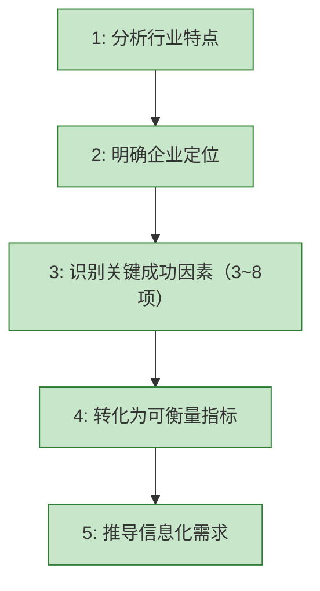

---

# 企业信息系统战略规划方法

**考试怎么考**：选择题匹配方法名称与定义（“由顶向下规划”对应 BSP，“抓关键因素”对应 CSF 等）；案例题可能要求根据企业场景推荐合适方法，或判断描述属于哪种方法。[^1]

## 一句话定义

信息系统战略规划就是 **给企业信息化画一张施工总图**——先想清楚未来长什么样，再倒推今年做什么。它回答三个问题：现在在哪？要去哪？怎么去？[^1]

---

## 五大经典方法详解放

### 1️⃣ BSP（企业系统规划法）— 规划之王

**核心逻辑**：**“自上而下看，自下而上建”**——先看老板的目标，再看业务怎么跑，再看需要什么数据，最后决定上什么系统。[^2]

**4步流程**：

**考场秒杀词**：“由顶向下规划，由底向上实施”“数据是企业核心资源”→ **BSP**。产出是系统架构蓝图。[^2]

---

### 2️⃣ CSF（关键成功因素法）— 实用之王

**核心逻辑**：**“抓住关键的 20%，解决 80% 的问题”**——找出决定成败的几个关键要素，集中资源干。[^3]

**5步流程**：

**考场秒杀词**：“关键要素”“20/80 法则”→ **CSF**（提出者 Rockart）。产出是优先系统清单。[^3]

---

### 3️⃣ SST（战略目标集转化法）— 精准之王

**核心逻辑**：**“把老板的战略翻译成 IT 听得懂的语言”**——老板说“3 年做到行业第一”，IT 翻译成“需要 BI 系统”。[^4]

| 老板说 | IT 翻译 |
|--------|--------|
| “成为行业标杆” | 需要“精准决策”→上 BI 系统 |
| “服务个性化” | 需要“客户画像”→上 CRM 系统 |
| “出海东南亚” | 需要“多语言多币种”→升级 ERP 国际版 |

**考场秒杀词**：“战略目标转化为信息系统需求”“战略翻译”→ **SST**（提出者 King）。产出是系统需求清单。[^4]

---

### 4️⃣ VCA（价值链分析法）— 商业之王

**核心逻辑**：**“画出企业从头到尾的产业链条，看哪一段能用 IT 改造，形成竞争优势”**——用波特的价值链模型分析基本活动与支持活动，找 IT 改造机会。[^5]

| 活动类型 | 包含内容 | IT 改造方向 |
|---------|---------|-----------|
| 基本活动 | 进料→生产→发货→营销→服务 | 每段都可 IT 提效（MES、CRM） |
| 支持活动 | 基础设施、人力、技术、采购 | IT 提升管理效率 |
| 利润 | 最终目标 | 通过 IT 获得比对手更高的利润 |

**考场秒杀词**：“价值链”“波特”“竞争优势环节”→ **VCA**。[^5]

---

### 5️⃣ SAM（战略一致性模型）— 诊断之王

**核心逻辑**：**“检查业务和 IT 是不是对齐了”**——业务要往东走，IT 却在往西建系统，就是脱节了，必须对齐。[^6]

| 要素 | 关注的问题 |
|------|-----------|
| 业务战略 | “我们要成为什么样的企业？” |
| IT 战略 | “我们需要什么样的 IT 能力？” |
| 业务架构 | “业务怎么运行？” |
| IT 架构 | “系统怎么建设？” |

**考场秒杀词**：“对齐”“匹配”“诊断”→ **SAM**。**注意：SAM 是诊断工具，不是规划方法**——这是它与其他四种的本质区别。[^6]

---

## 一对关键对比：CSF vs SST（最容易混淆的死对头）

| 对比维度 | CSF | SST |
|---------|-----|-----|
| 出发点 | 关键成功因素（行业/企业特点） | 战略目标（老板的目标） |
| 解决什么问题 | 先干什么、重点抓什么 | 战略落地需要什么 IT 能力 |
| 考场识别词 | “找出决定成败的关键要素” | “将企业战略目标转化为信息系统需求”[^3][^4] |

---

## 五种方法一页纸速查

| 方法 | 一句话 | 考场秒杀词 | 方法性质 |
|------|-------|-----------|---------|
| **BSP** | 自上而下看，自下而上建 | 由顶向下、数据驱动 | 规划方法 |
| **CSF** | 抓关键的 20% | 关键因素、Rockart | 规划方法 |
| **SST** | 翻译战略到 IT | 战略目标集转化、King | 翻译方法 |
| **VCA** | 画价值链找 IT 机会 | 波特、价值链 | 分析方法 |
| **SAM** | 检查业务 IT 是否对齐 | 对齐、匹配、诊断 | **诊断工具** |

---

## 一个口诀

> **BSP 定架构，CSF 抓重点，SST 译战略，VCA 找增值，SAM 对对齐。**
>
> - BSP 是规划之王（最完整）
> - CSF 是实用之王（有限资源抓重点）
> - SST 是精准之王（直接连接业务与 IT）
> - VCA 是商业之王（IT 如何帮企业赚钱）
> - SAM 是诊断之王（哪里脱节了）

---

## 隐形需求提醒

- 记住 **提出者**：CSF→Rockart，VCA→Porter，SST→King，SAM→Henderson & Venkatraman，BSP→IBM。
- 注意 **性质区分**：除 SAM 是诊断工具外，其余都是规划方法或分析方法。
- 考试陷阱常把 **CSF 和 SST**、**BSP 和 VCA** 混在一起考，务必看清题干关键词。

---

#### Sources
[^1]: [[企业信息系统战略规划方法]]
[^2]: [[企业信息系统战略规划方法]]
[^3]: [[企业信息系统战略规划方法]]
[^4]: [[企业信息系统战略规划方法]]
[^5]: [[企业信息系统战略规划方法]]
[^6]: [[企业信息系统战略规划方法]]

