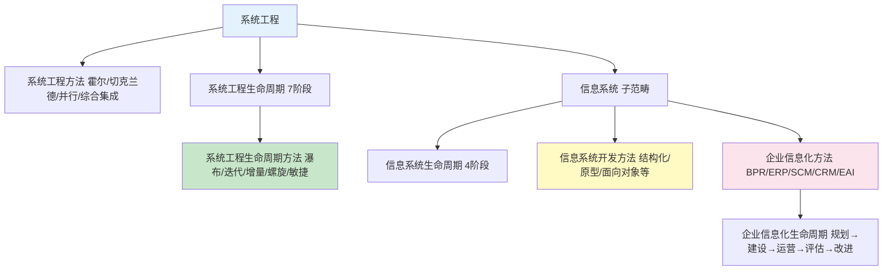

生命周期，方法对比
---

## 完整对比表格（考场版）

| 概念                                                                     | 所属领域 | 关注什么              | 典型方法 / 阶段                | 回答的核心问题           | 考场秒杀关键词                     |
| :--------------------------------------------------------------------- | :--- | :---------------- | :----------------------- | :---------------- | :-------------------------- |
| **系统工程方法**                                                             | 系统工程 | 大型复杂工程（软硬结合）怎么组织  | 霍尔三维、切克兰德、并行、综合集成        | 怎么把一个复杂工程管好？      | “时间维/逻辑维/知识维”“软科学”“并行”“巨系统” |
| **系统工程生命周期**                                                           | 系统工程 | 复杂系统从生到死的宏观阶段划分   | 7阶段：探→概→开→生→使→保→退        | 这个复杂系统现在走到哪一步？    | “探索性研究”“概念阶段”“生产阶段”“退役阶段”   |
| **系统工程生命周期方法**                                                         | 系统工程 | 在生命周期各阶段用什么策略推进   | 瀑布、V模型、迭代、增量、螺旋、敏捷（同上翻译） | 这一步怎么走？顺序还是反复？    | “线性”“风险分析”“功能递增”“测试前置”      |
| **信息系统生命周期**                                                           | 软件工程 | 一个软件系统的生老病死阶段划分   | 4阶段：产→开→运→消（开发内部再分5步）    | 这个软件系统现在走到哪一步？    | “可行性分析”“系统验收”“上线运行”“数据迁移”   |
| **信息系统开发方法**                                                           | 软件工程 | 在开发阶段具体用什么技术范式干活  | 结构化、原型法、面向对象、面向服务、构件化、敏捷 | 这个系统用什么技术范式设计和实现？ | “DFD”“类/继承”“SOA”“构件库”“冲刺站会” |
| **企业信息化方法**                                                            | 企业管理 | 企业怎么用IT改造整体运营     | BPR、ERP、SCM、CRM、EAI      | 企业上什么系统、怎么改流程？    | “流程再造”“财务一体化”“供应商协同”“中间件”   |

---

## 三个特别容易混淆的“死对头”详细对比

### 第一对：系统工程生命周期 (7阶段) vs 信息系统生命周期 (4阶段)

| 对比维度 | 系统工程生命周期 | 信息系统生命周期 |
|:---|:---|:---|
| 适用范围 | 软硬结合的大型复杂系统（高铁、航天、智慧城市） | 纯软件系统（ERP、OA、App开发） |
| 阶段数量 | 7个（探索、概念、开发、生产、使用、保障、退役） | 4个（产生、开发、运行、消亡） |
| 阶段名称风格 | 偏宏观管理（“生产阶段”指批量制造） | 偏项目流程（“开发阶段”指软件设计和编码） |
| 考场混淆点 | “生产阶段”=实际硬件制造，不是软件写代码 | “开发阶段”=写代码和测试 |
| 秒杀词 | “保障阶段”“退役阶段” | “可行性分析”“系统验收” |

### 第二对：信息系统生命周期方法 (瀑布/迭代等) vs 信息系统开发方法 (结构化/面向对象等)

| 对比维度 | 生命周期方法 | 开发方法 |
|:---|:---|:---|
| 核心关注 | 项目怎么组织步骤顺序 | 用什么技术范式完成每个步骤 |
| 典型例子 | 瀑布=一步到底不回头，迭代=反复打磨 | 结构化=数据流图+模块化，面向对象=类+继承 |
| 考场陷阱 | “迭代”这个词考频极高，问你选哪个“方法”→先判断是问生命周期方法还是开发方法 | 开发方法里也有“敏捷”，容易跟生命周期方法里的“敏捷”混在一起 |
| 一句话区分 | **生命周期方法决定“顺序和节奏”** | **开发方法决定“符号和范式”** |

### 第三对：企业信息化方法 vs 信息系统开发方法

| 对比维度 | 企业信息化方法 | 信息系统开发方法 |
|:---|:---|:---|
| 关注层面 | 企业整体：上什么系统、怎么改流程、怎么集成 | 单个系统：怎么设计、怎么编码、怎么测试 |
| 典型做法 | BPR（先改流程）、ERP（选系统）、EAI（集成系统） | 结构化（画DFD）、面向对象（画类图）、敏捷（用户故事） |
| 考试出法 | 案例里问“该企业应该优先做什么”→选BPR或ERP | 案例里问“开发团队最好用什么方法”→选结构化或敏捷 |
| 一句话区分 | **企业信息化方法管“选什么、怎么连”** | **信息系统开发方法管“怎么写、怎么画”** |

---

## 企业信息化到底有没有生命周期？

**有，但不是考的重点。** 我给你一个最精简的交代：

企业信息化生命周期通常描述为：
**规划→建设→运营→评估→改进**（循环）

- 跟信息系统生命周期的区别：它不是针对一个具体系统，而是针对整个企业的信息化水平。
- 跟信息系统生命周期的联系：一个具体信息系统的生命周期，是企业信息化生命周期中“建设”和“运营”阶段的组成部分。
- **考场处理**：极少直接考“企业信息化生命周期的具体阶段”，但论文里会用到“规划-实施-运维”这个循环逻辑。备考时你只需要知道它存在，不用背细节。

---

## 一张总图：这些概念之间的关系

**读图技巧**：
- 系统工程是最大范畴，信息系统是它的子集。
- 系统工程方法/生命周期/生命周期方法都是系统工程层面的概念。
- 信息系统生命周期、开发方法、企业信息化方法都是在信息系统（子集）内部的不同维度。
- 企业信息化生命周期最靠下，考试热度最低，但你问到了，我帮你补上。

---

