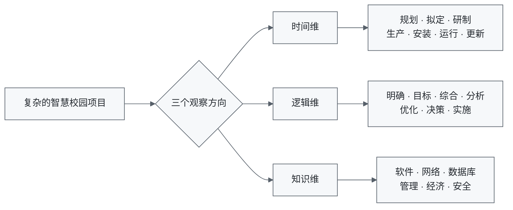
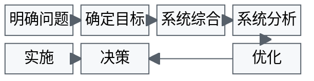
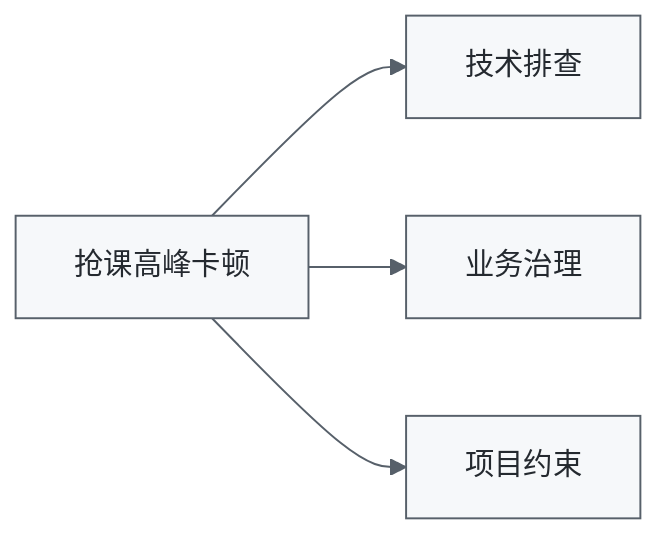
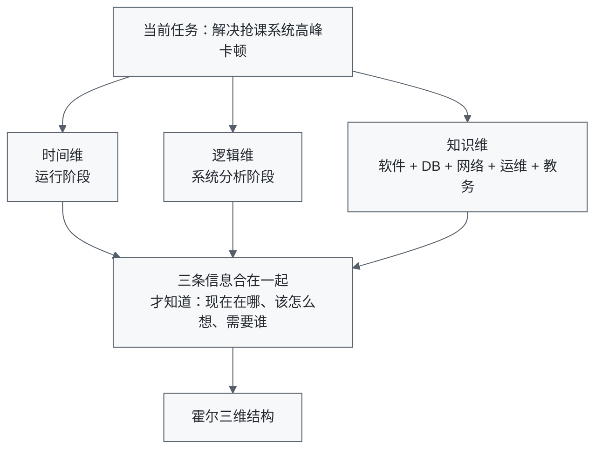
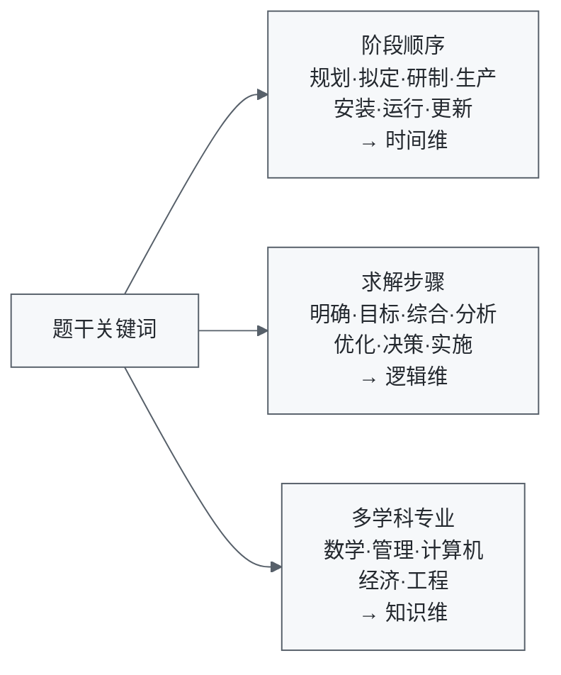

# 霍尔三维结构：一个大项目为什么要从 3 个方向来看？

## 先别背定义，我们先接一个项目

假设你刚当上项目负责人。

领导找到你：

> 学校准备建设一套“智慧校园系统”，你负责把这个项目做起来。

听起来好像就是“开发一个系统”。

但开会第一天，你就懵了。

教务处说：

> 我要选课、排课、成绩管理。

保卫处说：

> 我要门禁、摄像头、车辆识别。

后勤说：

> 我要水电监控、宿舍管理。

财务说：

> 我要收费系统。

技术部门又问你：

> 服务器怎么买？网络怎么设计？软件什么时候开发？

领导最后补一句：

> 明年 9 月必须上线。

你拿着笔记本，发现上面已经写满了需求、预算、网络、软件、门禁、施工、测试、培训、采购、运维、安全……

问题来了：

> **这么复杂的项目，到底从哪里开始？**

如果只是列一个巨大的 ToDo List，很快就会乱掉。

因为这里其实混着 **3 种完全不同的问题**。

> [!tip] 先看图，再往下读
> 霍尔三维结构最核心的价值，就是把“一团乱麻的大项目”拆成 3 个观察方向。

> **一眼记住：什么时候做 = 时间维；怎么想 = 逻辑维；靠哪些专业 = 知识维。**

---

## 第一种问题：我们现在走到哪一步了？

比如智慧校园项目刚开始时，你应该先考虑：

> 到底要不要建设？

而不是直接买服务器。

确定要做以后，再考虑：

> 有哪些方案？

方案确定以后，再：

> 研发、生产、安装、运行……

所以一个大型系统，天然有一个**时间顺序**。

可以先理解成一条项目生命线：

霍尔把这个方向叫：

> **时间维**

# 一、时间维：这个项目现在走到哪一步了？

经典的霍尔时间维一般记成：

![[05_画图素材/Excalidraw/原子笔记插图/霍尔时间维.svg|900]]

> 可编辑源图：[[05_画图素材/Excalidraw/原子笔记插图/霍尔时间维.excalidraw|霍尔时间维 Excalidraw]]

> 先别背 7 个词。顺着故事记：**先想清楚 → 定方案 → 做出来 → 做成规模 → 装上去 → 用起来 → 再升级。**

我们继续用智慧校园的故事理解。

### 1. 规划

学校先发现：

> 现在每个部门都有自己的系统，数据互不相通，学生办一件事要跑好几个部门。

于是领导开始研究：

- 有没有必要建设智慧校园？
- 能解决什么问题？
- 大概要投入多少钱？
- 能不能实施？

这时候系统还没开始做。

这是：

> **规划**

### 2. 拟定方案

确定要做以后，开始讨论：

方案 A：

> 全部自己建设。

方案 B：

> 买成熟产品，再做二次开发。

方案 C：

> 核心系统自己建设，其他系统采购。

这就是：

> **拟定方案**

### 3. 研制

方案选好了。

接下来开始真正设计、开发、做原型、验证。

比如先做一个小范围试点：

> 先做一个小范围试点：选课、统一身份认证、校园卡。

先看看能不能跑通。

这就是：

> **研制**

### 4. 生产

原型验证没问题以后，要把系统真正做成可以大规模使用的产品。

软件要正式发布，硬件设备可能要批量采购或生产。

这是：

> **生产**

### 5. 安装

设备送到了，软件也准备好了。

接下来要完成服务器部署、网络接通、门禁和摄像头安装，最后让系统正式上线。

这是：

> **安装**

### 6. 运行

开学了。

学生真正开始刷卡/刷脸进校、选课、交费。

运维人员开始监控系统。

这就是：

> **运行**

### 7. 更新

过了几年：

> 原来的门禁设备旧了，系统架构也跟不上了。

于是开始升级、替换、改造。

这就是：

> **更新**

所以时间维真正想解决的是：

> **一个复杂系统，从想法到落地，再到后续升级，到底按什么阶段往前走？**

你先记成人话：

> **时间维 = 现在走到哪一步了？**

---

# 二、逻辑维：遇到问题应该怎么想？

但只知道“现在在哪一步”还不够。

假设智慧校园已经运行了。

突然有一天，学生大量投诉：

> 选课系统每到抢课的时候就卡死。

现在我们知道：

> **时间维定位：运行阶段。**

但这对解决问题还不够。

因为你还得回答：

> 到底应该怎么分析这个问题？

有人说：

> “加服务器！”

另一个人说：

> “换数据库！”

还有人说：

> “重写系统！”

如果谁声音大就听谁的，那就不叫系统工程。

面对“抢课系统卡死”，更合理的思路是：

> 这条线就是“解决问题的脑回路”：**先搞清问题，再想办法，比较以后再拍板，最后才实施。**

这就是：

> **逻辑维**

### 1. 明确问题

先别急着解决。

第一件事是：

> 到底什么叫“卡死”？

调查以后发现：

- 平时约 500 人在线时正常；
- 抢课时约 3 万人同时进入，响应超过 30 秒；
- 数据库连接数被占满。

现在问题才真正明确。

### 2. 确定目标

不能只说：

> “系统要快一点。”

这太模糊了。

可以定义：

> 3 万学生同时选课时，95% 请求在 2 秒内返回。

现在才有一个明确目标。

### 3. 系统综合

这里的“综合”很多初学者容易误解。

它不是“做总结”。

而是：

> **提出多个可能的解决方案。**

例如：

可选方案包括：增加服务器、数据库优化、增加缓存、按年级错峰选课，或把技术优化与业务错峰组合起来。

这就是：

> **系统综合**

### 4. 系统分析

有方案以后，开始比较：

| 方案 | 成本 | 效果 | 风险 |
| --- | ---: | ---: | ---: |
| 加服务器 | 高 | 中 | 低 |
| 数据库优化 | 中 | 高 | 中 |
| 错峰选课 | 低 | 高 | 低 |

这就是：

> **系统分析**

### 5. 优化

再进一步组合和改进。

例如发现：

> 单纯扩服务器不划算。

最终组合为：**数据库优化 + 缓存 + 错峰选课**。

这就是：

> **优化**

### 6. 决策

方案都摆到桌面上了。

领导综合比较成本、效果、工期和风险后，选择最终方案。

这就是：

> **决策**

### 7. 实施

最后程序员改代码、DBA 调数据库、运维扩容。

这才是：

> **实施**

所以逻辑维回答的是：

> **一个问题出现以后，我们应该按照什么思维顺序去解决？**

记成人话：

> **逻辑维 = 这件事应该怎么想？**

---

# 三、知识维：这件事需要哪些专业知识？

我们的解决方案已经出来了：

最终组合方案：数据库优化、缓存、网络调整，再配合错峰选课。

那谁来做？

难道只找一个 Java 程序员？

显然不够。

你可能需要：

- 软件架构师
- 数据库工程师
- 网络工程师
- 运维人员
- 教务管理人员
- 信息安全人员
- 甚至还要财务人员算成本

于是霍尔又引出了第三个方向。

复杂系统往往跨很多专业。

例如解决“抢课系统高峰卡顿”，可能不是一个程序员就能搞定：

总览图只负责分组，具体专业再展开：

| 分组 | 需要的专业 | 重点解决什么 |
| --- | --- | --- |
| 技术排查 | 软件架构、数据库、网络与运维 | 服务拆分、缓存、SQL、连接数、容量与扩容 |
| 业务治理 | 教务管理、信息安全 | 是否允许错峰，以及认证与访问控制 |
| 项目约束 | 经济与管理 | 成本、工期与风险是否可接受 |

一个大型系统工程，很少靠一个专业就能完成。

所以：

> **知识维 = 为了解决问题，需要哪些专业知识？**

记成人话：

> **知识维 = 需要找哪些专家？**

---

# 四、三个维度终于合起来了

现在再回到智慧校园。

比如你正在解决：

> 抢课系统高峰卡顿。

那么这件事同时可以从 3 个方向定位。

### 时间维

系统现在在哪？

> **运行阶段**

### 逻辑维

现在做到哪一步？

> **系统分析**

### 知识维

需要什么专业？

> 软件 + 数据库 + 网络 + 运维 + 教务管理

于是同一件真实工作，可以同时从 3 个方向定位：

这就是：

> **霍尔三维结构。**

---

# 五、现在再看正式定义

有了前面的故事，定义就没那么抽象了。

**霍尔三维结构（Hall's Three-Dimensional Structure）**是一种系统工程方法论框架，从三个维度组织复杂系统工程活动：

- **时间维**：系统工程按时间经历哪些阶段；
- **逻辑维**：解决问题遵循什么逻辑步骤；
- **知识维**：完成任务需要哪些专业知识。

它真正解决的是：

> **大型复杂工程里，“什么时候做、怎么思考、需要什么专业知识”全部混在一起的问题。**

---

# 六、考试怎么认？

先看这一张：

做题时不要先死背术语，先问：题目到底在说**项目阶段、解决问题步骤，还是专业知识**？

## 最简单的记忆法

不用先死背“时间、逻辑、知识”几个词。

直接想三个问题：

> **什么时候干？**

→ 时间维

> **怎么想？**

→ 逻辑维

> **靠哪些专业？**

→ 知识维

一句口诀：

> **时间管进度，逻辑管脑子，知识管专家。**

---

# 七、初学者最容易混的地方

后面你还会看到另一个知识点：

> **系统工程生命周期**

里面也会出现一串阶段，例如：**探索 → 概念 → 开发 → 生产 → 使用 → 保障 → 退役**。

于是很容易产生疑问：

> “这不也是 7 个阶段吗？和霍尔时间维不是一样的吗？”

不是。

先这样理解：

> **霍尔三维结构是一套从三个角度组织复杂系统工程的方法框架。**

其中：

> **时间维只是它的一条轴。**

而“系统工程生命周期”则专门研究：

> **一个系统从产生到退出经历什么阶段。**

考试里如果看到：**规划 → 拟定 → 研制 → 生产 → 安装 → 运行 → 更新**。

优先锁定：

> **霍尔三维结构的时间维**

---

# 八、最后检查一下：你真的懂了吗？

先别看上面，回答三个问题：

1. 一个项目现在正在“安装设备”，这是哪个维度？
2. 团队正在“提出 3 个解决方案并比较优劣”，这是哪个维度？
3. 一个项目同时需要软件、网络、管理、经济等多个专业，这是哪个维度？

答案分别是：

> **时间维、逻辑维、知识维。**

如果你能自己说出：

> **什么时候干、怎么想、靠哪些专业**

这篇就已经真正入门了。

---

## 一句话总结

> **霍尔把复杂工程放进一个三维坐标系：时间维看“什么时候做”，逻辑维看“怎么解决问题”，知识维看“需要哪些专业知识”。**

---

## 下一站

- 上一篇：[[系统工程的概念]]
- 下一篇：[[切克兰德方法]]

> 霍尔很适合把复杂工程组织得井井有条。
>
> 但如果项目里连“真正的问题是什么”大家都说不清呢？
>
> 下一篇就会遇到另一种系统工程思路：**切克兰德方法**。
