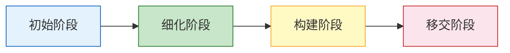

# 06_RUP

## 零基础先抓住

> [!question] 为什么要学这个
> 项目可以线性推进、反复迭代，也可以风险驱动。这里重点看“开发步骤按什么节奏和反馈方式推进”。

> [!important] 考试怎么认
> 看到与“**RUP**”相关的阶段、方法或关键术语时，先判断它解决什么问题、适用什么场景，再做选择。

**考试怎么考**：选择题问你RUP的四阶段名称，或判断RUP属于哪种生命周期模型。

**核心定义**：RUP（Rational统一过程）是IBM Rational公司提出的一种“用例驱动、架构为中心、迭代增量”的软件开发过程框架，简单说就是**把瀑布的规范性和迭代的灵活性结合起来**。

**RUP的四阶段**：

| 阶段 | 核心目标 | 关键产出 | 通俗理解 |
|:---|:---|:---|:---|
| **初始阶段** | 确定项目范围和商业用例 | 《愿景文档》《风险清单》 | 想清楚“做不做、值不值得” |
| **细化阶段** | 分析需求、建立架构基线 | 《需求模型》《软件架构文档》 | 画清楚“系统长什么样” |
| **构建阶段** | 开发所有功能组件 | 可运行的系统（Beta版） | 写代码、做测试 |
| **移交阶段** | 部署到用户环境 | 最终产品、用户手册 | 上线、培训、交接 |

**RUP的六个核心工作流**（了解即可）：
1. 业务建模
2. 需求
3. 分析与设计
4. 实现
5. 测试
6. 部署

**考场关键词**：
- 出现“用例驱动”“架构为中心”“迭代增量”→ **RUP**
- 出现“初始、细化、构建、移交”→ **RUP的四阶段**
- 出现“Rational统一过程”→ **RUP**

**一个口诀**：
> RUP四阶段：初细构建交，用例驱动架构稳，迭代增量是灵魂。

---

## 自测

1. 用自己的话解释“RUP”解决的核心问题。
2. 它与本模块最容易混淆的概念，核心区别是什么？

## 下一站

- 上一篇：[[敏捷开发模型]]
- 下一篇：[[4大阶段]]
