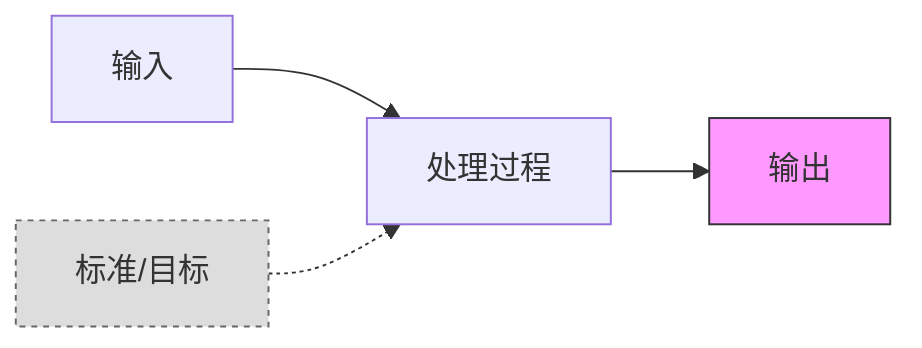
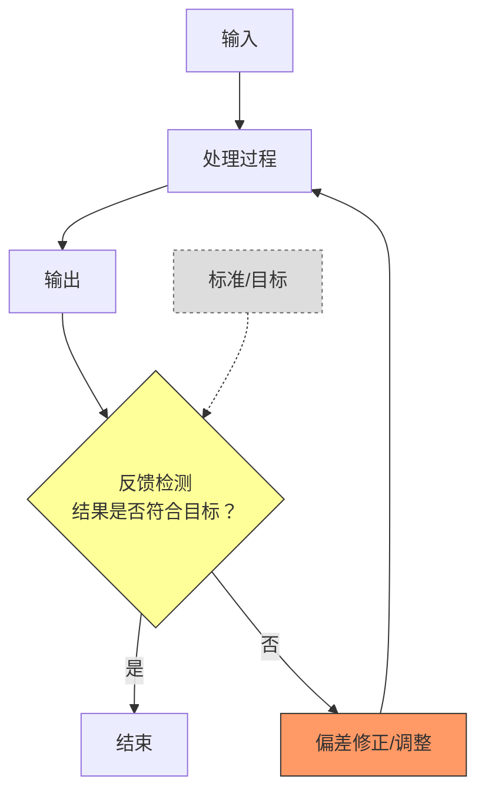

## 开环与闭环结构

考试怎么考？题干给你个场景（微波炉、空调、批处理任务），问你是开环还是闭环，或者直接问你“有没有反馈回路”来判断。

**核心判断标准就一条：看有没有反馈回路。**

---

### 先定义清楚

**开环结构**：系统没有反馈回路，信息顺着一条路走到黑，执行完就结束，不管结果对不对。像你按了微波炉定时键，它转完就停，食物热不热透它不管——它按你设的时间执行，不回头看。

**闭环结构**：系统有反馈回路，执行完后会把输出结果拿回来跟目标比一下，发现有偏差就自动调整，直到结果符合预期才收工。空调就是典型：设了26度，它实时测室温，高了就制冷，低了就停机或制热，一直在调。

---

### 开环 vs 闭环 关键对比

| 对比项 | 开环 | 闭环 |
|--------|------|------|
| 反馈回路 | 没有，干完拉倒 | 有，回头检查结果 |
| 信息怎么走 | 单向，一条道走到黑 | 循环，转着圈来 |
| 出错怎么办 | 不管，反正执行完了 | 自动检测偏差，修正再来 |
| 控制精度 | 一般，全靠初始设置准不准 | 高，动态调整 |
| 抗干扰能力 | 弱，中间被打断没办法自己纠正 | 强，能自己找补 |
| 成本和复杂度 | 简单、成本低 | 相对复杂，需要检测和调整机制 |

---

### 开环结构流程图

走法就是：输入目标 → 执行处理 → 直接输出 → 完事，不回头看结果对不对。

---

### 闭环结构流程图

走法是：执行 → 输出 → 检查结果是否达标 → 不达标就调 → 调完再来 → 直到达标才结束。

---

### 典型应用场景

**开环的常见案例**：定时开关、微波炉、老式洗衣机、定时任务、报表生成、批处理系统。都是一锤子买卖，设好了就干，干完收工不回头。

**闭环的常见案例**：恒温空调、汽车定速巡航、自动补货系统、自动驾驶、PID控制器。都是边走边看，边做边调，直到结果满意才停。

---

### 考场关键词速查

题干出现这些词，直接判断：

| 关键词 | 对应结构 |
|--------|---------|
| 无反馈、单向、不检查结果、一次性执行 | 开环 |
| 反馈回路、自动调整、偏差修正、循环检测 | 闭环 |
| 恒温、巡航、自动补货、自适应 | 闭环 |
| 报表生成、定时任务、批量处理 | 开环 |

---

### 记忆口诀

开环是一锤子买卖，做完从来不回头；闭环做了还得查，不达标就继续调。考场秒杀就记一条——有反馈就是闭环，没有就是开环，没错。