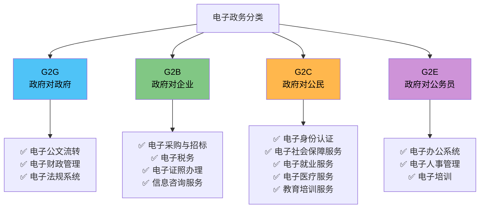

# 📋 电子政务分类 — 系统架构师备考笔记

## 零基础先抓住

> [!question] 为什么要学这个
> 不同管理层级和业务任务需要不同类型的信息系统。这里要学会根据“谁在用、解决什么问题”识别系统类型。

> [!important] 考试怎么认
> 看到与“**电子政务分类**”相关的系统类型、企业信息化方法、规划或发展阶段关键词时，先判断它服务哪个层级、解决什么问题。

> ⭐ **高频考点** · 题型：选择+案例  
> **一句话**：政府上网办事，按 **"对谁服务"** 分 4 类

---

## 🧭 四大分类总览

---

## 🎯 四大分类对比（一表秒懂）

| 分类 | 谁→谁 | 🏠 内外 | 核心业务 | ⚠️ 必考关键词 |
|:---:|:---|:---:|:---|:---|
| **G2G** | Gov → Gov | 🔵 内·部门间 | 电子公文、数据共享、法规系统 | **信息共享·业务协同** |
| **G2B** | Gov → Business | 🟢 外·企业 | 电子税务、采购招标、证照办理 | **一站式·并联审批** |
| **G2C** | Gov → Citizen | 🟠 外·公民 | 社保医疗、教育培训、就业服务 | **覆盖面最广·便民** |
| **G2E** | Gov → Employee | 🟣 内·个人 | OA办公、人事管理、内部培训 | **易漏·区分 G2G** |

> 💡 **大白话**：
> - **G2G** = 部门间发公文、通数据 ≈ 公司跨部门协作
> - **G2B** = 企业网上报税、办执照 ≈ 企业少跑腿
> - **G2C** = 支付宝里查社保、办护照
> - **G2E** = 政府员工打卡、查工资条

---

## 🎯🎯 官方考纲另一考法：5 类互动领域（B2G / C2G 反向互动）

> 上面 4 类是"**政府服务谁**"（服务对象分类）；官方考纲还常考"**谁在跟政府互动**"的 5 类方向，多出 **B2G、C2G** 两个反向：

| 领域 | 含义 | 典型场景 | 与 4 类的关系 |
| :---: | :--- | :--- | :--- |
| **G2G** | 政府 → 政府 | 部门间公文流转、数据共享 | 同左 |
| **G2B** | 政府 → 企业 | 政策发布、电子采购招标、证照办理 | 同左 |
| **G2C** | 政府 → 公民 | 社保查询、证件办理、公共服务 | 同左 |
| **B2G** | **企业 → 政府** | **纳税申报、项目投标、政策建议** | 新增！方向相反（企业找政府办事） |
| **C2G** | **居民 → 政府** | **参政议政、意见反馈、紧急报警** | 新增！方向相反（居民找政府办事） |

> [!warning] 方向陷阱（最爱考）
> - "**税务部门向企业提供网上报税**" → **G2B**（政府主动服务企业）
> - "**企业在线申报纳税**" → **B2G**（企业主动找政府办事）
> - 判断标准看**谁发起/服务谁**，不是看"涉不涉及企业"！

---

## 📈 电子政务发展阶段（1 分考点）

> 电子政务从低级到高级：**起步 → 单向互动 → 双向互动 → 网上事务处理**

| 阶段 | 特征 | 例子 |
| :--- | :--- | :--- |
| ① 起步阶段 | 政府**单向发布**静态信息 | 政府网站挂政策文件（只能看） |
| ② 单向互动 | 政府提供服务，用户可**下载** | 下载表格、查询办理进度 |
| ③ 双向互动 | 用户可**在线提交**，政府在线回复 | 网上咨询、在线投诉 |
| ④ 网上事务处理 | **全流程在线办结** | 一网通办、电子签章、在线审批 |

> **秒杀**："只能看"=起步；"能下载"=单向；"能提交"=双向；"全流程办结"=事务处理。

---

## ⚠️ 高频易错（3 个坑，必看！）

| # | 易混淆 | ❌ 错误想法 | ✅ 正确理解 |
|:---:|:---|:---|:---|
| 1️⃣ | **G2G vs G2E** | 公务员的事都是 G2G | G2G=部门↔部门；G2E=部门↔个人 |
| 2️⃣ | **G2B vs G2C** | 电子税务是给个人→G2C | 企业报税→G2B；个人报税→G2C |
| 3️⃣ | **多选题陷阱** | 电子社保是 G2B？ | 社保=服务公民→G2C |

---

## 🎤 口诀速记

> **「两内两外，政企民员」**
> - 🔵 G2**G** = **政**府对**政**府（内·部门间）
> - 🟣 G2**E** = **政**府对**员**工（内·个人）
> - 🟢 G2**B** = **政**府对**企**业（外）
> - 🟠 G2**C** = **政**府对**公****民**（外）

---

## 📌 真题溯源

| 年份 | 考点 | 题型 |
|:---:|:---|:---:|
| 2022 | G2B 电子采购（反向 B2G） | 选择 |
| 2021 | G2C 一网通办架构设计 | 案例 |
| 2020 | 四类区分（多选陷阱） | 选择 |
| 2019 | G2G 信息共享平台 | 案例 |

---

> 🏷️ `#软考` `#系统架构师` `#电子政务` `#架构设计`

## 自测

1. 用自己的话解释“电子政务分类”解决的核心问题。
2. 它与本模块最容易混淆的概念，核心区别是什么？

## 下一站

- 上一篇：[[商业智能BI]]
- 下一篇：[[企业信息化的概念]]
