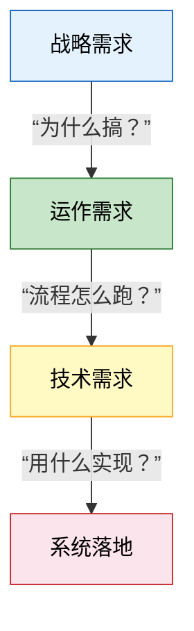

---

## 信息化需求的三个层次

**考试怎么考**：选择题给你一段描述，问属于哪个层次的需求；或者让你判断三个层次的正确顺序。

### 一句话定义

信息化需求就是企业搞信息化时需要满足的条件，分为**战略需求、运作需求、技术需求**三个层次，从上往下逐层支撑。

### 核心流程：三层如何支撑？

### 三个层次详解

| 层次 | 核心问题 | 通俗理解 | 典型内容 |
|:---|:---|:---|:---|
| **战略需求** | 为什么搞信息化？ | 老板层面想清楚目标 | 支撑企业战略、提升竞争力、实现数字化转型 |
| **运作需求** | 业务流程怎么跑？ | 业务部门提具体要什么功能 | 流程优化、信息共享、业务协同、消除信息孤岛 |
| **技术需求** | 用什么技术实现？ | IT部门选什么系统、搭什么架构 | 网络、服务器、数据库、系统架构、安全体系 |

### 一对关键对比

| 对比项 | 战略需求 | 运作需求 | 技术需求 |
|:---|:---|:---|:---|
| 提需求的人 | 高层管理者 | 中层业务人员 | IT技术人员 |
| 关注点 | 为什么做、值不值得 | 做什么、怎么跑 | 用什么做、能不能跑通 |
| 时间跨度 | 长期（3-5年） | 中期（1-2年） | 短期（项目周期内） |

### 考场关键词

- 出现**战略、竞争力、转型** → 战略需求
- 出现**流程、协同、信息共享、业务** → 运作需求
- 出现**网络、系统架构、数据库、技术选型** → 技术需求

### 一个口诀

> 战略定方向，运作管流程，技术来落地，三层不能乱。

### 常见易错提醒

> 注意区分 **“目的”** 与 **“需求”** ：目的是“最终要达成什么”；需求是“具体要满足什么条件”，三层需求顺序不可逆——战略→运作→技术，从上往下逐层支撑。好的，我基于最新软考系统架构师教程，生成精简版笔记。

---

