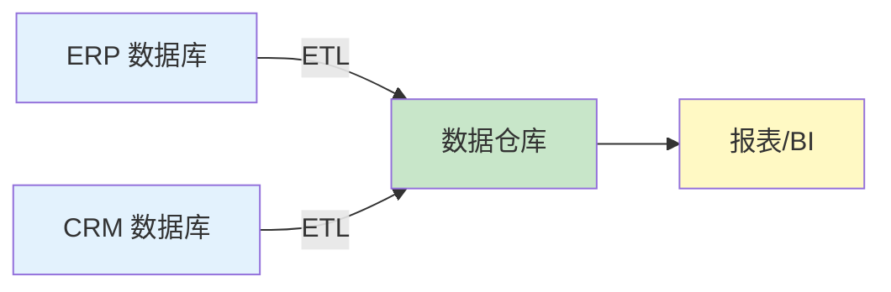
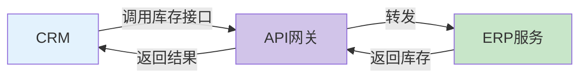
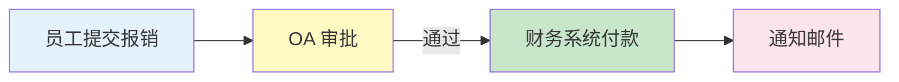
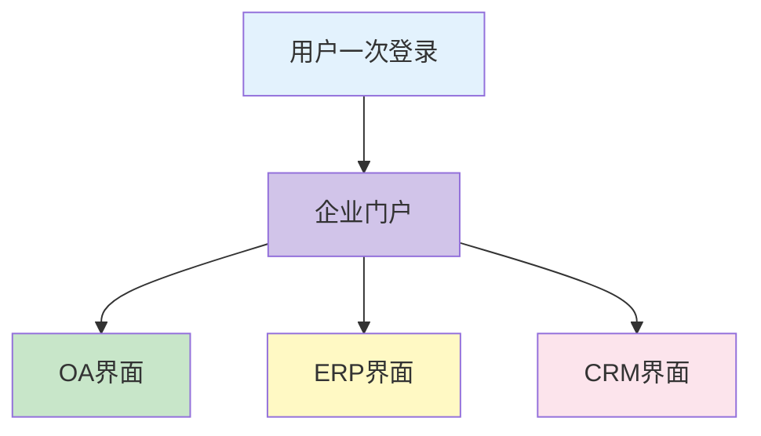
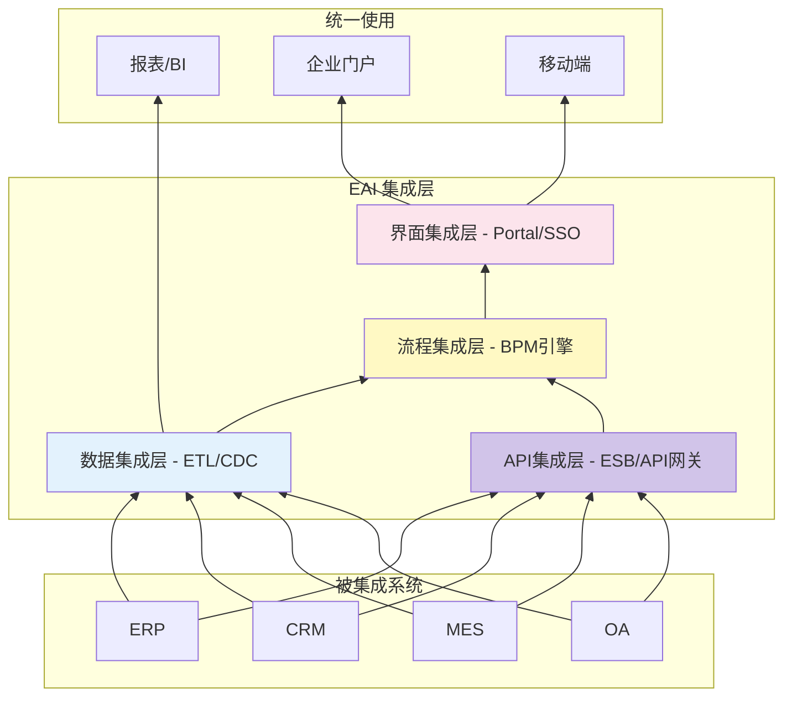

# 企业应用集成（EAI）

**考试怎么考**：选择题给你一个场景（“从多个系统取数做报表”），问用哪一层集成；案例题让你针对几套互不通信的系统设计集成方案，必须讲出选择哪一层以及为什么。

## 一句话定义

企业应用集成（EAI）就是把企业里各玩各的系统（如企业资源计划系统（ERP）、客户关系管理系统（CRM）、制造执行系统（MES）、办公自动化系统（OA））像乐高一样拼起来，让它们能互相通信、数据打通，核心是**消除信息孤岛**。

> [!important] 核心定义
> 企业应用集成（EAI）不是单一技术，而是一套集成方法论。它分四个从低到高的层次：**数据集成 → API集成 → 流程集成 → 界面集成**。越低越靠近底层数据，越高越靠近用户界面。

---

## 一、数据集成（最底层）

**做什么**：把不同数据库的表数据拉出来，清洗、转换后存入一个统一的地方（数据仓库/数据湖），供报表和商业智能（BI）分析用。

**典型场景**：每月销售报表需要合并企业资源计划系统（ERP）的订单、客户关系管理系统（CRM）的客户信息、财务系统的回款记录，抽取-转换-加载（ETL）在夜里定时跑一次。

**技术手段**：抽取-转换-加载（ETL）、变更数据捕获（CDC）、数据联邦。

**流程图（抽取到存储）**：

**一句口诀**：数据根据 ETL，拉取清洗统一存。

---

## 二、API 集成

**做什么**：把每个系统的功能包装成标准接口（表述性状态传递（REST）/简单对象访问协议（SOAP）），通过企业服务总线（ESB）或 API 网关互相调用，实现实时业务协同。

**典型场景**：用户在客户关系管理系统（CRM）创建订单时，实时调用企业资源计划系统（ERP）的库存接口检查库存，如果库存不足则提示“无货”。

**技术手段**：表述性状态传递（REST）API、远程过程调用（gRPC）、简单对象访问协议（SOAP）、企业服务总线（ESB）、API 网关。

**流程图（接口调用）**：

**一句口诀**：API 集成接口连，实时响应业务联。

---

## 三、流程集成

**做什么**：用业务流程管理（BPM）引擎把多个系统的操作编排成一个跨系统的自动化流程，业务数据按规则自动流转。

**典型场景**：员工提交报销 → 办公自动化系统（OA）审批 → 审批通过后自动触发财务系统付款 → 发邮件通知员工。

**技术手段**：业务流程管理（BPM）引擎、工作流引擎（如 Activiti、Flowable）、事件编排。

**流程图（自动化流程）**：

**一句口诀**：流程集成编排走，跨系统任务自动跑。

---

## 四、界面集成（最顶层）

**做什么**：用一个门户网站把所有系统的界面聚在一起，用户一次登录（单点登录（SSO））就能访问所有系统，无需切换。

**典型场景**：公司内网门户，左边是办公自动化系统（OA）待办、右边是企业资源计划系统（ERP）报表、中间有客户关系管理系统（CRM）客户列表——全部在一个浏览器页面里。

**技术手段**：门户（Portal）、单点登录（SSO）、内联框架（iframe）、微前端。

**流程图（统一入口）**：

**一句口诀**：界面集成门户看，一屏解决多系统。

---

## 五、一对关键对比：数据集成 vs API 集成（死对头）

这两个在选择题里最爱放在一起混淆，必须按住一个：

| 对比项 | 数据集成 | API 集成 |
|:---|:---|:---|
| 聚焦对象 | 数据库表、文件 | 服务接口、方法 |
| 典型技术 | 抽取-转换-加载（ETL）、变更数据捕获（CDC）、数据联邦 | 表述性状态传递（REST）API、远程过程调用（gRPC）、简单对象访问协议（SOAP） |
| 实时性 | 通常批量（夜间跑） | 实时或准实时 |
| 耦合度 | 高（直接读数据库） | 低（通过接口解耦） |
| 适合什么 | 报表、商业智能（BI）分析 | 业务联动、在线交易 |
| 考场识别词 | ETL、数据同步 | API、服务调用 |

**一句话辨死对头**：要历史数据做分析 → 数据集成；要实时业务协同 → API 集成。

---

## 六、四个集成层次完整对比表

| 层次 | 一句话 | 骨干技术（中文全称） | 实时性 | 考场秒杀词 |
|:---|:---|:---|:---|:---|
| **数据集成** | 把数据拉一起做分析 | 抽取-转换-加载（ETL）、变更数据捕获（CDC） | 批量为主 | 数据同步、异构数据库 |
| **API 集成** | 把功能包装成接口互相调 | 表述性状态传递（REST）、企业服务总线（ESB） | 实时/准实时 | 服务调用、API 网关 |
| **流程集成** | 编排跨系统业务流 | 业务流程管理（BPM）引擎 | 准实时 | 审批流、自动流转 |
| **界面集成** | 把多个界面统一到一个门户 | 门户（Portal）、单点登录（SSO） | 实时 | 统一登录、单点登录 |

---

## 七、考场怎么认：题干秒杀速查表

| 题干出现 | 对应判断 |
|:---|:---|
| 第三方系统对接、暴露接口、调用服务 | API 集成 |
| 定时同步、数据不一致、ETL、ODS（操作数据存储） | 数据集成 |
| 审批流、自动流转、工作流引擎 | 流程集成 |
| SSO、统一门户、多系统界面融合 | 界面集成 |
| ESB、消息中间件、服务总线 | 企业应用集成（EAI）的支撑技术 |
| 面向服务架构（SOA）、微服务 | 偏架构风格，与企业应用集成（EAI）不同层面 |

---

## 八、一个口诀

> **数据打底 API联，流程编排自动走，界面门户统一看。**

对应：数据集成（最底） → API 集成（中间） → 流程集成 → 界面集成（最顶）。

---

## 九、额外提醒：企业应用集成（EAI）不是业务流程重组（BPR）

- **业务流程重组（BPR）** 先把业务流程推倒重来，再考虑系统集成（先改业务）
- **企业应用集成（EAI）** 系统已经存在，通过技术拉通它们
- 考场陷阱：题干说“用EAI直接上”但没做流程优化 → 这是错的，**先BPR再EAI**

---

## 十、一张图看懂企业应用集成（EAI）在企业中的位置（总体架构）

**核心一句话**：企业应用集成（EAI）是企业的“数据高速公路”，从底层拉数据、中间接口调用、上层自动编排，到最顶层统一呈现，让各个系统不再是孤岛。