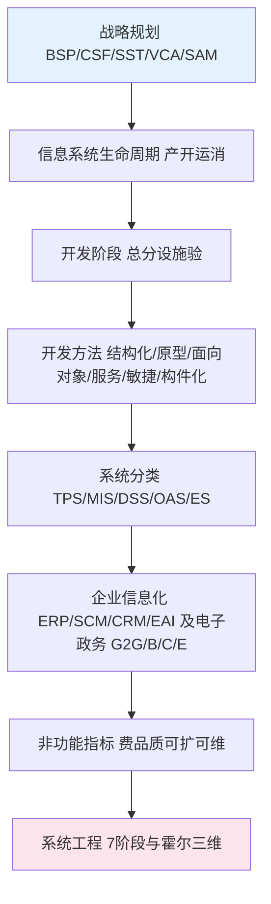

# 故事串联

好的，咱们今天不讲理论，来聊个故事。故事的主角叫“智达科技”，一家做了十年传统制造的公司，老板老张最近愁得慌——同行都在搞数字化，自己还在用Excel管订单，客户投诉越来越多。老张一咬牙：“上系统！”

---

## 第一章：别急着买软件，先想清楚方向

老张把IT主管小李叫来：“给我买套ERP，明天就上！”小李赶紧拦住：“老板，搞信息化不是买软件，得像盖楼一样先画施工图。”于是他们找了一家咨询公司，帮智达做**信息系统战略规划**。咨询师拿出一张表，五个方法排排站：

- **BSP**（企业系统规划法）说：“自上而下看目标，自下而上建系统。”
- **CSF**（关键成功因素法）说：“抓关键的20%，解决80%的问题。”
- **SST**（战略目标集转化法）说：“把老板的战略翻译成IT能听懂的语言。”
- **VCA**（价值链分析法）说：“画出产业链，看哪段能用IT赚钱。”
- **SAM**（战略一致性模型）说：“检查业务和IT是不是对齐了，别各走各的。”

老张选了BSP，因为“自上而下”听起来就像他管工厂的思路——先订产能目标，再拆到每条产线。小李带着团队从企业目标开始，梳理关键业务流程，分析数据需求，最后设计出信息系统蓝图。

---

## 第二章：系统从“想法”到“落地”的四步走

蓝图有了，接下来就是**信息系统生命周期**。小李给老张画了一条时间线：**产→开→运→消**。

- **产生阶段**：搞可行性分析。老张问：“这系统能不能帮我省100万？技术上能实现吗？”答案是通过，立项。
- **开发阶段**：分五个子步骤——**总体规划、系统分析、系统设计、系统实施、系统验收**（任务清单）。小李特别强调：**系统分析**只问“做什么”（产出数据流图DFD），**系统设计**才问“怎么做”（产出ER图、架构图）。老张点头：“就是说，分析是画功能草图，设计是画施工蓝图。”
- **运行阶段**：系统上线，用户培训，运维团队盯着日志。
- **消亡阶段**：等系统老了，把数据迁移走，关掉旧系统。

开发阶段选了**结构化方法**（怎么做）（自顶向下，文档驱动），因为老张喜欢“按部就班”。后来订单模型改得太频繁，又尝试了**原型法**——先做个界面让销售试用，不满意再改。最后发现**敏捷方法**更适合小步快跑，于是改成了两周一个迭代。

---

## 第三章：盖楼有原则，系统建设也有“七不准”

系统开发过程中，咨询师给智达项目组贴了一张“系统建设原则”挂图：

| 原则 | 违背后果 |
|:---|:---|
| **一把手原则** | 老板不参与，项目夭折 |
| **用户参与** | 验收时用户说“这不是我要的” |
| **自顶向下规划** | 各部门自成孤岛，数据对不上 |
| **工程化原则** | 人员离职，系统崩溃 |
| **创新性原则** | 只用电脑跑老流程，效率没提升 |
| **整体性原则** | 生产部和销售部的数据打架 |
| **经济性原则** | 预算超支，烂尾 |

老张一看，第一条“一把手原则”写的就是自己，于是每周亲自参加项目会。销售总监老刘也被拉进小组全程参与——这就是“用户参与”。果然，系统上线后销售部用得最顺。

---

## 第四章：系统分类——你家企业有哪几层？

系统建好了，智达内部慢慢跑起了各种系统，小李给老张科普了信息系统的五个层次：

1. **TPS（事务处理系统）**：最底层的“流水账”——收银、打卡、下单。智达的ERP里，每笔订单都靠TPS记录。
2. **MIS（管理信息系统）**：中层经理用的“报表面包机”——把TPS数据汇总成月度销售统计、库存预警。老张的部门经理天天看。
3. **DSS（决策支持系统）**：老板的“军师”——输入“如果降价10%”，推演下个月利润变化。老张靠它决定要不要搞双十一大促。
4. **OAS（办公自动化系统）**：全员的“电子文具盒”——OA审批、邮件、视频会议。员工请假不用再跑行政部。
5. **ES（专家系统）**：特殊领域的“AI老中医”——智达的售后维修用ES诊断设备故障，输入“异响+过热”，系统就弹出“可能轴承磨损”。

小李特别强调：**DSS是支援人决策，不是代替人**；ES靠知识库+推理机，只解决特定领域问题——别拿它当万能的。

---

## 第五章：企业信息化的“三大件”和“四大政府服务”

除了内部系统，智达还要跟客户和供应商对接。咨询师又介绍了**企业信息化方法**：

- **BPR（业务流程重组）**：先把流程理清楚，不能“用电脑跑老路”。
- **ERP（企业资源计划）**：人财物产供销一套系统管——智达就在用。
- **SCM（供应链管理）**：管好上游供应商，防止“牛鞭效应”。
- **CRM（客户关系管理）**：管好下游客户，360度客户视图。
- **EAI（企业应用集成）**：把新老系统拉通，像胶水一样粘合。

如果智达是政府单位，分类更简单：**G2G**（部门间发公文）、**G2B**（企业网上报税）、**G2C**（公民查社保）、**G2E**（公务员打卡）。口诀是“两内两外，政企民员”。

---

## 第六章：系统跑起来了，非功能指标怎么管？

系统上线三个月后，销售部抱怨“页面打开要5秒”，运维部说“数据库快撑不住了”。小李意识到，光关注功能还不够，还要盯着**非性能指标**：

| 指标 | 一句话 | 考试最爱考 |
|:---|:---|:---|
| 费用 | 算好建设成本和运营成本 | 方案选型 |
| 质量 | ISO 25010, 8个维度保质量 | 质量属性场景 |
| 标准化 | 接口、数据、协议、开发四统一 | 选择题 |
| 可靠性 | 可用性=MTBF/(MTBF+MTTR)，4个9=年宕机52.6分钟 | 计算+论文 |
| 可扩展 | 水平扩展加机器，垂直扩展加配置 | 架构演进 |
| 可维护 | 运维小哥要能监控、能调试、能修 | 论文素材 |

小李给系统加了水平扩展能力，把Session从单机挪到了Redis——**无状态设计**。他还引入了**并行工程**的思路：让开发和运维提前协同，缩短了每次升级的周期。

---

## 第七章：复杂系统的人生——系统工程生命周期

后来智达接了一个政府的大项目，涉及硬件、人员、环境。小李发现，之前的“信息系统生命周期”（4阶段）不够用了，得用**系统工程生命周期**（7阶段）：**探→概→开→生→使→保→退**。每个阶段都有明确交付物：

- 探索性研究：可行性报告
- 概念阶段：需求规格说明书（SRS）
- 开发阶段：可运行的原型
- 生产阶段：批量复制
- 使用阶段：运维手册
- 保障阶段：监控和升级
- 退役阶段：数据迁移和关停

老张听得头晕，小李说：“你就记住，信息系统4阶段是软件的生死，系统工程7阶段是复杂系统的全流程。它跟**霍尔三维结构的时间维**长得很像，但千万别搞混——霍尔时间维是‘规→拟→研→生→安→运→更’，偏任务清单；生命周期7阶段偏交付物。”

---

## 尾声：从“一锤子买卖”到“反馈闭环”

最后，小李给老张讲了一个生活常识：**开环系统**就像微波炉——设好时间只管转，不管菜热没热；**闭环系统**像空调——实时测温，自动调功率。智达的新系统采用了闭环控制：订单执行完，自动检查库存是否更新、客户是否收到通知，如果发现异常就触发警报。

老张听完，拍了拍小李：“以前我觉得信息化就是买软件，现在我明白了——它是一套从战略、到建设、到运维、到退役的完整方法论。你把这些方法画成一张图，下次开会我给全公司讲。”

小李打开笔记本，画出了下面这张图：

老张竖起大拇指：“这就是我们智达的信息化施工总图。”