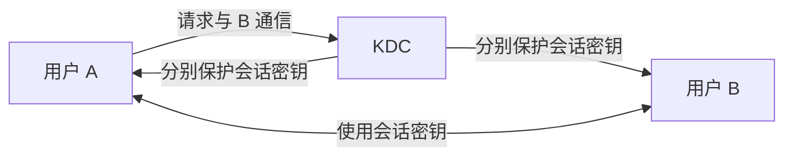

# 密钥管理：算法公开以后，真正的秘密怎样安全交到对方手里

> [!summary]- 快速复习卡片（学完再看）
> **作用/定位**：解决密钥怎样生成、分发、保存、轮换和失效。
> **核心结论**：两两预共享密钥会快速膨胀；KDC 用主密钥分发临时会话密钥；证书解决公钥与身份的可信绑定。
> **经典题型怎么做**：看到 N 个用户两两独立通信，先数用户对数；看到“公钥可能被冒充”，选证书/可信目录而不是直接公开。
> **易错点**：算法强不代表系统就安全；密钥泄露、复用或分发错误都可能让加密失效。

## 它在信息安全主线中负责什么

上一站 [[数字证书与PKI]] 已经解决了“这把公钥到底属于谁”，让身份与公钥有了可验证的可信绑定。**但密码系统真正运行起来以后，密钥不会只生成一次就永远安全：它还要被生成、分发、保存、使用、轮换、撤销，并在生命周期结束时销毁。**

加密算法再强，只要密钥泄露、发错人、长期不更换或被错误使用，机密性仍会失效。**密钥管理负责让密钥在整个生命周期内保持受控。**

| 定位 | 密钥管理在这里的答案 |
| --- | --- |
| 要防的风险 | 密钥难以安全送达、数量失控、泄露后持续可用或被错误使用 |
| 主要交付 | 可用且受控的共享密钥、公钥可信分发与密钥生命周期控制 |
| 依赖/边界 | KDC、CA 等都是可信基础设施；密钥管理不替代具体加密算法，也不自动完成身份认证和授权 |
| 在主线中的位置 | 它承接证书建立的公钥信任，把密码系统推进到“密钥怎样安全运行”；下一站身份认证再回答“当前正在操作系统的主体到底是谁” |

## 为什么有了加密算法还不够

算法可以公开，密钥必须受控。两家公司即使都知道怎样使用 AES，如果无法安全拿到同一把会话密钥，仍然不能开始保密通信。

密钥管理覆盖整个生命过程：生成、分发、保存、使用、轮换、撤销和销毁。本卡只抓考试最常用的“怎样分发”。

### 生成密钥时先看三个条件

大纲把密钥生成的基本判断压缩为三点：**足够的密钥空间、选择强密钥、足够的随机性**。密钥空间太小会让穷举更可行；弱密钥会因结构或可预测性被优先猜中；随机性不足会让攻击者不必遍历全部空间。它们回答“密钥本身是否难猜”，而 KDC、证书和轮换回答“这把密钥是否被正确使用和管理”，不能互相替代。

### 拿到密钥后，怎样限制它只能做该做的事

“能解开”不等于“允许拿来做任何事”。教材把这一层叫作**密钥使用控制**：密钥标签可以给密钥附加用途标识；控制矢量则用可变字段说明允许或禁止的使用条件。KDC 分发会话密钥时可把控制矢量与受主密钥保护的会话密钥关联，让接收方按相同控制信息恢复并使用它。

考试里不必背教材中的推导式；先区分：**密钥标签/控制矢量是在约束密钥用途，KDC 是在分发密钥，随机性是在保证密钥难猜。** 三者解决的不是同一个问题。

## 对称密钥怎样分发

如果 N 个用户都要两两保存一把独立共享密钥，需要的用户对数是：

$$
\frac{N(N-1)}{2}
$$

例如 4 个用户要维护 6 对共享关系。人数增长后，人工分发和长期保存都很重。

KDC（密钥分发中心）的思路是：每个用户只与 KDC 长期共享主密钥；需要通信时，由 KDC 生成短期会话密钥并安全发给双方。会话结束后，会话密钥可以失效，而不必更换所有长期主密钥。

## 公钥公开了，为什么仍然需要管理

公开一把公钥很容易，证明“这把公钥确实属于 A”才困难。直接广播可能被攻击者冒名替换；可信目录、公钥管理机构和数字证书都在解决可信分发问题。

其中数字证书把身份与公钥绑定，并由 CA 签名。验证证书的完整条件见 [[数字证书与PKI]]。

## 为什么还不能停：密钥安全运行，不等于系统已经知道“现在是谁在操作”

到这里，密码学主链已经解决了数据保密、内容变化检测、签名来源、公钥可信绑定和密钥生命周期等问题。**但系统真正收到一次登录或操作请求时，仍然必须验证当前主体声称的身份是否可信。**

密码学可以为认证提供证书、密钥和签名等工具，却不能把“管理好密钥”直接等同于“已经完成身份认证”。实际认证还可能依赖口令、令牌、生物特征或多因素组合。因此密码学主线在这里收口，下一站自然进入 [[身份认证]]。

## 考试怎么认

- “N 个用户两两通信需要多少共享密钥” → 数不同的用户对；
- “集中产生并分发会话密钥” → KDC；
- “公钥如何防冒充” → 可信公钥目录或数字证书；
- “大量业务数据” → 通常用临时对称会话密钥，不用公钥算法直接处理全部数据。

## 自测

1. 10 个用户两两独立共享密钥，为什么需要 45 把而不是 10 把？

> [!answer]- 第 1 题答案与解析
> **答案**：每一对不同用户都需要一把独立共享密钥，共有 $10×9/2=45$ 对。
> **解析**：不是“每个用户一把”，而是“每个用户对一把”。

2. KDC 中长期主密钥和临时会话密钥分别负责什么？

> [!answer]- 第 2 题答案与解析
> **答案**：长期主密钥用于各用户与 KDC 安全交换；会话密钥用于某次用户间通信，通常可在会话结束后失效。
> **解析**：这样无需为每一对用户长期保存一把共享密钥。

3. 公开发布公钥为什么仍有冒充风险？

> [!answer]- 第 3 题答案与解析
> **答案**：攻击者可以发布自己的公钥并冒充目标主体。
> **解析**：需要可信目录、公钥管理机构或数字证书来建立“身份 ↔ 公钥”的可信绑定。

4. 密钥空间足够大，为什么仍不能忽略随机性？

> [!answer]- 第 4 题答案与解析
> **答案**：若生成过程可预测，攻击者可优先猜测少量可能密钥，不必遍历整个理论空间。
> **解析**：密钥空间、强密钥和随机性共同决定密钥是否容易被猜中。

5. 密钥标签和控制矢量与 KDC 各自在解决什么问题？

> [!answer]- 第 5 题答案与解析
> **答案**：密钥标签和控制矢量约束密钥可被怎样使用；KDC 负责产生和分发会话密钥。
> **解析**：它们可以一起出现，但一个是用途控制，一个是分发机制；不要把两者混成同义词。

## 下一站

- 上一篇：[[数字证书与PKI]]
- 下一篇：[[身份认证]]
