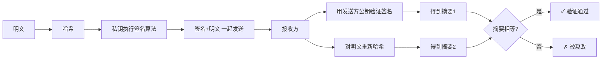

# 数字签名

> [!important] 软考定位
> ⭐⭐ 高频流程题：**谁用什么钥签、验证什么**，几乎年年考。

---

## 一、一句话定义

**数字签名** = 发送方用**自己的私钥**对消息摘要执行签名算法，接收方用**发送方公钥**验证，证明信息"是我发的、没被改过"。

---

## 二、签名与验证流程（⭐必背）

---

## 三、签名保证的"三性"

| 保证 | 原理 |
| :--- | :--- |
| **完整性** | 摘要比对，改了就失败 |
| **真实性** | 公钥能解开=确实是对方签的 |
| **不可抵赖** | 只有对方持有该私钥，抵赖不了 |

> ⚠️ **注意**：数字签名**不保证机密性**！签名是公开验证的，要保密得另加加密（用对方公钥）。

---

## 四、与加密的对比（高频陷阱）

| | 加密 | 签名 |
| :--- | :--- | :--- |
| 用谁的钥 | **对方公钥** | **自己私钥** |
| 目的 | 不让别人看 | 证明是我发的 |
| 验证方 | 对方用私钥解 | 任何人用公钥验 |

---

## 五、考场避坑

1. 看到"防抵赖/防篡改/验真"→ 签名；看到"保密"→ 加密
2. 签名前先哈希：因为非对称加密慢，签摘要更快
3. 问"数字签名能防什么"→ 篡改+伪造+抵赖；**不能防**窃听

---

## 六、一句话总结

> **私钥盖章、公钥验章；保了真、保了全、保了不抵赖，就是不保密。**

---

## 下一站

- 上一篇：[[哈希算法]]
- 下一篇：[[数字证书与PKI]]
