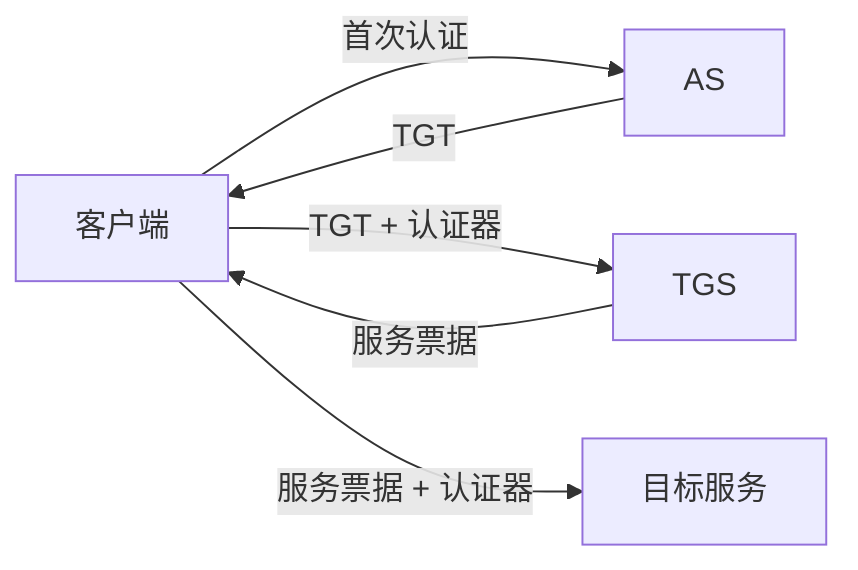

# Kerberos：为什么不用反复发送口令也能访问多个服务

> [!summary] 快速复习卡片
> **作用/定位**：基于可信第三方、对称密钥和票据完成网络身份认证，并常用于企业单点登录环境。
> **核心结论**：先获得 TGT，再向 TGS 换具体服务票据；口令本身不需要在每次访问服务时发送。
> **题干怎么认**：KDC、AS、TGS、TGT、服务票据、时间戳、时钟同步。
> **易错点**：防重放不只是“票据过期”，还依赖短期认证器/时间信息、票据生命周期和服务端检查。

## 核心角色

KDC（Key Distribution Center）通常逻辑上包含认证服务 AS 和票据授予服务 TGS。

- **TGT**：客户端认证后获得，用来向 TGS 证明自己有资格申请后续服务票据。
- **服务票据**：面向某个具体服务，客户端拿它去访问该服务。

## 为什么对时钟同步敏感

Kerberos 常使用带时间信息的认证器、票据有效期以及重放检查。时钟偏差过大，服务端可能无法判断请求是否处于允许时间窗口，因此认证会失败。

## 考试怎么认

看到 KDC/TGT/服务票据时，第一反应就是 Kerberos；同时要知道它属于**对称密钥为核心的第三方认证体系**，不是 PKI 公钥证书体系。

## 自测

1. TGT 和服务票据的用途为什么不同？
2. 为什么“票据有过期时间”不足以完整解释 Kerberos 防重放？

## 下一站
- 前置：[[身份认证]]
- 下一篇：[[单点登录SSO]]
