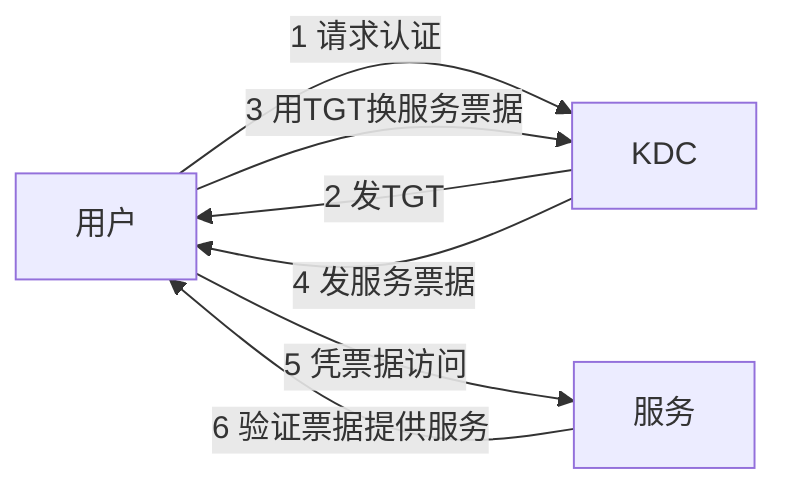

# Kerberos 认证协议

> [!important] 软考定位
> ⭐ 低频但特征明显：见到 **KDC、TGT、票据** 关键词就选它，属于"送分识别题"。

## 零基础先抓住

> [!question] 为什么要学这个
> 企业内服务很多，如果每访问一个服务都重新传口令，体验差且风险高。

> [!tip] 讲人话
> 像先到总服务台领一张 TGT，再凭 TGT 换具体窗口的服务票据。

> [!important] 考试怎么认
> 看到“KDC、TGT、票据、时间戳”几乎就是 Kerberos。

---

## 一、一句话定义

**Kerberos** = 基于**对称密钥 + 票据**的第三方认证协议，让用户"一票通行"访问多个服务。

---

## 二、核心角色

| 角色 | 作用 |
| :--- | :--- |
| **KDC**（密钥分发中心） | 认证与发票的"总务处" |
| **TGT**（票据授权票据） | 登录时发的"万能通行证" |
| **服务票据** | 访问具体服务的"项目门票" |

---

## 三、流程（理解即可）

---

## 四、特点

- 用户只需**登录一次**（天然支持单点登录）
- 基于**对称密钥**体系（比公钥快）
- **时间戳**防重放攻击（票据过期即失效）
- 密钥不在网上明文传输

---

## 五、考场避坑

1. 看到 KDC/TGT/票据 → Kerberos，别犹豫
2. Kerberos 用**对称加密**，不是公钥体系
3. 与 [[单点登录SSO]] 的区别：SSO 是目标/思想，Kerberos 是实现手段之一

---

## 六、一句话总结

> **KDC发通行证，TGT换门票，时间戳防重放——对称密钥体系里的单点登录大师。**

---

## 自测

1. TGT 与服务票据分别做什么？
2. Kerberos 为什么对时钟同步比较敏感？

> [!tip] 使用方法
> 先闭卷回答，再回到上面的“核心机制 / 考场避坑”核对；答不出来就回 [[信息安全技术索引|信息安全技术知识库]] 重新定位。

## 下一站

- 上一篇：[[身份认证]]
- 下一篇：[[单点登录SSO]]
