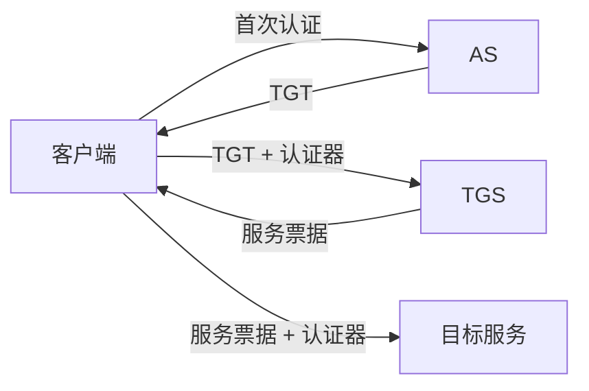

# Kerberos：为什么不用反复发送口令也能访问多个服务

> [!summary]- 快速复习卡片
> **作用/定位**：基于可信第三方、对称密钥和票据完成网络身份认证，并常用于企业单点登录环境。
> **核心结论**：先获得 TGT，再向 TGS 换具体服务票据；口令本身不需要在每次访问服务时发送。
> **题干怎么认**：KDC、AS、TGS、TGT、服务票据、时间戳、时钟同步。
> **易错点**：防重放不只是“票据过期”，还依赖短期认证器/时间信息、票据生命周期和服务端检查。

## 核心角色

KDC（Key Distribution Center）通常逻辑上包含认证服务 AS 和票据授予服务 TGS。

- **TGT**：客户端认证后获得，用来向 TGS 证明自己有资格申请后续服务票据。
- **服务票据**：面向某个具体服务，客户端拿它去访问该服务。

### 跟踪一次访问：谁能解开哪一张票

假设用户小林要访问文件服务 `filesrv`。每个主体都有自己的长期密钥：小林的密钥由她的凭据导出，KDC 保存/管理用户凭据；TGS 持有能保护 TGT 的密钥；文件服务持有自己的服务密钥。KDC 还分别生成短期会话密钥。下面只展开票据的保护对象和持有者，不要求背加密字段编码。

| 步骤 | 发给谁 / 其中有什么 | 谁能解开、凭什么 | 验证后得到什么 |
| --- | --- | --- | --- |
| AS 发初始凭据 | AS 回复含 TGT，以及小林—TGS 会话密钥；回复中给小林的部分由她的长期密钥保护，TGT 由 TGS 密钥保护 | 小林用自己的凭据解开回复，取得小林—TGS 会话密钥；她不能解开 TGT，TGS 才能用自己的密钥解开它 | 小林可持 TGT 和新鲜认证器申请服务票据；口令/长期密钥不用随请求明文发送 |
| TGS 换服务票 | 小林向 TGS 发 TGT、目标服务名和由小林—TGS 会话密钥保护的认证器；TGS 回复含服务票和小林—`filesrv` 会话密钥 | TGS 用 TGS 密钥解开 TGT，再用其中的会话密钥校验认证器；返回给小林的部分由小林—TGS 会话密钥保护。服务票本身由 `filesrv` 的服务密钥保护 | TGS 确认票据与认证器对应后，签发只面向 `filesrv` 的服务票据 |
| 服务端接纳请求 | 小林发送服务票和用小林—`filesrv` 会话密钥保护的新鲜认证器 | `filesrv` 用自己的服务密钥解开服务票，取出会话密钥；再用该会话密钥检查认证器中的身份、时间等信息 | 票据身份与认证器相符且时间/重放检查通过时，服务端确认请求来自持有对应会话密钥的客户端 |

记忆时用“**外层票据给目标服务器解，客户端拿配套会话密钥证明自己**”：TGT 给 TGS 解，服务票给具体服务解；客户端不需要、也不能解开票据本体。票据只证明认证关系；服务端仍要单独检查该身份是否有权读取或修改具体文件。若要求双向认证，服务端还需按协议返回使用会话密钥验证的响应，不能只因客户端通过认证就声称客户端已认证服务器。

依据：RFC 4120 说明票据由目标服务器的密钥保护，客户端需同时提交用票据会话密钥生成的新鲜认证器；Kerberos 票据本身不自动授予应用资源权限。详见 [RFC 4120](https://www.rfc-editor.org/rfc/rfc4120.html)。

## 为什么对时钟同步敏感

Kerberos 常使用带时间信息的认证器、票据有效期以及重放检查。时钟偏差过大，服务端可能无法判断请求是否处于允许时间窗口，因此认证会失败。

## 考试怎么认

看到 KDC/TGT/服务票据时，第一反应就是 Kerberos；同时要知道它属于**对称密钥为核心的第三方认证体系**，不是 PKI 公钥证书体系。

## 自测

1. TGT 和服务票据的用途为什么不同？

> [!answer]- 第 1 题答案与解析
> **答案**：TGT 用来向 TGS 申请后续服务票据；服务票据则面向某个具体服务，供客户端访问该服务。
> **解析**：Kerberos 先用 TGT 完成“有资格申请服务”的证明，再按服务换取针对该服务的票据。

2. 为什么“票据有过期时间”不足以完整解释 Kerberos 防重放？

> [!answer]- 第 2 题答案与解析
> **答案**：还需要认证器中的时间信息、短时间窗口和服务端重放检查等共同限制旧请求的再次使用。
> **解析**：票据生命周期只能限制长期复用；认证器和时间校验用于识别当前请求是否新鲜。

3. TGS 为什么能读 TGT，而客户端和文件服务通常不能？

> [!answer]- 第 3 题答案与解析
> **答案**：TGT 由 TGS 所持有的密钥保护；客户端只取得 TGS 返回给它的配套会话密钥，文件服务使用自己的服务密钥，二者都不是 TGT 的解密方。
> **解析**：票据由目标服务器读取；客户端用会话密钥生成认证器证明自己。

4. 文件服务解开服务票并验证认证器后，能否不检查权限就让用户读取任意文件？

> [!answer]- 第 4 题答案与解析
> **答案**：不能。
> **解析**：Kerberos 证明客户端身份与会话密钥持有关系；具体文件操作仍需应用授权规则判定。

## 下一站
- 前置：[[身份认证]]
- 下一篇：[[单点登录SSO]]
