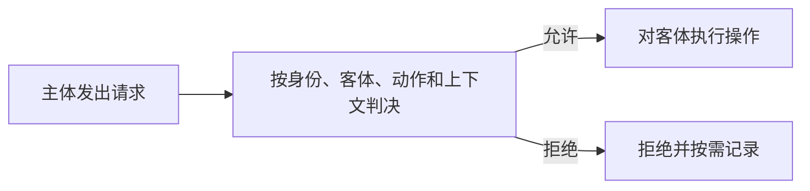

# 访问控制基础：用户已经登录，系统怎样决定这次操作能不能做

> [!summary] 快速复习卡片
> **作用/定位**：认证以后，对主体访问客体的具体动作作出允许或拒绝决定。
> **核心结论**：主体发起访问，客体被访问，策略规定允许哪些操作；完整访问控制还要有认证、策略执行和审计。
> **题干怎么认**：用户/进程、文件/数据、读写执行、权限规则、ACL、能力表、审计。
> **易错点**：认证通过只说明“身份被接受”，不代表可以访问所有资源。

## 从一次“读取工资表”开始

员工登录后请求读取工资表。系统至少要回答三件事：谁在请求、要访问什么、这项操作是否符合规则。

- **主体**：主动发起操作的用户、进程或服务；
- **客体**：被访问的文件、数据库记录、设备或服务；
- **控制策略**：主体在什么条件下可以对客体执行读、写、执行等动作。

这里的“上下文”可以包括时间、位置、设备状态等。判决和执行必须配合：只计算“应该拒绝”却没有真正拦住请求，访问控制仍然失败。

## 认证、授权、审计怎样接起来

1. **认证**确认主体是谁；
2. **授权/策略判决**判断它能做什么；
3. **执行**真正放行或拒绝；
4. **审计**记录谁在什么时候做了什么，便于追责和发现滥用。

## 访问矩阵怎样落地

把主体放在行、客体放在列，每个格子记录读/写等权限，就得到访问控制矩阵。真实系统通常很稀疏，因此不会保存整张大矩阵。

| 保存方式 | 相当于保存矩阵的哪一部分 | 最方便回答的问题 |
| --- | --- | --- |
| ACL（访问控制表） | 按客体保存一列 | 谁能访问这个文件 |
| 能力表 | 按主体保存一行 | 这个用户能访问什么 |
| 授权关系表 | 只保存非空关系 | 哪个主体对哪个客体有什么权 |

## 接下来为什么还要学 DAC、MAC、RBAC

本卡讲“访问控制共同怎样工作”；[[DAC自主访问控制]]、[[MAC强制访问控制]]、[[RBAC基于角色访问控制]]进一步回答“策略依据什么分配权限”。

## 自测

1. 用户输入正确口令后，为什么还不能直接读取工资表？
2. 查询“谁能访问这份文件”时，ACL 为什么比能力表直接？

## 下一站

- 前置：[[身份认证]]
- 下一站：[[DAC自主访问控制]]
