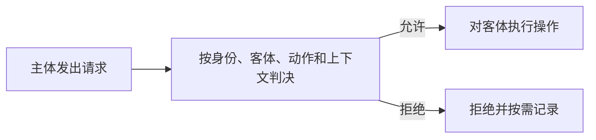

# 访问控制基础：用户已经登录，系统怎样决定这次操作能不能做

> [!summary]- 快速复习卡片（学完再看）
> **作用/定位**：认证以后，对主体访问客体的具体动作作出允许或拒绝决定。
> **核心结论**：主体发起访问，客体被访问，策略规定允许哪些操作；完整访问控制还要有认证、策略执行和审计。
> **题干怎么认**：用户/进程、文件/数据、读写执行、权限规则、ACL、能力表、审计。
> **易错点**：认证通过只说明“身份被接受”，不代表可以访问所有资源。

## 它在信息安全主线中负责什么

身份认证解决“请求者是谁”，但公司不可能让每个已登录用户都读取、修改所有资料。**访问控制负责按规则决定某个主体能否对某个客体执行某种动作，重点防止未授权访问和越权操作。**

| 定位 | 访问控制在这里的答案 |
| --- | --- |
| 要防的风险 | 已登录用户或进程读取、修改不该接触的资源 |
| 主要交付 | 对具体访问请求的允许/拒绝判决及其执行、审计依据 |
| 依赖/边界 | 需要可信身份、明确策略和正确执行；访问控制不直接加密数据，也不等于事后审计已经完成 |
| 在主线中的位置 | 它承接认证的身份结果；DAC、MAC、RBAC 继续回答“权限依据什么规则分配” |

## 从一次“读取工资表”开始

员工登录后请求读取工资表。系统至少要回答三件事：谁在请求、要访问什么、这项操作是否符合规则。

- **主体**：主动发起操作的用户、进程或服务；
- **客体**：被访问的文件、数据库记录、设备或服务；
- **控制策略**：主体在什么条件下可以对客体执行读、写、执行等动作。

这里的“上下文”可以包括时间、位置、设备状态等。判决和执行必须配合：只计算“应该拒绝”却没有真正拦住请求，访问控制仍然失败。

## 认证、授权、审计怎样接起来

1. **认证**确认主体是谁；
2. **授权/策略判决**判断它能做什么；
3. **执行**真正放行或拒绝；
4. **审计**记录谁在什么时候做了什么，便于追责和发现滥用。

## 访问矩阵怎样落地

把主体放在行、客体放在列，每个格子记录读/写等权限，就得到访问控制矩阵。真实系统通常很稀疏，因此不会保存整张大矩阵。

| 保存方式 | 相当于保存矩阵的哪一部分 | 最方便回答的问题 |
| --- | --- | --- |
| ACL（访问控制表） | 按客体保存一列 | 谁能访问这个文件 |
| 能力表 | 按主体保存一行 | 这个用户能访问什么 |
| 授权关系表 | 只保存非空关系 | 哪个主体对哪个客体有什么权 |

## 接下来为什么还要学 DAC、MAC、RBAC

本卡讲“访问控制共同怎样工作”；[[DAC自主访问控制]]、[[MAC强制访问控制]]、[[RBAC基于角色访问控制]]进一步回答“策略依据什么分配权限”。

> [!question]- 自测（展开查看答案）
> 1. 用户输入正确口令后，为什么还不能直接读取工资表？
>    > **答案**：口令正确只完成身份认证；系统还要根据主体、工资表和读取动作，按策略判断是否授权。
>    > **解析**：认证回答“是谁”，访问控制回答“能不能做”。
> 2. 查询“谁能访问这份文件”时，ACL 为什么比能力表直接？
>    > **答案**：ACL 按客体保存访问矩阵的一列，直接列出对该文件有权的主体。
>    > **解析**：能力表按主体保存一行，更适合查“这个用户能访问什么”。
> 3. 为什么访问控制还需要审计？
>    > **答案**：策略难以约束所有滥用情形，特别是特权用户；审计记录可用于追责、发现和调查问题。
>    > **解析**：访问控制的教材主线包括认证、策略实现和审计，而不是只做一次允许/拒绝判断。

## 下一站

- 前置：[[身份认证]]
- 下一站：[[DAC自主访问控制]]
