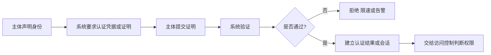

# 身份认证：系统怎样验证“你确实是你”

> [!summary]- 快速复习卡片（学完再看）
> **作用/定位**：身份认证是“验证主体是谁”的总概念；证书认证只是其中一种实现方式。
> **核心结论**：TLS 中“验证证书 + 服务器证明持有对应私钥”已经可以完成该场景的服务器身份认证；本篇不是要求再认证一次，而是统一学习口令、令牌、生物特征、证书和多因素等认证方式。
> **认证因素**：所知、所有、所是；多因素通常要求来自不同类别。
> **题干怎么认**：口令/PIN → 所知；令牌/设备密钥 → 所有；指纹/人脸 → 所是。
> **易错点**：认证回答“你是谁”，授权回答“你能做什么”；认证通过不代表拥有全部权限。

## 它在信息安全主线中负责什么

前面的密码学主链已经解决了**数据怎样保密、怎样发现内容变化、怎样用签名验证来源、公钥怎样建立可信绑定，以及密钥怎样安全度过生命周期**。

其中 [[数字证书与PKI]] 其实已经讲过一种**具体的身份认证方式**：以 HTTPS/TLS 服务器认证为例，浏览器先验证证书，确认“这个公钥可信地绑定到当前网站身份”；服务器再在握手中证明自己确实掌握对应私钥。到这一步，**这个 TLS 场景里的服务器身份认证已经完成**。

所以现在单独学习“身份认证”，**不是说 TLS 后面还必须再认证一次**。这里是在把视角从“证书认证这个具体实例”提升到“身份认证这个总概念”：系统还可以使用口令、令牌、生物特征、Kerberos、多因素认证等不同方式来回答同一个问题——**当前这个主体到底是谁？**

| 定位 | 身份认证在这里的答案 |
| --- | --- |
| 要防的风险 | 冒名登录、盗用他人身份访问系统 |
| 主要交付 | 对主体身份的可信确认，以及可供后续授权使用的认证结果/会话 |
| 常见实现 | 口令、令牌、生物特征、数字证书、Kerberos、多因素认证等 |
| 依赖/边界 | 凭据、认证器和恢复流程必须受保护；认证通过不等于拥有资源权限 |
| 在主线中的位置 | 它统一回答“你是谁”；下一篇访问控制回答“你能对什么资源做什么” |

## 前面证书已经认证过服务器，为什么还要单独学身份认证

**因为“数字证书”是身份认证的一种手段，而“身份认证”是更大的上位概念。**

可以把关系压成下面这张表：

| 知识点 | 主要在问什么 | 典型答案 |
| --- | --- | --- |
| 数字证书与 PKI | “这把公钥到底属于谁？” | CA 把身份与公钥建立可信绑定 |
| 证书认证 | “当前对方是否真的掌握这个身份对应的私钥？” | 验证证书，并验证对方对私钥的持有证明 |
| 身份认证 | “系统有哪些办法确认当前主体是谁？” | 口令、令牌、生物特征、证书、Kerberos、MFA 等 |
| 访问控制 | “确认你是谁之后，你能做什么？” | 根据权限策略决定允许或拒绝访问 |

因此不要把学习顺序误解成：

> 证书认证完成 → 还必须再做一次“身份认证”。

正确理解是：

> **证书认证本来就属于身份认证。现在这一篇是在做总览和分类，不是在追加一个必经步骤。**

一个系统具体使用哪种认证方式取决于场景。例如：

- HTTPS 网站通常需要服务器向浏览器完成服务器身份认证；
- 企业登录可能使用账号口令 + TOTP；
- 某些系统使用客户端证书；
- Windows 域环境可能使用 Kerberos。

它们不是必须全部串行执行，而是**不同场景下可选择的身份认证机制**。

## 为什么认证在授权之前

身份认证验证主体声称的身份；授权决定通过认证的主体能访问什么。审计再记录谁在何时做了什么。三者相互关联，但不能互相替代。

例如用户 `zhangsan` 输入正确口令后，系统确认“当前主体是 zhangsan”，这一步是**认证**；随后系统检查 `zhangsan` 是否拥有工资表的读取权限，这一步才是**授权/访问控制**。

所以主线是：

**先确认是谁 → 再判断能做什么。**

## 认证因素

| 因素 | 含义 | 例子 |
| --- | --- | --- |
| 所知 | 主体知道的信息 | 口令、PIN |
| 所有 | 主体持有的物品或密钥 | 硬件令牌、智能卡、设备私钥 |
| 所是 | 主体的生物特征 | 指纹、人脸、虹膜 |

**多因素认证（MFA）**要求来自不同类别的两个或多个因素。口令 + PIN 仍都是“所知”，不构成双因素。短信验证码在考试材料中常按持有手机理解，但现实安全性还受 SIM 换卡、短信劫持和终端安全影响。

数字证书通常与“所有”这一类因素相关：真正需要保护的是对应私钥。证书本身可以公开，认证价值来自“主体能证明自己掌握对应私钥”，而不是“谁拿到公开证书谁就成为证书里的主体”。证书与 PKI 的完整机制仍回到 [[数字证书与PKI]]，这里不重复展开。

## 一次认证怎样发生

不同认证方式只是“提交什么证明、系统怎样验证”不同：

- 口令认证：验证“你知道某个秘密”；
- Token/设备密钥：验证“你持有某个凭据或设备”；
- 生物特征：验证“你具有某种生物特征”；
- 证书认证：验证证书可信，并验证主体掌握对应私钥；
- MFA：组合多个不同类别的认证因素。

口令认证中，服务端应存储带盐的专用口令哈希/派生结果，而不是明文口令；验证时对输入执行相同派生再比较。还需配合限速、锁定策略、MFA 和安全的恢复流程。

## 易错边界

- **证书认证已经是一种身份认证**，不是做完证书认证后还必须再执行一个名叫“身份认证”的步骤。
- 数字证书负责身份与公钥的可信绑定；真正认证当前实体时，还要验证它能证明自己掌握相应私钥。
- “复杂口令定期强制更换”不是任何情况下都越频繁越安全；考试按给定策略判断，现实应避免可预测的小改式轮换。
- 生物特征难以像口令一样更换，通常应配合活体检测和其他因素。
- MFA 降低单一凭据失陷风险，不意味着不会遭遇钓鱼、会话劫持或账户恢复攻击。

## 考试怎么认

- “认证的目的” → 确认主体身份，即“你是谁”；
- “授权/访问控制” → 认证以后判断“你能做什么”；
- “数字证书与认证的关系” → **数字证书是身份认证可使用的一种凭据/机制，不是身份认证之后的另一个必经阶段**；
- 两个不同因素才是 2FA；同类凭据叠加不是；
- 指纹是“所是”，硬件令牌是“所有”，口令是“所知”。

## 自测

1. HTTPS 中浏览器已经验证服务器证书，并确认服务器掌握对应私钥。之后是否还必须再执行一次独立的“身份认证”才能算服务器身份可信？

> [!answer]- 第 1 题答案与解析
> **答案**：不是。这个过程本身就是一种服务器身份认证。
> **解析**：数字证书/PKI 是身份认证的一种实现基础；“身份认证”这一篇是在学习认证的总概念和其他认证方式，不代表协议里还要机械追加一次认证。

2. 口令加 PIN 为什么通常不算双因素认证？

> [!answer]- 第 2 题答案与解析
> **答案**：两者都属于“所知”，没有使用不同类别的认证因素。
> **解析**：多因素的关键不是凭据数量，而是因素类别不同。

3. 用户认证通过后，为什么仍可能被拒绝读取工资表？

> [!answer]- 第 3 题答案与解析
> **答案**：认证只确认“用户是谁”，访问控制还要按权限策略判断其是否有读取工资表的权利。
> **解析**：认证与授权是相邻但不同的两步。

4. 为什么 MFA 不能完全消除账号被盗风险？

> [!answer]- 第 4 题答案与解析
> **答案**：攻击者仍可能通过钓鱼、会话劫持或账户恢复流程等方式绕过或窃取认证结果。
> **解析**：MFA 降低单一凭据失陷风险，不等于替代其他安全控制。

## 下一站

- 上一篇：[[密钥管理]] —— 密码学主线已经把密钥安全运行的问题收口；这里把“证书认证”提升为“身份认证”的总概念。
- 下一篇：[[访问控制基础]] —— 身份已经确认以后，继续回答“这个主体能访问哪些资源、执行哪些操作”。
- 协议实例：[[Kerberos认证]]
- 证书认证实例：[[数字证书与PKI]]、[[TLS与HTTPS]]
