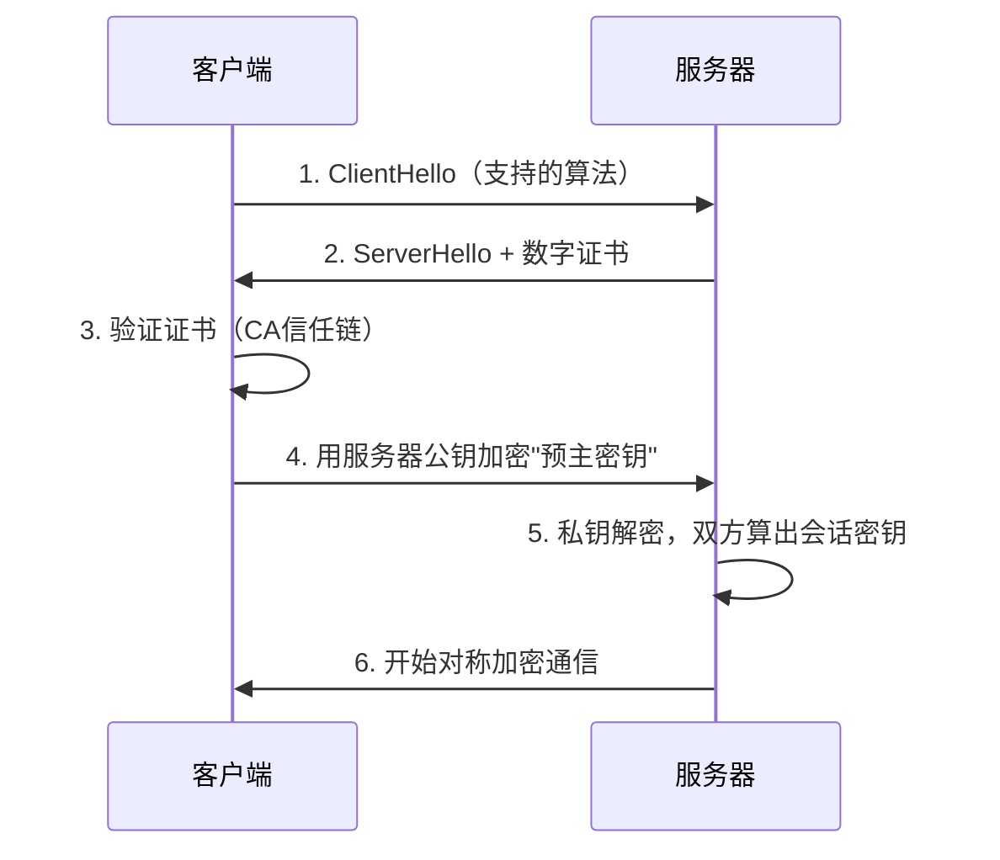

---
tags:
  - 系统架构师
  - 系统架构师/信息安全
  - 系统架构师/信息安全/网络安全
priority: ⭐⭐
status: 学习中
created: 2026-08-03 星期一
---
# TLS 与 HTTPS

> [!important] 软考定位
> ⭐⭐ 高频：**TLS 握手流程**完美串联了证书+非对称+对称三大知识点，是"送分综合题"。

---

## 一、一句话定义

**TLS（传输层安全协议）** = 位于传输层与应用层之间的安全协议，为网络通信提供**加密 + 完整性 + 身份验证**。

---

## 二、两层结构

| 子协议 | 作用 |
| :--- | :--- |
| **握手协议** | 协商密钥、**验证服务器证书**（防中间人） |
| **记录协议** | 用协商好的对称密钥**加密传输数据** |

---

## 三、握手流程（⭐）

**本质**：**非对称（+证书）协商密钥 → 对称加密传数据** —— 把 [[对称加密]]、[[非对称加密]]、[[数字证书与PKI]] 串成一条线。

---

## 四、HTTPS

- **HTTPS = HTTP + TLS**（默认 **443** 端口；HTTP 是 80）
- 浏览器地址栏小锁 = TLS 生效
- 现代要求：全站 HTTPS（防止中间人篡改）

---

## 五、考场避坑

1. 握手第一步验证的是**服务器证书**（一般不做客户端证书）
2. 数据加密用的是**对称密钥**（会话密钥），不是公钥
3. HTTPS 默认端口 443，HTTP 80——最基础的选择题

---

## 六、一句话总结

> **证书验身份、公钥传密钥、对称跑数据——TLS 一握三用。**

