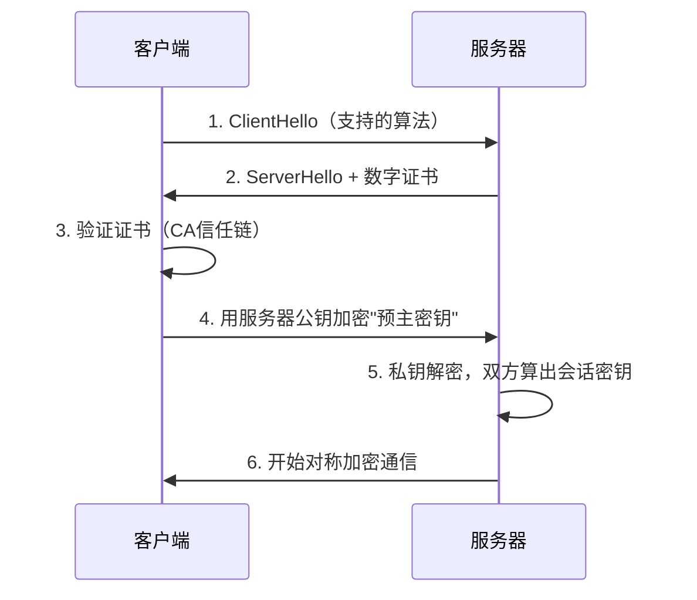

# TLS 与 HTTPS

> [!important] 软考定位
> ⭐⭐ 高频：**TLS 握手流程**完美串联了证书+非对称+对称三大知识点，是"送分综合题"。

## 零基础先抓住

> [!question] 为什么要学这个
> 浏览器和服务器跨不可信网络通信，需要同时解决窃听、篡改和服务器身份验证。

> [!tip] 讲人话
> 先查验对方身份证（证书），再协商一把临时会话钥匙，之后用这把快钥匙保护大量数据。

> [!important] 考试怎么认
> 看到“HTTPS、证书、握手、会话密钥、443”，优先想到 TLS。

---

## 一、一句话定义

**TLS（传输层安全协议）** = 建立在可靠传输之上、为应用协议提供安全通信能力的协议，为网络通信提供**机密性 + 完整性 + 身份验证**。

---

## 二、两层结构

| 子协议 | 作用 |
| :--- | :--- |
| **握手协议** | 协商密钥、**验证服务器证书**（防中间人） |
| **记录协议** | 用协商好的对称密钥**加密传输数据** |

---

## 三、握手流程（⭐）

> [!note] 版本提醒
> 下图是用于理解“证书 + 密钥协商 + 对称加密”的**经典 RSA 密钥交换示意**。现代 TLS（尤其 TLS 1.3）通常使用 (EC)DHE 协商共享密钥，服务器证书主要用于身份验证和签名，不应把 TLS 一概理解成“客户端永远用服务器公钥加密预主密钥”。

**本质**：**非对称（+证书）协商密钥 → 对称加密传数据** —— 把 [[对称加密]]、[[非对称加密]]、[[数字证书与PKI]] 串成一条线。

---

## 四、HTTPS

- **HTTPS = HTTP + TLS**（默认 **443** 端口；HTTP 是 80）
- 浏览器地址栏小锁 = TLS 生效
- 现代要求：全站 HTTPS（防止中间人篡改）

---

## 五、考场避坑

1. 握手第一步验证的是**服务器证书**（一般不做客户端证书）
2. 数据加密用的是**对称密钥**（会话密钥），不是公钥
3. HTTPS 默认端口 443，HTTP 80——最基础的选择题

---

## 六、一句话总结

> **证书验身份、公钥传密钥、对称跑数据——TLS 一握三用。**

---

## 自测

1. 现代 TLS 中服务器证书主要承担什么作用？
2. 为什么握手完成后业务数据通常用对称密钥保护？

> [!tip] 使用方法
> 先闭卷回答，再回到上面的“核心机制 / 考场避坑”核对；答不出来就回 [[信息安全技术索引|信息安全技术知识库]] 重新定位。

## 下一站

- 上一篇：[[VPN]]
- 下一篇：[[无线网络安全]]
