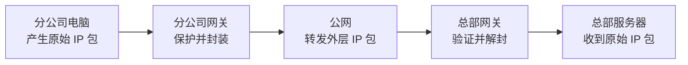

# VPN：怎样在不可信公网之上建立受保护的逻辑连接

> [!summary]- 快速复习卡片（学完再看）
> **作用/定位**：利用隧道、认证、加密等机制，把远程用户或网络连接成受保护的逻辑专用网络。
> **核心结论**：IPsec 属于 IP 层安全机制；AH 不提供机密性，ESP 可提供机密性并可配合完整性/认证保护。
> **题干怎么认**：IPsec、AH/ESP、传输/隧道模式、站点互联、远程接入。
> **易错点**：“SSL VPN = 浏览器免客户端”“ESP 永远同时提供全部安全服务”都过于绝对。

## 它在信息安全主线中负责什么

防火墙和 IPS 保护的是边界与异常流量，但远程员工、分支机构仍可能必须通过不可信公网访问内部资源。**VPN 在公网中建立受保护的逻辑连接，让远程接入或站点互联获得可控的通信保护。**

| 定位 | VPN 在这里的答案 |
| --- | --- |
| 要防的风险 | 公网传输被窃听、篡改，或远程接入缺少受保护的逻辑通道 |
| 主要交付 | 隧道、认证和加密等机制组成的受保护逻辑网络连接 |
| 依赖/边界 | 依赖终端、网关、密钥与认证配置；VPN 不自动让内部应用没有漏洞，也不替代访问权限控制 |
| 在主线中的位置 | 它解决跨公网的网络级连接保护；TLS/HTTPS 进一步解释浏览器与 Web 服务怎样保护具体应用通信 |

## 一份数据怎样穿过站点到站点 VPN

先看一个具体场景：长沙分公司的电脑要访问总部内网服务器。两边各有一个 VPN 网关，中间经过任何人都可能观察的公网。

参与对象只有四个：分公司电脑产生原始 IP 包；分公司网关负责保护和封装；公网负责转发外层 IP 包；总部网关负责验证、解密和拆封，再把原始包交给总部服务器。

一次通信按下面的顺序发生：

1. 两端网关先完成身份认证、参数协商和密钥准备，形成可用的安全关联；没有这些前提，网关不能凭空知道该用哪套算法和密钥。
2. 分公司电脑把访问总部服务器的原始 IP 包交给分公司网关。
3. 网关按照策略选择这条流量，对原始包进行 ESP 等安全处理；在隧道模式下，再加上用于公网路由的新 IP 头。
4. 公网路由器只需根据外层 IP 头把数据送到总部网关，不需要理解被保护的内部数据。
5. 总部网关收到后先验证报文；验证通过才解密、去掉 VPN 封装，并把还原出的原始 IP 包转发给总部服务器。验证失败的报文不会进入内部网络。

所以“隧道”不是公网里真的铺了一条专线，而是**两端按同一套规则封装和解封，使原始通信在公网之上获得一条受保护的逻辑路径**。

## IPsec 的两个常见协议

- **AH**：提供数据源认证和完整性等保护，不提供加密机密性。
- **ESP**：核心能力包括机密性；根据所选算法/配置，还可以提供完整性和认证等保护。

把它们放回刚才的流程：AH 可以帮助接收端确认报文来源并检查完整性，但不会隐藏内容；ESP 可以把被保护部分加密，并可按配置同时提供完整性和认证。它们描述的是“怎样保护报文”，传输/隧道模式描述的是“保护和封装到什么范围”，两个维度不要混在一起。

## 两种模式

- **传输模式**：主要保护原 IP 报文的上层载荷，原 IP 头仍用于路由。
- **隧道模式**：把整个原 IP 包封装到新的 IP 包中，常用于网关到网关/站点到站点。

## SSL/TLS VPN 怎么理解

教材/经典题常把 IPsec VPN 与 SSL VPN 按层次和使用场景对比：IPsec 更接近网络层透明保护，SSL/TLS VPN 更接近基于 TLS 的远程应用/接入。

工程实现中 SSL/TLS VPN 既可能是浏览器门户，也可能需要客户端建立全隧道，因此不要把“SSL VPN 一定免客户端”当定义。

> [!note] 范围边界
> 当前已核验大纲在安全协议处明确列出 SSL、PGP、IPSec。本卡继续把 VPN/IPsec 作为主问题；未在该大纲证据中明确列出的其他 VPN 承载或运营商技术，不因为旧元数据曾提及就扩写进本卡。

## 自测

1. AH 与 ESP 最稳定的区分点是什么？

> [!answer]- 第 1 题答案与解析
> **答案**：AH 不提供加密机密性；ESP 的核心能力包括机密性。
> **解析**：ESP 还能否提供完整性/认证要看算法和配置，不要写成无条件绝对句。

2. 为什么站点到站点常使用隧道模式？

> [!answer]- 第 2 题答案与解析
> **答案**：隧道模式可把整个原 IP 包封装进新的 IP 包，适合由两端网关代表两个网段建立保护连接。
> **解析**：传输模式主要保护原 IP 包的上层载荷。

3. “SSL VPN 一定工作在应用层且无需客户端”为什么只能作为经典简化口径？

> [!answer]- 第 3 题答案与解析
> **答案**：SSL/TLS VPN 既可能采用浏览器门户，也可能需要客户端建立全隧道。
> **解析**：考试按题干给出的层次和场景判断，避免把经典概括当作唯一产品形态。

## 下一站
- 上一篇：[[IDS与IPS]]
- 下一篇：[[TLS与HTTPS]]
