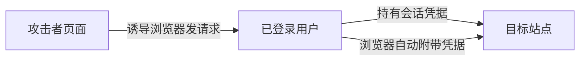

# CSRF：为什么用户没主动操作，浏览器却可能替他提交请求

> [!summary]- 快速复习卡片（学完再看）
> **作用/定位**：利用浏览器会自动附带某些登录凭据，让受害者在不知情时向目标站点发起状态改变请求。
> **核心结论**：典型防御是抗 CSRF Token + 合理 SameSite Cookie + Origin/Referer 等校验，敏感操作可再认证。
> **题干怎么认**：用户已登录、跨站诱导、自动带 Cookie、转账/改密码、CSRF Token。
> **易错点**：“目标站完全没校验来源”不是所有 CSRF 的必要定义；核心是服务器缺少能证明该请求来自合法交互的抗伪造机制。

## 它在信息安全主线中负责什么

XSS 是攻击者让脚本在浏览器中执行；还有一种攻击不必执行脚本，而是利用浏览器已经保存的登录状态。**CSRF 关注攻击者诱导已登录用户的浏览器向目标站点提交状态改变请求，借用的是用户的身份，而不是偷走身份凭据本身。**

| 定位 | CSRF 在这里的答案 |
| --- | --- |
| 要防的风险 | 浏览器自动携带登录凭据，替用户完成非本人意愿的敏感操作 |
| 主要交付 | 让服务端能区分“合法页面交互”与“跨站伪造请求”的校验机制 |
| 依赖/边界 | 依赖服务端对状态改变请求正确校验；Token、SameSite、来源校验应组合使用，不能被单一机制替代 |
| 在主线中的位置 | 它处理“借身份发请求”的 Web 风险；这一站结束后转入安全架构与治理，学习怎样让多种控制从局部措施变成整体、持续的安全能力 |

## 攻击链

CSRF 通常依赖浏览器自动携带 Cookie、HTTP 认证等环境凭据。攻击者往往不需要直接读取这些凭据，只要能诱导浏览器发出有效请求即可。

## 防御为什么有效

- **CSRF Token**：攻击站点无法轻易构造目标站要求的随机秘密值。
- **SameSite Cookie**：`SameSite` 是 Cookie 的跨站携带规则，用来限制跨站请求自动带上登录 Cookie 的场景。
- **Origin/Referer 校验**：`Origin` 表示请求来自哪个站点，`Referer` 通常记录请求从哪个页面跳来；服务端可把它们作为请求来源信号。
- **重新认证/二次确认**：对高风险操作额外提高门槛。

## 与 XSS 区分

XSS 是让攻击脚本进入受信任页面的执行上下文；CSRF 是借受害者浏览器已有身份发出请求。若站点存在 XSS，攻击者往往还能绕过许多 CSRF 防护，所以两类问题不能互相替代。

## 为什么学完 SQL 注入、XSS、CSRF 还不能结束

到这里，我们已经会分别处理三种典型应用风险：

- [[SQL注入]]：防止不可信输入改变数据库查询语义；
- [[XSS跨站脚本]]：防止不可信内容进入浏览器执行上下文；
- CSRF：防止攻击者借用受害者已有身份伪造敏感请求。

但这些仍然是**针对具体攻击面的单点控制**。一个真实系统还要继续回答：哪些风险最重要、哪些控制应该放在哪一层、一道防线失效后谁继续保护、谁负责配置和复核、控制是否长期有效、出事后怎样发现和恢复。

所以，**修好一种漏洞 ≠ 已经形成完整安全体系。单点安全技术解决“某一种攻击怎样防”；安全架构与治理继续解决“怎样从整体风险出发，让多种控制分层配合、持续生效，并在单点失效后仍有其他防线”。**

## 自测

1. 为什么攻击者不需要知道用户 Cookie 的具体值，也可能发起 CSRF？

> [!answer]- 第 1 题答案与解析
> **答案**：浏览器可能在向目标站点发请求时自动附带 Cookie，攻击者只需诱导浏览器发送构造好的请求。
> **解析**：CSRF 的关键是“借用浏览器已有身份”，不一定是读取或窃取凭据。

2. Token 和 SameSite 分别在哪一层阻断攻击链？

> [!answer]- 第 2 题答案与解析
> **答案**：Token 要求请求包含攻击站点难以获得的秘密值；SameSite 限制某些跨站请求自动附带 Cookie。
> **解析**：前者增强请求真实性校验，后者减少自动携带会话凭据的机会。

## 下一站
- 上一篇：[[XSS跨站脚本]]
- 主线下一篇：[[信息系统安全为什么需要治理]]
