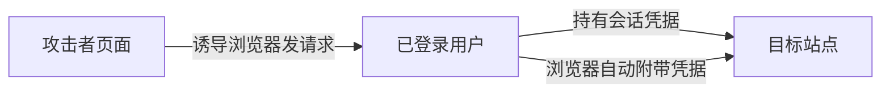

# CSRF：为什么用户没主动操作，浏览器却可能替他提交请求

> [!summary] 快速复习卡片
> **作用/定位**：利用浏览器会自动附带某些登录凭据，让受害者在不知情时向目标站点发起状态改变请求。
> **核心结论**：典型防御是抗 CSRF Token + 合理 SameSite Cookie + Origin/Referer 等校验，敏感操作可再认证。
> **题干怎么认**：用户已登录、跨站诱导、自动带 Cookie、转账/改密码、CSRF Token。
> **易错点**：“目标站完全没校验来源”不是所有 CSRF 的必要定义；核心是服务器缺少能证明该请求来自合法交互的抗伪造机制。

## 攻击链

CSRF 通常依赖浏览器自动携带 Cookie、HTTP 认证等环境凭据。攻击者往往不需要直接读取这些凭据，只要能诱导浏览器发出有效请求即可。

## 防御为什么有效

- **CSRF Token**：攻击站点无法轻易构造目标站要求的随机秘密值。
- **SameSite Cookie**：限制跨站请求自动携带 Cookie 的场景。
- **Origin/Referer 校验**：为服务端提供请求来源信号。
- **重新认证/二次确认**：对高风险操作额外提高门槛。

## 与 XSS 区分

XSS 是让攻击脚本进入受信任页面的执行上下文；CSRF 是借受害者浏览器已有身份发出请求。若站点存在 XSS，攻击者往往还能绕过许多 CSRF 防护，所以两类问题不能互相替代。

## 自测

1. 为什么攻击者不需要知道用户 Cookie 的具体值，也可能发起 CSRF？
2. Token 和 SameSite 分别在哪一层阻断攻击链？

## 下一站
- 上一篇：[[XSS跨站脚本]]
- 下一篇：[[等级保护2.0]]
