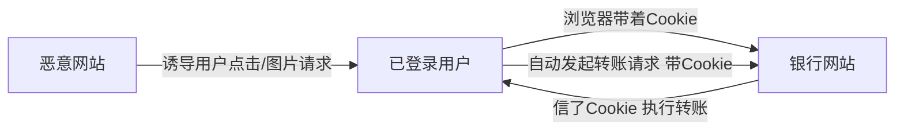

---
tags:
  - 系统架构师
  - 系统架构师/信息安全
  - 系统架构师/信息安全/应用安全
priority: ⭐⭐
status: 学习中
created: 2026-08-03 星期一
---
# CSRF 跨站请求伪造

> [!important] 软考定位
> ⭐⭐ Web 三兄弟之三。**"借刀杀人"的机制 + Token 防御**是核心考点。

---

## 一、一句话定义

**CSRF（Cross-Site Request Forgery）** = 攻击者**冒充已登录的用户**，诱导其浏览器向目标网站发送伪造请求。

---

## 二、攻击条件与流程（⭐）

**三个前提**：
1. 用户**已登录**目标网站（有有效 Cookie）
2. 目标网站未校验请求来源
3. 用户访问了恶意页面（钓鱼/挂马）

> 🧠 **本质**：浏览器自动带 Cookie，服务器分不清请求是"人点的"还是"网页偷偷发的"。

---

## 三、危害

- 改密码、转账、删数据（借用户之手）
- 篡改个人设置

---

## 四、防御（⭐⭐）

| 手段 | 说明 |
| :--- | :--- |
| **Token（CSRF Token）** ✅ | 表单带随机 Token，服务器校验 |
| **SameSite Cookie** | 限制跨站请求携带 Cookie |
| **二次确认** | 敏感操作让用户再次输入密码/验证码 |
| 校验 Referer/Origin | 判断请求来源 |

---

## 五、三兄弟对比（⭐⭐⭐）

| | [[SQL注入]] | [[XSS跨站脚本]] | CSRF |
| :--- | :--- | :--- | :--- |
| 攻击目标 | 数据库 | 用户浏览器 | 用户已登录的站点 |
| 本质 | 输入变成SQL | 脚本进别人浏览器 | 冒充用户发请求 |
| 防御核心 | 参数化查询 | 输出编码/CSP | Token/SameSite |

---

## 六、考场避坑

1. CSRF 特征是"**冒充用户/借刀杀人/浏览器自动带Cookie**"
2. 防御首选 **Token**（不是靠加密，因为Cookie会被自动带上）
3. 和 XSS 区别：XSS 是"**盗**"用户身份，CSRF 是"**借**"用户身份

---

## 七、一句话总结

> **你登录着、你点了个链接、钱没了——Token验证让伪造请求无处遁形。**

