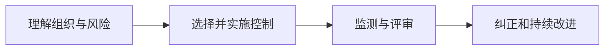

# ISO/IEC 27001：为什么安全管理不是买完设备就结束

> [!summary] 快速复习卡片
> **作用/定位**：规定信息安全管理体系（ISMS）的要求，让组织持续管理信息安全风险。
> **核心结论**：它是管理体系要求标准，不是一项加密、防火墙或漏洞扫描技术。
> **题干怎么认**：ISMS、风险管理、建立/实施/维护/持续改进管理体系。
> **复习边界**：当前作为 P3 标准识别，不背控制域清单，也不把某版条款结构写成永久不变。

## 安全设备为什么不能替代管理体系

设备需要有人配置，权限需要有人审批，事件需要有人响应，供应商和离职人员也要纳入流程。如果职责、风险评估和复查机制缺位，技术控制会逐渐失效。

ISO/IEC 27001 关注的是：组织怎样建立、实施、维护并持续改进 ISMS，并让风险处理适合自身规模、业务和环境。

可以用持续改进循环帮助理解，但做题时优先抓“ISMS 要求 + 风险管理”，不要把 ISO/IEC 27001 简化成一张固定 PDCA 表。

## 与等级保护怎样区分

[[等级保护2.0]]是我国网络安全等级保护制度语境；ISO/IEC 27001 是组织建立 ISMS 的国际标准。两者关注点有交集，但不能用“强制/自愿”四个字替代具体适用法规、合同和认证场景判断。

## 自测

> [!question] 自测
> 1. 为什么通过某款安全产品测试不能等同于建立了 ISMS？
>
> > [!answer]- 第 1 题答案与解析
> > **答案**：ISMS 还包括风险管理、职责分工、制度流程、监测评审和持续改进；单一产品只能承担其中部分技术控制。
> > **解析**：安全管理体系关注组织怎样持续管理风险，而不是某个设备是否已部署。
>
> 2. ISO/IEC 27001 与等级保护为什么不能互相替代？
>
> > [!answer]- 第 2 题答案与解析
> > **答案**：前者是建立 ISMS 的国际标准，后者处于我国网络安全等级保护制度语境；两者可有交集，但适用依据和要求不同。
> > **解析**：不能只凭“都谈安全管理”就把它们视为同一制度或互相替代。

## 下一站

- 前置：[[等级保护2.0]]
- 主线到这里收口；扩展理解：[[可信计算]]、[[零信任架构]]
- 本章复习：[[信息安全技术-考前速记]]
