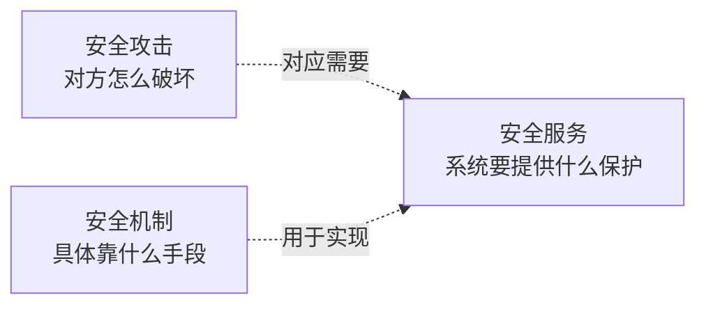

# OSI安全体系结构：把安全攻击、服务和机制放进同一张地图

> [!summary]- 快速复习卡片（学完再看）
> **一句话**：OSI 安全体系结构不是一套新的安全技术，而是把安全内容统一分成“安全攻击、安全服务、安全机制”三部分，并说明它们怎样对应。
> **五类安全服务**：鉴别、访问控制、数据机密性、数据完整性、抗抵赖性。
> **第一反应**：攻击看“对方怎么破坏”，服务看“系统要提供什么保护”，机制看“具体靠什么手段实现”。
> **易错点**：这三部分是分类与对应关系，不是按顺序执行的三个步骤。

## 这篇到底在讲什么

前面已经学过加密、数字签名、身份认证、访问控制，也见过窃听、冒充、重放、篡改等攻击。

**OSI 安全体系结构做的事情，就是把这些已经学过的内容重新整理到同一套框架里。**

| OSI 里的部分 | 它回答什么 | 例子 |
| --- | --- | --- |
| 安全攻击 | 对方怎么破坏系统或通信 | 窃听、冒充、重放、篡改、拒绝服务 |
| 安全服务 | 系统需要提供什么保护能力 | 鉴别、访问控制、机密性、完整性、抗抵赖性 |
| 安全机制 | 具体靠什么手段实现这些保护能力 | 加密、数字签名、访问控制、认证交换等 |

所以这里**不是再学一遍加密或认证原理**，而是要知道它们在整个安全体系中分别属于什么位置。

## 三者是什么关系

下面是**关系图，不是执行流程图**：

例如：

- **窃听**是一种安全攻击；系统需要**数据机密性**服务；可以用**加密机制**实现。
- **冒充**是一种安全攻击；系统需要**鉴别**服务；可以用认证交换、数字签名等机制支撑。
- **篡改**是一种安全攻击；系统需要**数据完整性**服务；可以用完整性机制、数字签名等实现。

> **不要背成“攻击 → 服务 → 机制”的执行步骤。**
> 它真正表达的是：攻击说明“要防什么”，服务说明“希望得到什么保护”，机制说明“靠什么实现保护”。

而且它们不是一一对应：**一种安全服务可以由多种机制共同实现，一种机制也可能支撑多种安全服务。**

## 五类安全服务一句话记

| 安全服务 | 一句话 |
| --- | --- |
| 鉴别 | 确认“你是谁”或“数据是谁发的”。 |
| 访问控制 | 确认“你有没有权限做这件事”。 |
| 数据机密性 | 不让未授权的人看懂数据。 |
| 数据完整性 | 发现数据是否被未授权修改。 |
| 抗抵赖性 | 发生争议时，能够证明谁做过这件事。 |

## 服务和机制不要混

- **数据机密性**是服务，**加密**是实现它的机制；
- **数据完整性**是服务，完整性机制、数字签名可以支撑它；
- **抗抵赖性**是服务，数字签名、公证等机制可以支撑它。

考试遇到选项时先问一句：

> **它是在说“要什么保护”，还是在说“用什么办法做到”？**

前者通常是安全服务，后者通常是安全机制。

## 考试第一动作

题目出现“OSI 安全体系结构”时，先把名词放进三个篮子：

1. **安全攻击**：对方怎么破坏；
2. **安全服务**：系统要提供什么保护；
3. **安全机制**：具体怎么实现保护。

如果题目直接问“五类安全服务”，检查：

> **鉴别、访问控制、数据机密性、数据完整性、抗抵赖性。**

## 自测

1. “窃听、数据机密性、加密”分别属于哪一类？

> [!answer]- 第 1 题答案与解析
> **答案**：窃听属于安全攻击，数据机密性属于安全服务，加密属于安全机制。
> **解析**：分别对应“怎么破坏、要什么保护、怎么实现”。

2. 为什么不能把“安全攻击 → 安全服务 → 安全机制”当成系统实际执行流程？

> [!answer]- 第 2 题答案与解析
> **答案**：因为 OSI 安全体系结构是在分类并描述对应关系，不是在规定系统必须依次执行三个步骤。
> **解析**：同一种服务可能由多种机制共同实现，同一种机制也可能支撑多个服务。

## 下一站

OSI 安全体系结构把前面学过的攻击、保护能力和实现手段放进同一张地图；下一步继续看怎样把这些控制真正放到网络、主机、应用、数据等位置组成整体方案：[[安全架构设计]]。
